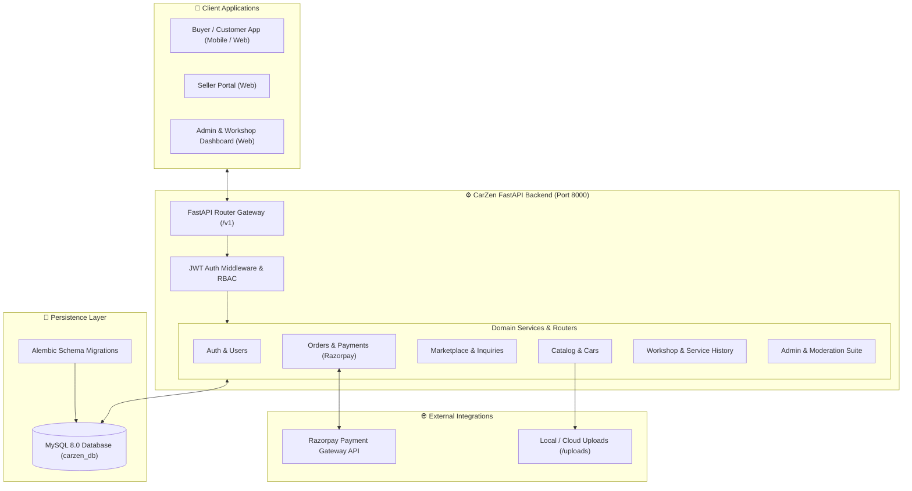

# CarZen — Full-Stack Automotive Marketplace & Workshop Ecosystem

[](https://fastapi.tiangolo.com)
[](https://www.python.org/)
[](https://www.sqlalchemy.org/)
[](https://www.mysql.com/)
[](https://alembic.sqlalchemy.org/)
[](https://razorpay.com/)
[](LICENSE)

**CarZen** is a modern, enterprise-ready automotive platform that combines a **peer-to-peer vehicle marketplace**, an **intelligent car inventory & catalog manager**, a **digital workshop service & booking system**, and an integrated **Razorpay payment gateway**.

Designed with a clean, decoupled architecture using **FastAPI**, **SQLAlchemy 2.0**, and **MySQL**, CarZen provides 170+ production-tested endpoints for buyers, sellers, workshop technicians, and platform administrators.

---

## 📑 Quick Navigation & Documentation

- 📖 **[Full REST API Documentation (172 Endpoints)](docs/API_DOCUMENTATION.md)** — Complete endpoint reference with HTTP methods, paths, parameters, schemas, sample payloads, and cURL commands.
- 🔧 **[Service Center & Workshop Implementation Guide](docs/SERVICE_API_FRONTEND_GUIDE.md)** — Step-by-step frontend integration guide for customer booking and workshop management.
- ⚡ **Interactive Swagger UI**: [`http://localhost:8000/docs`](http://localhost:8000/docs) (when server is running)
- 📚 **ReDoc Documentation**: [`http://localhost:8000/redoc`](http://localhost:8000/redoc)

---

## 🌟 Key Features

### 1. 🚗 Vehicle Catalog & Inventory Management
- **Hierarchical Master Catalog**: Brands, Models, and Variants with normalized technical specifications.
- **Seller Car Registry**: Add and manage vehicles with VIN, registration number, fuel type, transmission, mileage, and condition (New/Used).
- **Multi-Media Gallery**: Upload high-resolution car images, set primary display photos, and reorder gallery items.
- **Dynamic Feature Badges**: Attach comfort, safety, entertainment, and performance features to cars.
- **Admin Verification**: Built-in verification workflow (Pending, Approved, Rejected) before vehicles enter public listings.

### 2. 🛒 Marketplace & Public Discovery
- **Public Listings**: Browse verified active vehicles with keyword search, brand/model filters, price sorting, and pagination.
- **Detailed Car Views**: Comprehensive vehicle specs, high-resolution media gallery, seller info, and verified reviews.
- **Wishlist & Favorites**: Authenticated users can save vehicles to their personal favorites list.
- **Lifecycle Management**: Sellers can create, update, publish, pause, or delist vehicles seamlessly.

### 3. 💬 Inquiries & Buyer-Seller Negotiation
- **Direct Inquiries**: Prospective buyers can initiate inquiries with customized offers and questions.
- **Live Threaded Messaging**: Real-time communication between buyer and seller per vehicle inquiry.
- **Status Workflow**: Track inquiries through `PENDING`, `RESPONDED`, and `CLOSED` states.

### 4. 💳 Orders, Checkout & Razorpay Payments
- **Flexible Order Modes**: Support for full vehicle purchase payments and advance booking/token deposits.
- **Razorpay Order Creation**: Generate secure Razorpay payment orders on the backend.
- **HMAC SHA-256 Verification**: Server-side cryptographic signature validation for tamper-proof transactions.
- **Cash on Delivery (COD)**: Cash settlement workflow with confirmation tracking.
- **Webhook Integration**: Event-driven webhook processing for asynchronous payment status updates.
- **Transaction Ledger**: Dual-entry financial audit records for buyers, sellers, and administrators.

### 5. 🔧 Digital Workshop & Vehicle Service Center
- **Service Catalog**: Browse standard periodic services, emergency repairs, and custom packages with transparent pricing.
- **Appointment Scheduling**: Real-time slot availability checking with conflict prevention.
- **End-to-End Service Lifecycle**:
  $$\text{Pending} \longrightarrow \text{Scheduled} \longrightarrow \text{In Progress} \longrightarrow \text{Completed}$$
- **Digital Service Booklet**: Odometer readings, parts replaced, technician notes, and invoices automatically attached to the vehicle's permanent maintenance log.
- **Online Service Payment**: Pay for workshop jobs directly via Razorpay before or after vehicle handover.

### 6. ⭐ Trust, Safety & Notifications
- **Verified Reviews**: Only verified buyers can submit star ratings and detailed reviews for cars.
- **Moderation & Dispute Reporting**: Flag suspicious listings or inappropriate behavior for admin intervention.
- **Push & In-App Notifications**: Alerts for order updates, inquiry replies, service status changes, and payment confirmations.

### 7. 🛡️ Comprehensive Admin Portal
- **Dashboard & Analytics**: High-level platform metrics for revenue, active users, listings, and service volume.
- **Vehicle & Listing Moderation**: Review submitted vehicles and listings with single-click approve/reject/delist actions.
- **Workshop Queue**: Assign service technicians, update job statuses, and record final odometers.
- **User Governance**: View registered users, update roles (`USER` vs `ADMIN`), and manage account statuses (`ACTIVE`, `INACTIVE`, `BLOCKED`).

---

## 🏛️ System Architecture



---

## 📂 Project Structure

```
CarZen/
├── backend/
│   ├── app/
│   │   ├── api/v1/                   # REST API Routers grouped by domain
│   │   │   ├── addresss/             # User address CRUD
│   │   │   ├── admin/                # Admin operations (cars, listings, orders, services)
│   │   │   ├── auth/                 # Authentication & Token validation
│   │   │   ├── buyer/                # Buyer dashboard, discovery, orders, inquiries
│   │   │   ├── car_management/       # Cars, brands, models, variants, marketplace
│   │   │   ├── contact/              # User contact management
│   │   │   ├── notification/         # In-app notifications
│   │   │   ├── order/                # Vehicle orders & checkout
│   │   │   ├── payment/              # Razorpay payments, verification, webhooks
│   │   │   ├── report/               # User reports & safety moderation
│   │   │   ├── reviews/              # Verified car reviews & ratings
│   │   │   ├── seller/               # Seller dashboard, inquiries, orders
│   │   │   ├── services/             # Workshop catalog, booking, digital history
│   │   │   ├── transactions/         # Financial transaction ledger
│   │   │   ├── users/                # User profile & account management
│   │   │   └── home.py               # Health check endpoint
│   │   ├── core/                     # Security, JWT tokens, RBAC dependencies
│   │   ├── database/                 # SQLAlchemy engine & session lifecycle
│   │   ├── models/                   # SQLAlchemy ORM models & Enums
│   │   ├── schemas/                  # Pydantic validation & response schemas
│   │   ├── services/                 # Business logic and domain services
│   │   └── main.py                   # FastAPI application initialization & middleware
│   ├── alembic/                      # Database migration scripts
│   ├── scripts/                      # Utility scripts (docs generator, data migrations)
│   │   ├── build_docs.py             # Automated API docs generator
│   │   └── migrate_car_management.py # Car management schema migrator
│   ├── uploads/                      # Uploaded vehicle photos and media files
│   ├── alembic.ini                   # Alembic configuration
│   ├── requirements.txt              # Production Python dependencies
│   ├── run.py                        # Server runner entrypoint
│   └── .env.example                  # Environment configuration template
├── docs/
│   ├── API_DOCUMENTATION.md          # Complete REST API reference (172 endpoints)
│   └── SERVICE_API_FRONTEND_GUIDE.md # Workshop & Service module integration guide
├── README.md                         # Main repository guide (this file)
└── LICENSE                           # Project license
```

---

## 🛠️ Tech Stack & Dependencies

| Layer | Technology | Purpose |
| :--- | :--- | :--- |
| **Framework** | [FastAPI](https://fastapi.tiangolo.com/) `0.141.1` | High-performance asynchronous Python web framework |
| **ASGI Server** | [Uvicorn](https://www.uvicorn.org/) `0.52.3` | Lightning-fast ASGI production server |
| **ORM** | [SQLAlchemy](https://www.sqlalchemy.org/) `2.0.52` | Python SQL toolkit and Object Relational Mapper |
| **Database Driver** | [PyMySQL](https://github.com/PyMySQL/PyMySQL) `1.2.0` | Pure-Python MySQL client library |
| **Migrations** | [Alembic](https://alembic.sqlalchemy.org/) `1.16.5` | Lightweight database migration tool |
| **Validation** | [Pydantic](https://docs.pydantic.dev/) v2 | Data parsing, validation, and schema generation |
| **Security & JWT** | [python-jose](https://github.com/mpdavis/python-jose) + [Passlib](https://passlib.readthedocs.io/) | Cryptographic JWT signing and Bcrypt password hashing |
| **Payments** | [Razorpay](https://razorpay.com/) REST API | Payment gateway order generation & HMAC signature verification |
| **File Handling** | `python-multipart` | Multipart form-data handling for photo uploads |

---

## 🚀 Getting Started & Installation

### Prerequisites
Make sure you have installed:
- **Python 3.10+** (Python 3.12 recommended)
- **MySQL 8.0+** running locally or accessible remotely
- **Git**

---

### Step 1: Clone the Repository
```bash
git clone https://github.com/your-org/CarZen.git
cd CarZen
```

---

### Step 2: Set Up Virtual Environment
```bash
# Windows (PowerShell)
python -m venv venv
.\venv\Scripts\Activate.ps1

# Linux / macOS
python3 -m venv venv
source venv/bin/activate
```

---

### Step 3: Install Dependencies
```bash
pip install --upgrade pip
pip install -r backend/requirements.txt
```

---

### Step 4: Configure Environment Variables
Create your local `.env` file in the `backend/` directory by copying the example:

```bash
cp backend/.env.example backend/.env
```

Edit `backend/.env` with your database credentials and API keys:

```ini
# Database Connection
DATABASE_HOST="localhost"
DATABASE_PORT=3306
DATABASE_NAME="carzen_db"
DATABASE_USER="root"
DATABASE_PASSWORD="your_mysql_password"

# CORS Allowed Origins (Comma-separated)
CORS_ORIGINS="http://localhost:3000,http://127.0.0.1:8000,http://localhost:8000"

# JWT Security
SECRET_KEY="your-super-secret-jwt-key-replace-in-production"
ALGORITHM="HS256"
ACCESS_TOKEN_EXPIRE_MINUTES=1440

# Razorpay Payment Gateway
RAZORPAY_KEY_ID="rzp_test_your_key_id"
RAZORPAY_KEY_SECRET="your_razorpay_secret"
RAZORPAY_WEBHOOK_SECRET="your_razorpay_webhook_secret"
RAZORPAY_MAX_ORDER_AMOUNT_PAISE=5000000
```

---

### Step 5: Database Setup & Migrations

1. **Create the MySQL Database**:
   ```sql
   CREATE DATABASE carzen_db CHARACTER SET utf8mb4 COLLATE utf8mb4_unicode_ci;
   ```

2. **Initialize Database Tables**:
   ```bash
   python backend/init_db.py
   ```
   *(Alternatively, running `python backend/run.py` will automatically verify and create all missing tables).*

---

### Step 6: Start the Development Server

From the repository root:
```bash
python backend/run.py
```
Or run directly with Uvicorn from the `backend/` directory:
```bash
cd backend
uvicorn app.main:app --reload --host 0.0.0.0 --port 8000
```

The application will boot at:
- **API Base URL**: `http://localhost:8000`
- **Interactive Swagger Docs**: `http://localhost:8000/docs`
- **ReDoc Documentation**: `http://localhost:8000/redoc`

---

## 🔒 Authentication & Role-Based Access Control (RBAC)

CarZen uses standard OAuth2 Bearer Tokens (JWT).

### 1. Register a User
```bash
curl -X POST "http://localhost:8000/v1/auth/register" \
  -H "Content-Type: application/json" \
  -d '{
    "first_name": "John",
    "last_name": "Doe",
    "username": "johndoe",
    "email": "john@example.com",
    "password": "SecurePassword123!",
    "phone_number": "+919876543210"
  }'
```

### 2. Login to Obtain Access Token
```bash
curl -X POST "http://localhost:8000/v1/auth/login" \
  -H "Content-Type: application/json" \
  -d '{
    "email": "john@example.com",
    "password": "SecurePassword123!"
  }'
```
**Response**:
```json
{
  "access_token": "eyJhbGciOiJIUzI1NiIsInR5cCI6IkpXVCJ9...",
  "token_type": "bearer"
}
```

### 3. Send Authenticated Requests
Attach the token to subsequent requests:
```http
Authorization: Bearer <access_token>
```

### Role Matrix
| Role | Capabilities |
| :--- | :--- |
| **Public** | Browse active marketplace listings, view active services catalog, read car reviews, check API health. |
| **User (Buyer / Seller)** | Add cars to inventory, create listings, submit inquiries, place orders, make payments, book workshop services, leave reviews, manage profile. |
| **Admin** | Approve/reject vehicles, moderate listings, assign workshop technicians, view platform transactions, manage user accounts & roles, resolve reports. |

---

## 📋 API Overview Quick Reference

Below is a snapshot of primary endpoints. For the exhaustive list of all 172 endpoints with request/response schemas, view **[docs/API_DOCUMENTATION.md](docs/API_DOCUMENTATION.md)**.

### Auth & Users
| Method | Endpoint | Description | Auth |
| :--- | :--- | :--- | :--- |
| `POST` | `/v1/auth/register` | Register new user account | Public |
| `POST` | `/v1/auth/login` | Authenticate and obtain JWT token | Public |
| `GET` | `/v1/auth/validate` | Validate current session token | Authenticated |
| `GET` | `/v1/users/me` | Fetch authenticated user profile | Authenticated |
| `PATCH`| `/v1/users/update/me` | Update user details & profile photo | Authenticated |

### Cars & Marketplace
| Method | Endpoint | Description | Auth |
| :--- | :--- | :--- | :--- |
| `GET` | `/v1/listings` | Search and filter public car listings | Public |
| `GET` | `/v1/listings/{id}` | Get detailed public listing | Public |
| `POST`| `/v1/cars` | Add car to seller inventory | User |
| `POST`| `/v1/cars/{id}/media` | Upload photos to car gallery | User |
| `POST`| `/v1/cars/{id}/listing` | Create marketplace listing from car | User |
| `POST`| `/v1/cars/{id}/listing/publish` | Publish listing to marketplace | User |
| `POST`| `/v1/cars/{id}/favorite` | Add car to wishlist | User |

### Inquiries & Orders
| Method | Endpoint | Description | Auth |
| :--- | :--- | :--- | :--- |
| `POST`| `/v1/buyer/inquiries` | Create vehicle inquiry / offer | User (Buyer) |
| `POST`| `/v1/inquiries/{id}/messages` | Send message in inquiry thread | Authenticated |
| `POST`| `/v1/orders` | Place vehicle purchase or token order | User (Buyer) |
| `GET` | `/v1/orders/{id}` | Get order details | Authenticated |
| `PATCH`| `/v1/seller/orders/{id}/accept`| Seller accepts buyer order | User (Seller) |

### Payments (Razorpay)
| Method | Endpoint | Description | Auth |
| :--- | :--- | :--- | :--- |
| `POST`| `/v1/payments` | Create Razorpay order for vehicle | User (Buyer) |
| `POST`| `/v1/payments/{id}/verify` | Verify Razorpay payment signature | User (Buyer) |
| `POST`| `/v1/payments/{id}/confirm-cash`| Confirm cash settlement | Authenticated |
| `POST`| `/v1/payments/webhook` | Process Razorpay webhook events | Public (Signature Verified) |

### Workshop & Service Center
| Method | Endpoint | Description | Auth |
| :--- | :--- | :--- | :--- |
| `GET` | `/v1/services` | Browse available workshop services | Public |
| `GET` | `/v1/service-slots` | Check available appointment slots | Authenticated |
| `POST`| `/v1/service-requests` | Book a vehicle service appointment | User |
| `POST`| `/v1/service-requests/{id}/pay-online` | Initiate Razorpay online payment | User |
| `POST`| `/v1/service-requests/{id}/verify-online` | Verify Razorpay payment signature | User |
| `GET` | `/v1/cars/{id}/service-history` | View digital service logbook | Authenticated |

### Admin Operations
| Method | Endpoint | Description | Auth |
| :--- | :--- | :--- | :--- |
| `POST`| `/v1/admin/cars/{id}/approve` | Approve seller vehicle for marketplace | Admin |
| `PATCH`| `/v1/admin/listings/{id}/approve` | Approve public listing | Admin |
| `GET` | `/v1/admin/service-requests` | View workshop bookings queue | Admin |
| `PATCH`| `/v1/admin/service-requests/{id}/status` | Update workshop job status | Admin |
| `GET` | `/v1/admin/transactions` | View all platform financial transactions | Admin |

---

## 🔄 Automated Docs Generator

CarZen includes an automated script that introspects the running FastAPI application schemas and generates up-to-date markdown documentation with realistic sample payloads and cURL requests:

```bash
# Run docs generator
python backend/scripts/build_docs.py
```
Output will be written directly to `docs/API_DOCUMENTATION.md`.

---

## 🧪 Testing & Code Quality

Run tests using `pytest` and `httpx`:
```bash
pytest backend/tests/
```

Check code formatting and imports:
```bash
ruff check backend/
```

---

## 📄 License

This project is licensed under the MIT License — see the [LICENSE](LICENSE) file for details.
