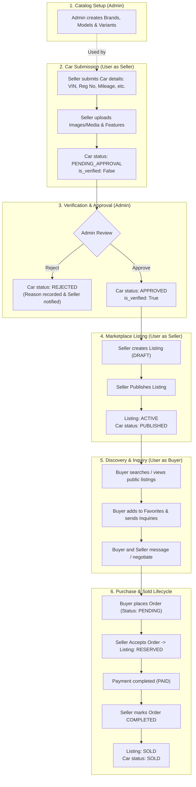

# CarZen Full Project REST API Documentation

> **Version**: 1.0.0  
> **Base URL**: `http://localhost:8000` (Local) / `https://api.carzen.example.com` (Production)  
> **API Prefix**: `/v1`  
> **Interactive Swagger UI**: [`http://localhost:8000/docs`](http://localhost:8000/docs)  
> **ReDoc**: [`http://localhost:8000/redoc`](http://localhost:8000/redoc)  


---

## Table of Contents

1. [Overview & Architecture Standards](#overview--architecture-standards)
2. [Authentication & Authorization Guide](#authentication--authorization-guide)
3. [Car Management & User Workflow](#car-management--user-workflow)
4. [HTTP Status Codes & Error Formats](#http-status-codes--error-formats)
5. [System & Health (1 Endpoints)](#system--health)
6. [Authentication & Authorization (4 Endpoints)](#authentication--authorization)
7. [User Profile & Management (10 Endpoints)](#user-profile--management)
8. [Address Management (5 Endpoints)](#address-management)
9. [Contact Information (6 Endpoints)](#contact-information)
10. [Vehicle Catalog (Brands, Models, Variants) (19 Endpoints)](#vehicle-catalog-brands-models-variants)
11. [Seller Car Inventory & Assets (15 Endpoints)](#seller-car-inventory--assets)
12. [Marketplace Listings & Public Catalog (8 Endpoints)](#marketplace-listings--public-catalog)
13. [Favorites & Wishlist (3 Endpoints)](#favorites--wishlist)
14. [Buyer Operations (11 Endpoints)](#buyer-operations)
15. [Seller Operations (9 Endpoints)](#seller-operations)
16. [Inquiry Messaging (2 Endpoints)](#inquiry-messaging)
17. [Vehicle Orders & Checkout (3 Endpoints)](#vehicle-orders--checkout)
18. [Payments & Razorpay Integration (6 Endpoints)](#payments--razorpay-integration)
19. [Financial Transactions Ledger (4 Endpoints)](#financial-transactions-ledger)
20. [Service Center & Maintenance History (14 Endpoints)](#service-center--maintenance-history)
21. [Reviews & Ratings (5 Endpoints)](#reviews--ratings)
22. [Moderation Reports (3 Endpoints)](#moderation-reports)
23. [Notifications System (5 Endpoints)](#notifications-system)
24. [Admin Operations & Management (39 Endpoints)](#admin-operations--management)

---

## Overview & Architecture Standards


The CarZen REST API powers an end-to-end automotive platform built with FastAPI, SQLAlchemy 2.0, and MySQL. It features:
- **Vehicle Catalog**: Multi-tier hierarchy of Brands, Models, and Variants with vehicle specs.
- **Inventory Management**: Seller car registry with multi-image gallery upload, primary image selection, and customizable feature badges.
- **Marketplace Engine**: Public listings with keyword search, brand/model filters, price sorting, and admin approval workflows.
- **Negotiation & Inquiries**: Buyer-seller inquiry threads with direct messaging and real-time status transitions.
- **Checkout & Razorpay**: Multi-mode orders supporting full payment, booking deposit, cash-on-delivery confirmation, and signature verification.
- **Workshop & Service Management**: Service catalog, slot reservation, job lifecycle tracking (Pending -> Scheduled -> In-Progress -> Completed), digital odometer recording, and automatic service booklet creation.
- **Trust & Safety**: Verified reviews, buyer dispute reporting, and comprehensive admin moderation suites.

### Standard Request Headers
For JSON endpoints:
```http
Content-Type: application/json
Accept: application/json
Authorization: Bearer <your_jwt_access_token>
```
For file upload endpoints (`POST /v1/cars/{car_id}/media`):
```http
Content-Type: multipart/form-data
Authorization: Bearer <your_jwt_access_token>
```

## Authentication & Authorization Guide


All protected endpoints require an `Authorization` header containing a valid Bearer JWT.

### Auth Flow
1. **Register**: `POST /v1/auth/register` creates a user account.
2. **Login**: `POST /v1/auth/login` verifies credentials and returns a signed JWT token.
3. **Attach Header**: Send `Authorization: Bearer <token>` with every subsequent request.
4. **Token Validation**: Call `GET /v1/auth/validate` to verify session liveness and fetch user details.

### Roles and Permissions
| Role | Code Value | Description |
| :--- | :--- | :--- |
| **Public** | None | Unauthenticated access to public catalog, active services, health checks, and webhooks. |
| **User (Buyer & Seller)** | `user` | Standard platform account. Can register cars, create listings, submit inquiries, place orders, book workshop services, and leave reviews. |
| **Admin** | `admin` | Elevated operational role. Can verify cars, approve/reject listings, configure service catalogs, assign technicians, manage users, and resolve dispute reports. |

## Car Management & User Workflow


CarZen operates with **two fundamental system user roles**: `ADMIN` and `USER` (where any `USER` can seamlessly act as both **Buyer** and **Seller** within the platform).

### User Roles Architecture
- **Admin (`admin`)**: Responsible for master catalog curation (Brands, Models, Variants), reviewing and verifying car registrations, approving or rejecting vehicle submissions and listings, and overseeing platform orders.
- **User (`user`)**: Standard platform account with dual capabilities:
  - **As Seller**: Registers vehicles with VIN and specifications, uploads media and feature badges, creates listings, negotiates inquiries, and accepts orders.
  - **As Buyer**: Explores active listings with comprehensive filters, bookmarks favorites, submits inquiries to sellers, places orders, and makes payments.

### End-to-End Workflow Diagram



### Detailed Workflow Phases

#### 1. Catalog Setup (Admin)
- **Relevant Endpoints**: `POST /v1/car-brands`, `POST /v1/car-models`, `POST /v1/car-variants`
- Master database hierarchy (Brand $\\to$ Model $\\to$ Variant) must exist before users can register cars.
- Establishes standardized vehicle taxonomy: body types, fuel types, transmission, horsepower, and engine capacity.

#### 2. Car Submission & Media Upload (User as Seller)
- **Relevant Endpoints**:
  - `POST /v1/cars` (Creates vehicle entry)
  - `POST /v1/cars/{car_id}/media` (Uploads images and videos with primary flag & sort order)
  - `POST /v1/cars/{car_id}/features` (Adds equipment and features)
- **Status Upon Creation**: `approval_status = PENDING_APPROVAL`, `is_verified = False`.
- Automated notifications are broadcast to all active platform administrators.
- Strict validation rules apply: resale vehicles (`OLD`) require registration number, VIN, registration year, and ownership type.

#### 3. Verification & Approval (Admin)
- **Relevant Endpoints**:
  - `GET /v1/admin/cars` (Admin lists pending/submitted cars)
  - `POST /v1/admin/cars/{car_id}/approve` (Verifies and approves car)
  - `POST /v1/admin/cars/{car_id}/reject` (Rejects car with recorded feedback reason)
- Approving sets `is_verified = True` and `approval_status = APPROVED`.
- Notifications alert the seller regarding approval or required corrections.
- *Security Rule*: If a seller edits sensitive attributes (VIN, registration number, manufacturing year, transmission, fuel type, or variant), the car is automatically revoked to `PENDING_APPROVAL` and unverified.

#### 4. Marketplace Listing & Publishing (User as Seller)
- **Relevant Endpoints**:
  - `POST /v1/cars/{car_id}/listing` (Creates draft listing with asking price and title)
  - `POST /v1/cars/{car_id}/listing/publish` (Publishes listing to marketplace)
  - `POST /v1/cars/{car_id}/listing/unpublish` (Reverts listing to draft)
- Only cars with `approval_status = APPROVED` can be published.
- Publishing changes `Listings.listing_status` to `ACTIVE` and `Cars.approval_status` to `PUBLISHED`.

#### 5. Discovery, Favorites & Inquiry Negotiation (User as Buyer)
- **Relevant Endpoints**:
  - `GET /v1/listings` (Public marketplace search with multi-criteria filters)
  - `GET /v1/buyer/listings/{listing_id}` (Views car detail & automatically records view analytics)
  - `POST /v1/cars/{car_id}/favorite` (Adds listing to buyer favorites)
  - `POST /v1/buyer/listings/{listing_id}/inquiries` (Buyer opens inquiry with seller)
  - `POST /v1/inquiries/{inquiry_id}/messages` (Two-way chat between buyer and seller)

#### 6. Order Placement & Sold Lifecycle (Buyer & Seller)
- **Relevant Endpoints**:
  - `POST /v1/orders` (Buyer creates purchase order; order `status = PENDING`)
  - `POST /v1/seller/orders/{order_id}/accept` (Seller confirms; listing becomes `RESERVED`)
  - `POST /v1/payments/razorpay/verify` (Buyer pays; order `payment_status = PAID`)
  - `PATCH /v1/seller/orders/{order_id}/status` (Seller moves order to `PROCESSING` $\\to$ `COMPLETED`)
- When an order reaches `COMPLETED`:
  - `Listings.listing_status` transitions to `SOLD`.
  - `Cars.approval_status` transitions to `SOLD`.
  - All users who saved this car in their favorites receive an automated notification that the car has been sold.

### Status Transition Matrix

| Platform Stage | Car Approval Status (`Cars.approval_status`) | Car Verified (`Cars.is_verified`) | Listing Status (`Listings.listing_status`) | Order Status (`Orders.status`) |
| :--- | :--- | :--- | :--- | :--- |
| **Car Created by Seller** | `PENDING_APPROVAL` | `False` | *(Not Created)* | *(Not Created)* |
| **Admin Rejects Car** | `REJECTED` | `False` | *(Not Created)* | *(Not Created)* |
| **Admin Approves Car** | `APPROVED` | `True` | *(Not Created)* | *(Not Created)* |
| **Seller Creates Listing** | `APPROVED` | `True` | `DRAFT` | *(Not Created)* |
| **Seller Publishes Listing** | `PUBLISHED` | `True` | `ACTIVE` | *(Not Created)* |
| **Buyer Places Order** | `PUBLISHED` | `True` | `ACTIVE` | `PENDING` |
| **Seller Accepts Order** | `PUBLISHED` | `True` | `RESERVED` | `CONFIRMED` |
| **Payment Captured** | `PUBLISHED` | `True` | `RESERVED` | `PROCESSING` |
| **Order Completed / Handed Over** | `SOLD` | `True` | `SOLD` | `COMPLETED` |
| **Order Cancelled / Rejected** | `PUBLISHED` | `True` | `ACTIVE` *(restored)* | `CANCELLED` / `REJECTED` |

## HTTP Status Codes & Error Formats


| HTTP Status | Name | Meaning |
| :--- | :--- | :--- |
| **`200 OK`** | Success | Standard response for successful GET, PATCH, and PUT operations. |
| **`201 Created`** | Created | Successfully created a new resource (auth, car, listing, order, review, etc.). |
| **`204 No Content`** | Deleted | Successful deletion with no response body. |
| **`400 Bad Request`** | Bad Request | Invalid business state transition (e.g. attempting to cancel an in-progress service). |
| **`401 Unauthorized`** | Unauthorized | Invalid, expired, or missing JWT Bearer token. |
| **`403 Forbidden`** | Forbidden | Insufficient permissions (e.g. standard user calling admin endpoints). |
| **`404 Not Found`** | Not Found | Entity with requested identifier does not exist. |
| **`422 Unprocessable`**| Validation Error | Payload failed Pydantic schema validation. |
| **`500 Internal Error`**| Server Error | Unexpected server runtime exception. |

#### Example Error Payload (400 / 401 / 403 / 404)
```json
{
  "detail": "Listing not found or you are not authorized to modify it."
}
```

#### Example Validation Error Payload (422)
```json
{
  "detail": [
    {
      "loc": ["body", "price"],
      "msg": "field required",
      "type": "value_error.missing"
    }
  ]
}
```


---

## System & Health

*Total Endpoints: 1*


### GET `/`

**Summary**: Home  

**Authentication**: Public (No authentication required)  


#### Response (`200 Successful Response`)

```json
{}
```

#### Example cURL Request
```bash
curl -X GET "http://localhost:8000/" \
  -H "Accept: application/json"
```


---

## Authentication & Authorization

*Total Endpoints: 4*


### POST `/v1/auth/login`

**Summary**: Login  

**Authentication**: Public (No authentication required)  


#### Request Body (`application/json`)

| Field | Type | Required | Description |
| :--- | :--- | :--- | :--- |
| `email` | `string` | **Yes** | Email |
| `password` | `string` | **Yes** | Password |


**Example Payload**:
```json
{
  "email": "user@carzen.com",
  "password": "SecureP@ssw0rd123"
}
```


#### Response (`200 Successful Response`)

```json
{
  "access_token": "eyJhbGciOiJIUzI1NiIsInR5cCI6IkpXVCJ9...",
  "token_type": "eyJhbGciOiJIUzI1NiIsInR5cCI6IkpXVCJ9..."
}
```

#### Example cURL Request
```bash
curl -X POST "http://localhost:8000/v1/auth/login" \
  -H "Accept: application/json" \
  -H "Content-Type: application/json" \
  -d '{
  "email": "user@carzen.com",
  "password": "SecureP@ssw0rd123"
}'
```


---

### POST `/v1/auth/register`

**Summary**: Register  

**Authentication**: Public (No authentication required)  


#### Request Body (`application/json`)

| Field | Type | Required | Description |
| :--- | :--- | :--- | :--- |
| `first_name` | `string` | **Yes** | First Name |
| `last_name` | `string` | No | Last Name |
| `username` | `string` | **Yes** | Username |
| `email` | `string` | **Yes** | Email |
| `password` | `string` | **Yes** | Password |
| `phone_number` | `string` | No | Phone Number |
| `profile_image_url` | `string` | No | Profile Image Url |


**Example Payload**:
```json
{
  "first_name": "John",
  "last_name": "string",
  "username": "johndoe",
  "email": "user@carzen.com",
  "password": "SecureP@ssw0rd123",
  "phone_number": "string",
  "profile_image_url": "string"
}
```


#### Response (`201 Successful Response`)

```json
{
  "id": 1,
  "first_name": "John",
  "last_name": "string",
  "username": "johndoe",
  "email": "user@carzen.com",
  "phone_number": "string",
  "role": "user",
  "status": "active",
  "profile_image_url": "string",
  "created_at": "2026-09-28T10:00:00Z",
  "updated_at": "2026-09-28T10:00:00Z",
  "deleted_at": "2026-09-28T10:00:00Z"
}
```

#### Example cURL Request
```bash
curl -X POST "http://localhost:8000/v1/auth/register" \
  -H "Accept: application/json" \
  -H "Content-Type: application/json" \
  -d '{
  "first_name": "John",
  "last_name": "string",
  "username": "johndoe",
  "email": "user@carzen.com",
  "password": "SecureP@ssw0rd123",
  "phone_number": "string",
  "profile_image_url": "string"
}'
```


---

### POST `/v1/auth/register-admin`

**Summary**: Register  

**Authentication**: Public (No authentication required)  


#### Request Body (`application/json`)

| Field | Type | Required | Description |
| :--- | :--- | :--- | :--- |
| `first_name` | `string` | **Yes** | First Name |
| `last_name` | `string` | No | Last Name |
| `username` | `string` | **Yes** | Username |
| `email` | `string` | **Yes** | Email |
| `password` | `string` | **Yes** | Password |
| `phone_number` | `string` | No | Phone Number |
| `profile_image_url` | `string` | No | Profile Image Url |


**Example Payload**:
```json
{
  "first_name": "John",
  "last_name": "string",
  "username": "johndoe",
  "email": "user@carzen.com",
  "password": "SecureP@ssw0rd123",
  "phone_number": "string",
  "profile_image_url": "string"
}
```


#### Response (`201 Successful Response`)

```json
{
  "id": 1,
  "first_name": "John",
  "last_name": "string",
  "username": "johndoe",
  "email": "user@carzen.com",
  "phone_number": "string",
  "role": "user",
  "status": "active",
  "profile_image_url": "string",
  "created_at": "2026-09-28T10:00:00Z",
  "updated_at": "2026-09-28T10:00:00Z",
  "deleted_at": "2026-09-28T10:00:00Z"
}
```

#### Example cURL Request
```bash
curl -X POST "http://localhost:8000/v1/auth/register-admin" \
  -H "Accept: application/json" \
  -H "Content-Type: application/json" \
  -d '{
  "first_name": "John",
  "last_name": "string",
  "username": "johndoe",
  "email": "user@carzen.com",
  "password": "SecureP@ssw0rd123",
  "phone_number": "string",
  "profile_image_url": "string"
}'
```


---

### GET `/v1/auth/validate`

**Summary**: Validate Access Token  

**Authentication**: Authenticated User (`Bearer <token>`)  


#### Response (`200 Successful Response`)

```json
{
  "valid": false,
  "user": {
    "id": 1,
    "first_name": "John",
    "last_name": {},
    "username": "johndoe",
    "email": "user@carzen.com",
    "phone_number": {},
    "role": {},
    "status": {},
    "profile_image_url": {},
    "created_at": {},
    "updated_at": {},
    "deleted_at": {}
  }
}
```

#### Example cURL Request
```bash
curl -X GET "http://localhost:8000/v1/auth/validate" \
  -H "Authorization: Bearer <YOUR_ACCESS_TOKEN>" \
  -H "Accept: application/json"
```


---

## User Profile & Management

*Total Endpoints: 10*


### PATCH `/v1/admin/update/me`

**Summary**: Update Admin Profile  

**Authentication**: Admin (`Bearer <token>` with `role=ADMIN`)  


#### Request Body (`application/json`)

| Field | Type | Required | Description |
| :--- | :--- | :--- | :--- |
| `first_name` | `string` | No | First Name |
| `last_name` | `string` | No | Last Name |
| `username` | `string` | No | Username |
| `email` | `string` | No | Email |
| `phone_number` | `string` | No | Phone Number |
| `profile_image_url` | `string` | No | Profile Image Url |


**Example Payload**:
```json
{
  "first_name": "string",
  "last_name": "string",
  "username": "string",
  "email": "user@carzen.com",
  "phone_number": "string",
  "profile_image_url": "string"
}
```


#### Response (`200 Successful Response`)

```json
{
  "id": 1,
  "first_name": "John",
  "last_name": "string",
  "username": "johndoe",
  "email": "user@carzen.com",
  "phone_number": "string",
  "role": "user",
  "status": "active",
  "profile_image_url": "string",
  "created_at": "2026-09-28T10:00:00Z",
  "updated_at": "2026-09-28T10:00:00Z",
  "deleted_at": "2026-09-28T10:00:00Z"
}
```

#### Example cURL Request
```bash
curl -X PATCH "http://localhost:8000/v1/admin/update/me" \
  -H "Authorization: Bearer <YOUR_ACCESS_TOKEN>" \
  -H "Accept: application/json" \
  -H "Content-Type: application/json" \
  -d '{
  "first_name": "string",
  "last_name": "string",
  "username": "string",
  "email": "user@carzen.com",
  "phone_number": "string",
  "profile_image_url": "string"
}'
```


---

### GET `/v1/admin/users`

**Summary**: List Registered Users  

**Authentication**: Admin (`Bearer <token>` with `role=ADMIN`)  


#### Response (`200 Successful Response`)

```json
[
  {
    "id": 1,
    "first_name": "John",
    "last_name": "string",
    "username": "johndoe",
    "email": "user@carzen.com",
    "phone_number": "string",
    "role": "user",
    "status": "active",
    "profile_image_url": "string",
    "created_at": "2026-09-28T10:00:00Z",
    "updated_at": "2026-09-28T10:00:00Z",
    "deleted_at": "2026-09-28T10:00:00Z"
  }
]
```

#### Example cURL Request
```bash
curl -X GET "http://localhost:8000/v1/admin/users" \
  -H "Authorization: Bearer <YOUR_ACCESS_TOKEN>" \
  -H "Accept: application/json"
```


---

### GET `/v1/admin/users/{user_id}`

**Summary**: Get Admin User By Id  

**Authentication**: Admin (`Bearer <token>` with `role=ADMIN`)  


#### Path Parameters

| Parameter | Type | Required | Description |
| :--- | :--- | :--- | :--- |
| `user_id` | `integer` | **Yes** | - |

#### Response (`200 Successful Response`)

```json
{
  "id": 1,
  "first_name": "John",
  "last_name": "string",
  "username": "johndoe",
  "email": "user@carzen.com",
  "phone_number": "string",
  "role": "user",
  "status": "active",
  "profile_image_url": "string",
  "created_at": "2026-09-28T10:00:00Z",
  "updated_at": "2026-09-28T10:00:00Z",
  "deleted_at": "2026-09-28T10:00:00Z"
}
```

#### Example cURL Request
```bash
curl -X GET "http://localhost:8000/v1/admin/users/{user_id}" \
  -H "Authorization: Bearer <YOUR_ACCESS_TOKEN>" \
  -H "Accept: application/json"
```


---

### DELETE `/v1/admin/users/{user_id}`

**Summary**: Delete User As Admin  

**Authentication**: Admin (`Bearer <token>` with `role=ADMIN`)  


#### Path Parameters

| Parameter | Type | Required | Description |
| :--- | :--- | :--- | :--- |
| `user_id` | `integer` | **Yes** | - |

#### Response (`200 Successful Response`)

```json
{
  "message": "string"
}
```

#### Example cURL Request
```bash
curl -X DELETE "http://localhost:8000/v1/admin/users/{user_id}" \
  -H "Authorization: Bearer <YOUR_ACCESS_TOKEN>" \
  -H "Accept: application/json"
```


---

### PATCH `/v1/admin/users/{user_id}/role-status`

**Summary**: Update User Role And Status  

**Authentication**: Admin (`Bearer <token>` with `role=ADMIN`)  


#### Path Parameters

| Parameter | Type | Required | Description |
| :--- | :--- | :--- | :--- |
| `user_id` | `integer` | **Yes** | - |

#### Request Body (`application/json`)

| Field | Type | Required | Description |
| :--- | :--- | :--- | :--- |
| `role` | `string` | No | - |
| `status` | `string` | No | - |


**Example Payload**:
```json
{
  "role": "user",
  "status": "active"
}
```


#### Response (`200 Successful Response`)

```json
{
  "id": 1,
  "first_name": "John",
  "last_name": "string",
  "username": "johndoe",
  "email": "user@carzen.com",
  "phone_number": "string",
  "role": "user",
  "status": "active",
  "profile_image_url": "string",
  "created_at": "2026-09-28T10:00:00Z",
  "updated_at": "2026-09-28T10:00:00Z",
  "deleted_at": "2026-09-28T10:00:00Z"
}
```

#### Example cURL Request
```bash
curl -X PATCH "http://localhost:8000/v1/admin/users/{user_id}/role-status" \
  -H "Authorization: Bearer <YOUR_ACCESS_TOKEN>" \
  -H "Accept: application/json" \
  -H "Content-Type: application/json" \
  -d '{
  "role": "user",
  "status": "active"
}'
```


---

### GET `/v1/users/me`

**Summary**: Get User Profile  

**Authentication**: Authenticated User (`Bearer <token>`)  


#### Response (`200 Successful Response`)

```json
{
  "id": 1,
  "first_name": "John",
  "last_name": "string",
  "username": "johndoe",
  "email": "user@carzen.com",
  "phone_number": "string",
  "role": "user",
  "status": "active",
  "profile_image_url": "string",
  "created_at": "2026-09-28T10:00:00Z",
  "updated_at": "2026-09-28T10:00:00Z",
  "deleted_at": "2026-09-28T10:00:00Z"
}
```

#### Example cURL Request
```bash
curl -X GET "http://localhost:8000/v1/users/me" \
  -H "Authorization: Bearer <YOUR_ACCESS_TOKEN>" \
  -H "Accept: application/json"
```


---

### DELETE `/v1/users/me`

**Summary**: Delete User Account  

**Authentication**: Authenticated User (`Bearer <token>`)  


#### Response (`200 Successful Response`)

```json
{
  "message": "string"
}
```

#### Example cURL Request
```bash
curl -X DELETE "http://localhost:8000/v1/users/me" \
  -H "Authorization: Bearer <YOUR_ACCESS_TOKEN>" \
  -H "Accept: application/json"
```


---

### POST `/v1/users/me/change-password`

**Summary**: Change User Password  

**Authentication**: Authenticated User (`Bearer <token>`)  


#### Request Body (`application/json`)

| Field | Type | Required | Description |
| :--- | :--- | :--- | :--- |
| `current_password` | `string` | **Yes** | Current Password |
| `new_password` | `string` | **Yes** | New Password |


**Example Payload**:
```json
{
  "current_password": "SecureP@ssw0rd123",
  "new_password": "SecureP@ssw0rd123"
}
```


#### Response (`200 Successful Response`)

```json
{
  "message": "string"
}
```

#### Example cURL Request
```bash
curl -X POST "http://localhost:8000/v1/users/me/change-password" \
  -H "Authorization: Bearer <YOUR_ACCESS_TOKEN>" \
  -H "Accept: application/json" \
  -H "Content-Type: application/json" \
  -d '{
  "current_password": "SecureP@ssw0rd123",
  "new_password": "SecureP@ssw0rd123"
}'
```


---

### PATCH `/v1/users/update/me`

**Summary**: Update User Profile  

**Authentication**: Authenticated User (`Bearer <token>`)  


#### Request Body (`application/json`)

| Field | Type | Required | Description |
| :--- | :--- | :--- | :--- |
| `first_name` | `string` | No | First Name |
| `last_name` | `string` | No | Last Name |
| `username` | `string` | No | Username |
| `email` | `string` | No | Email |
| `phone_number` | `string` | No | Phone Number |
| `profile_image_url` | `string` | No | Profile Image Url |


**Example Payload**:
```json
{
  "first_name": "string",
  "last_name": "string",
  "username": "string",
  "email": "user@carzen.com",
  "phone_number": "string",
  "profile_image_url": "string"
}
```


#### Response (`200 Successful Response`)

```json
{
  "id": 1,
  "first_name": "John",
  "last_name": "string",
  "username": "johndoe",
  "email": "user@carzen.com",
  "phone_number": "string",
  "role": "user",
  "status": "active",
  "profile_image_url": "string",
  "created_at": "2026-09-28T10:00:00Z",
  "updated_at": "2026-09-28T10:00:00Z",
  "deleted_at": "2026-09-28T10:00:00Z"
}
```

#### Example cURL Request
```bash
curl -X PATCH "http://localhost:8000/v1/users/update/me" \
  -H "Authorization: Bearer <YOUR_ACCESS_TOKEN>" \
  -H "Accept: application/json" \
  -H "Content-Type: application/json" \
  -d '{
  "first_name": "string",
  "last_name": "string",
  "username": "string",
  "email": "user@carzen.com",
  "phone_number": "string",
  "profile_image_url": "string"
}'
```


---

### GET `/v1/users/{user_id}`

**Summary**: Get User By Id  

**Authentication**: Authenticated User (`Bearer <token>`)  


#### Path Parameters

| Parameter | Type | Required | Description |
| :--- | :--- | :--- | :--- |
| `user_id` | `integer` | **Yes** | - |

#### Response (`200 Successful Response`)

```json
{
  "id": 1,
  "first_name": "John",
  "last_name": "string",
  "username": "johndoe",
  "email": "user@carzen.com",
  "phone_number": "string",
  "role": "user",
  "status": "active",
  "profile_image_url": "string",
  "created_at": "2026-09-28T10:00:00Z",
  "updated_at": "2026-09-28T10:00:00Z",
  "deleted_at": "2026-09-28T10:00:00Z"
}
```

#### Example cURL Request
```bash
curl -X GET "http://localhost:8000/v1/users/{user_id}" \
  -H "Authorization: Bearer <YOUR_ACCESS_TOKEN>" \
  -H "Accept: application/json"
```


---

## Address Management

*Total Endpoints: 5*


### GET `/v1/address`

**Summary**: Get Address  

**Authentication**: Authenticated User (`Bearer <token>`)  


#### Response (`200 Successful Response`)

```json
[
  {
    "id": 1,
    "address_line_1": "123 MG Road, Indiranagar",
    "address_line_2": "string",
    "landmark": "string",
    "city": "Bengaluru",
    "state": "Karnataka",
    "country": "string",
    "postal_code": "560001",
    "latitude": 10.5,
    "longitude": 10.5,
    "is_default": false
  }
]
```

#### Example cURL Request
```bash
curl -X GET "http://localhost:8000/v1/address" \
  -H "Authorization: Bearer <YOUR_ACCESS_TOKEN>" \
  -H "Accept: application/json"
```


---

### POST `/v1/address-add`

**Summary**: Create Address  

**Authentication**: Authenticated User (`Bearer <token>`)  


#### Request Body (`application/json`)

| Field | Type | Required | Description |
| :--- | :--- | :--- | :--- |
| `address_line_1` | `string` | **Yes** | Address Line 1 |
| `address_line_2` | `string` | No | Address Line 2 |
| `landmark` | `string` | No | Landmark |
| `city` | `string` | **Yes** | City |
| `state` | `string` | **Yes** | State |
| `country` | `string` | No | Country |
| `postal_code` | `string` | **Yes** | Postal Code |
| `latitude` | `string` | No | Latitude |
| `longitude` | `string` | No | Longitude |
| `is_default` | `boolean` | No | Is Default |


**Example Payload**:
```json
{
  "address_line_1": "123 MG Road, Indiranagar",
  "address_line_2": "string",
  "landmark": "string",
  "city": "Bengaluru",
  "state": "Karnataka",
  "country": "India",
  "postal_code": "560001",
  "latitude": 10.5,
  "longitude": 10.5,
  "is_default": false
}
```


#### Response (`201 Successful Response`)

```json
{
  "id": 1,
  "address_line_1": "123 MG Road, Indiranagar",
  "address_line_2": "string",
  "landmark": "string",
  "city": "Bengaluru",
  "state": "Karnataka",
  "country": "string",
  "postal_code": "560001",
  "latitude": 10.5,
  "longitude": 10.5,
  "is_default": false
}
```

#### Example cURL Request
```bash
curl -X POST "http://localhost:8000/v1/address-add" \
  -H "Authorization: Bearer <YOUR_ACCESS_TOKEN>" \
  -H "Accept: application/json" \
  -H "Content-Type: application/json" \
  -d '{
  "address_line_1": "123 MG Road, Indiranagar",
  "address_line_2": "string",
  "landmark": "string",
  "city": "Bengaluru",
  "state": "Karnataka",
  "country": "India",
  "postal_code": "560001",
  "latitude": 10.5,
  "longitude": 10.5,
  "is_default": false
}'
```


---

### GET `/v1/address/{address_id}`

**Summary**: Get Address By Id  

**Authentication**: Authenticated User (`Bearer <token>`)  


#### Path Parameters

| Parameter | Type | Required | Description |
| :--- | :--- | :--- | :--- |
| `address_id` | `integer` | **Yes** | - |

#### Response (`200 Successful Response`)

```json
{
  "id": 1,
  "address_line_1": "123 MG Road, Indiranagar",
  "address_line_2": "string",
  "landmark": "string",
  "city": "Bengaluru",
  "state": "Karnataka",
  "country": "string",
  "postal_code": "560001",
  "latitude": 10.5,
  "longitude": 10.5,
  "is_default": false
}
```

#### Example cURL Request
```bash
curl -X GET "http://localhost:8000/v1/address/{address_id}" \
  -H "Authorization: Bearer <YOUR_ACCESS_TOKEN>" \
  -H "Accept: application/json"
```


---

### PATCH `/v1/address/{address_id}`

**Summary**: Update Address  

**Authentication**: Authenticated User (`Bearer <token>`)  


#### Path Parameters

| Parameter | Type | Required | Description |
| :--- | :--- | :--- | :--- |
| `address_id` | `integer` | **Yes** | - |

#### Request Body (`application/json`)

| Field | Type | Required | Description |
| :--- | :--- | :--- | :--- |
| `address_line_1` | `string` | **Yes** | Address Line 1 |
| `address_line_2` | `string` | No | Address Line 2 |
| `landmark` | `string` | No | Landmark |
| `city` | `string` | **Yes** | City |
| `state` | `string` | **Yes** | State |
| `country` | `string` | **Yes** | Country |
| `postal_code` | `string` | **Yes** | Postal Code |
| `latitude` | `string` | No | Latitude |
| `longitude` | `string` | No | Longitude |
| `is_default` | `boolean` | No | Is Default |


**Example Payload**:
```json
{
  "address_line_1": "123 MG Road, Indiranagar",
  "address_line_2": "string",
  "landmark": "string",
  "city": "Bengaluru",
  "state": "Karnataka",
  "country": "string",
  "postal_code": "560001",
  "latitude": 10.5,
  "longitude": 10.5,
  "is_default": true
}
```


#### Response (`200 Successful Response`)

```json
{
  "id": 1,
  "address_line_1": "123 MG Road, Indiranagar",
  "address_line_2": "string",
  "landmark": "string",
  "city": "Bengaluru",
  "state": "Karnataka",
  "country": "string",
  "postal_code": "560001",
  "latitude": 10.5,
  "longitude": 10.5,
  "is_default": false
}
```

#### Example cURL Request
```bash
curl -X PATCH "http://localhost:8000/v1/address/{address_id}" \
  -H "Authorization: Bearer <YOUR_ACCESS_TOKEN>" \
  -H "Accept: application/json" \
  -H "Content-Type: application/json" \
  -d '{
  "address_line_1": "123 MG Road, Indiranagar",
  "address_line_2": "string",
  "landmark": "string",
  "city": "Bengaluru",
  "state": "Karnataka",
  "country": "string",
  "postal_code": "560001",
  "latitude": 10.5,
  "longitude": 10.5,
  "is_default": true
}'
```


---

### DELETE `/v1/address/{address_id}`

**Summary**: Delete Address  

**Authentication**: Authenticated User (`Bearer <token>`)  


#### Path Parameters

| Parameter | Type | Required | Description |
| :--- | :--- | :--- | :--- |
| `address_id` | `integer` | **Yes** | - |

#### Response (`200 Successful Response`)

```json
{
  "message": "string"
}
```

#### Example cURL Request
```bash
curl -X DELETE "http://localhost:8000/v1/address/{address_id}" \
  -H "Authorization: Bearer <YOUR_ACCESS_TOKEN>" \
  -H "Accept: application/json"
```


---

## Contact Information

*Total Endpoints: 6*


### GET `/v1/contact`

**Summary**: Get Contact  

**Authentication**: Authenticated User (`Bearer <token>`)  


#### Response (`200 Successful Response`)

```json
[
  {
    "id": 1,
    "email": "user@carzen.com",
    "phone_number": "string",
    "whatsapp_number": "string",
    "preferred_contact_method": "phone",
    "contact_visibility": "public",
    "is_visible": false,
    "address": {}
  }
]
```

#### Example cURL Request
```bash
curl -X GET "http://localhost:8000/v1/contact" \
  -H "Authorization: Bearer <YOUR_ACCESS_TOKEN>" \
  -H "Accept: application/json"
```


---

### POST `/v1/contact-add`

**Summary**: Create Contact  

**Authentication**: Authenticated User (`Bearer <token>`)  


#### Request Body (`application/json`)

| Field | Type | Required | Description |
| :--- | :--- | :--- | :--- |
| `address_id` | `integer` | **Yes** | Address Id |
| `whatsapp_number` | `string` | No | Whatsapp Number |
| `preferred_contact_method` | `enum`: phone, email, whatsapp | No | - |
| `contact_visibility` | `enum`: public, buyers_only, private | No | - |
| `is_visible` | `boolean` | No | Is Visible |


**Example Payload**:
```json
{
  "address_id": 1,
  "whatsapp_number": "string",
  "preferred_contact_method": "phone",
  "contact_visibility": "public",
  "is_visible": true
}
```


#### Response (`201 Successful Response`)

```json
{
  "id": 1,
  "email": "user@carzen.com",
  "phone_number": "string",
  "whatsapp_number": "string",
  "preferred_contact_method": "phone",
  "contact_visibility": "public",
  "is_visible": false,
  "address": {
    "id": 1,
    "address_line_1": "123 MG Road, Indiranagar",
    "address_line_2": {},
    "landmark": {},
    "city": "Bengaluru",
    "state": "Karnataka",
    "country": "string",
    "postal_code": "560001",
    "latitude": {},
    "longitude": {},
    "is_default": false
  }
}
```

#### Example cURL Request
```bash
curl -X POST "http://localhost:8000/v1/contact-add" \
  -H "Authorization: Bearer <YOUR_ACCESS_TOKEN>" \
  -H "Accept: application/json" \
  -H "Content-Type: application/json" \
  -d '{
  "address_id": 1,
  "whatsapp_number": "string",
  "preferred_contact_method": "phone",
  "contact_visibility": "public",
  "is_visible": true
}'
```


---

### GET `/v1/contact/{contact_id}`

**Summary**: Get Contact By Id  

**Authentication**: Authenticated User (`Bearer <token>`)  


#### Path Parameters

| Parameter | Type | Required | Description |
| :--- | :--- | :--- | :--- |
| `contact_id` | `integer` | **Yes** | - |

#### Response (`200 Successful Response`)

```json
{
  "id": 1,
  "email": "user@carzen.com",
  "phone_number": "string",
  "whatsapp_number": "string",
  "preferred_contact_method": "phone",
  "contact_visibility": "public",
  "is_visible": false,
  "address": {
    "id": 1,
    "address_line_1": "123 MG Road, Indiranagar",
    "address_line_2": {},
    "landmark": {},
    "city": "Bengaluru",
    "state": "Karnataka",
    "country": "string",
    "postal_code": "560001",
    "latitude": {},
    "longitude": {},
    "is_default": false
  }
}
```

#### Example cURL Request
```bash
curl -X GET "http://localhost:8000/v1/contact/{contact_id}" \
  -H "Authorization: Bearer <YOUR_ACCESS_TOKEN>" \
  -H "Accept: application/json"
```


---

### PATCH `/v1/contact/{contact_id}`

**Summary**: Update Contact  

**Authentication**: Authenticated User (`Bearer <token>`)  


#### Path Parameters

| Parameter | Type | Required | Description |
| :--- | :--- | :--- | :--- |
| `contact_id` | `integer` | **Yes** | - |

#### Request Body (`application/json`)

| Field | Type | Required | Description |
| :--- | :--- | :--- | :--- |
| `address_id` | `string` | No | Address Id |
| `whatsapp_number` | `string` | No | Whatsapp Number |
| `preferred_contact_method` | `string` | No | - |
| `contact_visibility` | `string` | No | - |
| `is_visible` | `string` | No | Is Visible |


**Example Payload**:
```json
{
  "address_id": 1,
  "whatsapp_number": "string",
  "preferred_contact_method": "phone",
  "contact_visibility": "public",
  "is_visible": false
}
```


#### Response (`200 Successful Response`)

```json
{
  "id": 1,
  "email": "user@carzen.com",
  "phone_number": "string",
  "whatsapp_number": "string",
  "preferred_contact_method": "phone",
  "contact_visibility": "public",
  "is_visible": false,
  "address": {
    "id": 1,
    "address_line_1": "123 MG Road, Indiranagar",
    "address_line_2": {},
    "landmark": {},
    "city": "Bengaluru",
    "state": "Karnataka",
    "country": "string",
    "postal_code": "560001",
    "latitude": {},
    "longitude": {},
    "is_default": false
  }
}
```

#### Example cURL Request
```bash
curl -X PATCH "http://localhost:8000/v1/contact/{contact_id}" \
  -H "Authorization: Bearer <YOUR_ACCESS_TOKEN>" \
  -H "Accept: application/json" \
  -H "Content-Type: application/json" \
  -d '{
  "address_id": 1,
  "whatsapp_number": "string",
  "preferred_contact_method": "phone",
  "contact_visibility": "public",
  "is_visible": false
}'
```


---

### DELETE `/v1/contact/{contact_id}`

**Summary**: Delete Contact  

**Authentication**: Authenticated User (`Bearer <token>`)  


#### Path Parameters

| Parameter | Type | Required | Description |
| :--- | :--- | :--- | :--- |
| `contact_id` | `integer` | **Yes** | - |

#### Response (`200 Successful Response`)

```json
{
  "message": "string"
}
```

#### Example cURL Request
```bash
curl -X DELETE "http://localhost:8000/v1/contact/{contact_id}" \
  -H "Authorization: Bearer <YOUR_ACCESS_TOKEN>" \
  -H "Accept: application/json"
```


---

### PATCH `/v1/contact/{contact_id}/visibility`

**Summary**: Contact Visibility Update  

**Authentication**: Authenticated User (`Bearer <token>`)  


#### Path Parameters

| Parameter | Type | Required | Description |
| :--- | :--- | :--- | :--- |
| `contact_id` | `integer` | **Yes** | - |

#### Request Body (`application/json`)

| Field | Type | Required | Description |
| :--- | :--- | :--- | :--- |
| `contact_visibility` | `enum`: public, buyers_only, private | **Yes** | - |


**Example Payload**:
```json
{
  "contact_visibility": "public"
}
```


#### Response (`200 Successful Response`)

```json
{
  "id": 1,
  "email": "user@carzen.com",
  "phone_number": "string",
  "whatsapp_number": "string",
  "preferred_contact_method": "phone",
  "contact_visibility": "public",
  "is_visible": false,
  "address": {
    "id": 1,
    "address_line_1": "123 MG Road, Indiranagar",
    "address_line_2": {},
    "landmark": {},
    "city": "Bengaluru",
    "state": "Karnataka",
    "country": "string",
    "postal_code": "560001",
    "latitude": {},
    "longitude": {},
    "is_default": false
  }
}
```

#### Example cURL Request
```bash
curl -X PATCH "http://localhost:8000/v1/contact/{contact_id}/visibility" \
  -H "Authorization: Bearer <YOUR_ACCESS_TOKEN>" \
  -H "Accept: application/json" \
  -H "Content-Type: application/json" \
  -d '{
  "contact_visibility": "public"
}'
```


---

## Vehicle Catalog (Brands, Models, Variants)

*Total Endpoints: 19*


### GET `/v1/car-brands`

**Summary**: List Brands  

**Authentication**: Public / Authenticated  


#### Query Parameters

| Parameter | Type | Required | Default | Description |
| :--- | :--- | :--- | :--- | :--- |
| `page` | `integer` | No | `1` | - |
| `limit` | `integer` | No | `20` | - |
| `search` | `string` | No | `-` | - |
| `is_active` | `string` | No | `-` | - |

#### Response (`200 Successful Response`)

```json
{
  "data": [
    {
      "id": 1,
      "name": "string",
      "slug": "string",
      "country": {},
      "logo_url": {},
      "description": {},
      "is_active": true,
      "created_at": {},
      "updated_at": {}
    }
  ],
  "pagination": {
    "page": 1,
    "limit": 10,
    "total": 1,
    "total_pages": 1
  }
}
```

#### Example cURL Request
```bash
curl -X GET "http://localhost:8000/v1/car-brands?page=1&limit=20" \
  -H "Accept: application/json"
```


---

### POST `/v1/car-brands`

**Summary**: Create Brand  

**Authentication**: Authenticated User (`Bearer <token>`)  


#### Request Body (`application/json`)

| Field | Type | Required | Description |
| :--- | :--- | :--- | :--- |
| `name` | `string` | **Yes** | Name |
| `slug` | `string` | **Yes** | Slug |
| `country` | `string` | No | Country |
| `logo_url` | `string` | No | Logo Url |
| `description` | `string` | No | Description |
| `is_active` | `boolean` | No | Is Active |


**Example Payload**:
```json
{
  "name": "string",
  "slug": "string",
  "country": "string",
  "logo_url": "string",
  "description": "string",
  "is_active": true
}
```


#### Response (`201 Successful Response`)

```json
{
  "id": 1,
  "name": "string",
  "slug": "string",
  "country": "string",
  "logo_url": "string",
  "description": "string",
  "is_active": true,
  "created_at": "2026-09-28T10:00:00Z",
  "updated_at": "2026-09-28T10:00:00Z"
}
```

#### Example cURL Request
```bash
curl -X POST "http://localhost:8000/v1/car-brands" \
  -H "Authorization: Bearer <YOUR_ACCESS_TOKEN>" \
  -H "Accept: application/json" \
  -H "Content-Type: application/json" \
  -d '{
  "name": "string",
  "slug": "string",
  "country": "string",
  "logo_url": "string",
  "description": "string",
  "is_active": true
}'
```


---

### GET `/v1/car-brands/{brand_id}`

**Summary**: Get Brand  

**Authentication**: Public / Authenticated  


#### Path Parameters

| Parameter | Type | Required | Description |
| :--- | :--- | :--- | :--- |
| `brand_id` | `integer` | **Yes** | - |

#### Response (`200 Successful Response`)

```json
{
  "id": 1,
  "name": "string",
  "slug": "string",
  "country": "string",
  "logo_url": "string",
  "description": "string",
  "is_active": true,
  "created_at": "2026-09-28T10:00:00Z",
  "updated_at": "2026-09-28T10:00:00Z"
}
```

#### Example cURL Request
```bash
curl -X GET "http://localhost:8000/v1/car-brands/{brand_id}" \
  -H "Accept: application/json"
```


---

### PATCH `/v1/car-brands/{brand_id}`

**Summary**: Update Brand  

**Authentication**: Authenticated User (`Bearer <token>`)  


#### Path Parameters

| Parameter | Type | Required | Description |
| :--- | :--- | :--- | :--- |
| `brand_id` | `integer` | **Yes** | - |

#### Request Body (`application/json`)

| Field | Type | Required | Description |
| :--- | :--- | :--- | :--- |
| `name` | `string` | No | Name |
| `slug` | `string` | No | Slug |
| `country` | `string` | No | Country |
| `logo_url` | `string` | No | Logo Url |
| `description` | `string` | No | Description |
| `is_active` | `string` | No | Is Active |


**Example Payload**:
```json
{
  "name": "string",
  "slug": "string",
  "country": "string",
  "logo_url": "string",
  "description": "string",
  "is_active": false
}
```


#### Response (`200 Successful Response`)

```json
{
  "id": 1,
  "name": "string",
  "slug": "string",
  "country": "string",
  "logo_url": "string",
  "description": "string",
  "is_active": true,
  "created_at": "2026-09-28T10:00:00Z",
  "updated_at": "2026-09-28T10:00:00Z"
}
```

#### Example cURL Request
```bash
curl -X PATCH "http://localhost:8000/v1/car-brands/{brand_id}" \
  -H "Authorization: Bearer <YOUR_ACCESS_TOKEN>" \
  -H "Accept: application/json" \
  -H "Content-Type: application/json" \
  -d '{
  "name": "string",
  "slug": "string",
  "country": "string",
  "logo_url": "string",
  "description": "string",
  "is_active": false
}'
```


---

### DELETE `/v1/car-brands/{brand_id}`

**Summary**: Delete Brand  

**Authentication**: Authenticated User (`Bearer <token>`)  


#### Path Parameters

| Parameter | Type | Required | Description |
| :--- | :--- | :--- | :--- |
| `brand_id` | `integer` | **Yes** | - |

#### Response (`200 Successful Response`)

```json
{
  "message": "string"
}
```

#### Example cURL Request
```bash
curl -X DELETE "http://localhost:8000/v1/car-brands/{brand_id}" \
  -H "Authorization: Bearer <YOUR_ACCESS_TOKEN>" \
  -H "Accept: application/json"
```


---

### GET `/v1/car-brands/{brand_id}/models`

**Summary**: List Brand Models  

**Authentication**: Public / Authenticated  


#### Path Parameters

| Parameter | Type | Required | Description |
| :--- | :--- | :--- | :--- |
| `brand_id` | `integer` | **Yes** | - |

#### Query Parameters

| Parameter | Type | Required | Default | Description |
| :--- | :--- | :--- | :--- | :--- |
| `page` | `integer` | No | `1` | - |
| `limit` | `integer` | No | `20` | - |

#### Response (`200 Successful Response`)

```json
{
  "data": [
    {
      "id": 1,
      "brand_id": 1,
      "name": "string",
      "slug": "string",
      "body_type": {},
      "seating_capacity": {},
      "description": {},
      "is_active": true,
      "created_at": {},
      "updated_at": {}
    }
  ],
  "pagination": {
    "page": 1,
    "limit": 10,
    "total": 1,
    "total_pages": 1
  }
}
```

#### Example cURL Request
```bash
curl -X GET "http://localhost:8000/v1/car-brands/{brand_id}/models?page=1&limit=20" \
  -H "Accept: application/json"
```


---

### PATCH `/v1/car-brands/{brand_id}/status`

**Summary**: Set Brand Status  

**Authentication**: Authenticated User (`Bearer <token>`)  


#### Path Parameters

| Parameter | Type | Required | Description |
| :--- | :--- | :--- | :--- |
| `brand_id` | `integer` | **Yes** | - |

#### Request Body (`application/json`)

| Field | Type | Required | Description |
| :--- | :--- | :--- | :--- |
| `is_active` | `boolean` | **Yes** | Is Active |


**Example Payload**:
```json
{
  "is_active": true
}
```


#### Response (`200 Successful Response`)

```json
{
  "id": 1,
  "name": "string",
  "slug": "string",
  "country": "string",
  "logo_url": "string",
  "description": "string",
  "is_active": true,
  "created_at": "2026-09-28T10:00:00Z",
  "updated_at": "2026-09-28T10:00:00Z"
}
```

#### Example cURL Request
```bash
curl -X PATCH "http://localhost:8000/v1/car-brands/{brand_id}/status" \
  -H "Authorization: Bearer <YOUR_ACCESS_TOKEN>" \
  -H "Accept: application/json" \
  -H "Content-Type: application/json" \
  -d '{
  "is_active": true
}'
```


---

### GET `/v1/car-models`

**Summary**: List Models  

**Authentication**: Public / Authenticated  


#### Query Parameters

| Parameter | Type | Required | Default | Description |
| :--- | :--- | :--- | :--- | :--- |
| `page` | `integer` | No | `1` | - |
| `limit` | `integer` | No | `20` | - |
| `search` | `string` | No | `-` | - |
| `brand_id` | `string` | No | `-` | - |
| `body_type` | `string` | No | `-` | - |
| `is_active` | `string` | No | `-` | - |

#### Response (`200 Successful Response`)

```json
{
  "data": [
    {
      "id": 1,
      "brand_id": 1,
      "name": "string",
      "slug": "string",
      "body_type": {},
      "seating_capacity": {},
      "description": {},
      "is_active": true,
      "created_at": {},
      "updated_at": {}
    }
  ],
  "pagination": {
    "page": 1,
    "limit": 10,
    "total": 1,
    "total_pages": 1
  }
}
```

#### Example cURL Request
```bash
curl -X GET "http://localhost:8000/v1/car-models?page=1&limit=20" \
  -H "Accept: application/json"
```


---

### POST `/v1/car-models`

**Summary**: Create Model  

**Authentication**: Authenticated User (`Bearer <token>`)  


#### Request Body (`application/json`)

| Field | Type | Required | Description |
| :--- | :--- | :--- | :--- |
| `brand_id` | `integer` | **Yes** | Brand Id |
| `name` | `string` | **Yes** | Name |
| `slug` | `string` | **Yes** | Slug |
| `body_type` | `string` | No | - |
| `seating_capacity` | `string` | No | Seating Capacity |
| `description` | `string` | No | Description |
| `is_active` | `boolean` | No | Is Active |


**Example Payload**:
```json
{
  "brand_id": 1,
  "name": "string",
  "slug": "string",
  "body_type": "hatchback",
  "seating_capacity": 1,
  "description": "string",
  "is_active": true
}
```


#### Response (`201 Successful Response`)

```json
{
  "id": 1,
  "brand_id": 1,
  "name": "string",
  "slug": "string",
  "body_type": "hatchback",
  "seating_capacity": 1,
  "description": "string",
  "is_active": true,
  "created_at": "2026-09-28T10:00:00Z",
  "updated_at": "2026-09-28T10:00:00Z"
}
```

#### Example cURL Request
```bash
curl -X POST "http://localhost:8000/v1/car-models" \
  -H "Authorization: Bearer <YOUR_ACCESS_TOKEN>" \
  -H "Accept: application/json" \
  -H "Content-Type: application/json" \
  -d '{
  "brand_id": 1,
  "name": "string",
  "slug": "string",
  "body_type": "hatchback",
  "seating_capacity": 1,
  "description": "string",
  "is_active": true
}'
```


---

### GET `/v1/car-models/{model_id}`

**Summary**: Get Model  

**Authentication**: Public / Authenticated  


#### Path Parameters

| Parameter | Type | Required | Description |
| :--- | :--- | :--- | :--- |
| `model_id` | `integer` | **Yes** | - |

#### Response (`200 Successful Response`)

```json
{
  "id": 1,
  "brand_id": 1,
  "name": "string",
  "slug": "string",
  "body_type": "hatchback",
  "seating_capacity": 1,
  "description": "string",
  "is_active": true,
  "created_at": "2026-09-28T10:00:00Z",
  "updated_at": "2026-09-28T10:00:00Z"
}
```

#### Example cURL Request
```bash
curl -X GET "http://localhost:8000/v1/car-models/{model_id}" \
  -H "Accept: application/json"
```


---

### PATCH `/v1/car-models/{model_id}`

**Summary**: Update Model  

**Authentication**: Authenticated User (`Bearer <token>`)  


#### Path Parameters

| Parameter | Type | Required | Description |
| :--- | :--- | :--- | :--- |
| `model_id` | `integer` | **Yes** | - |

#### Request Body (`application/json`)

| Field | Type | Required | Description |
| :--- | :--- | :--- | :--- |
| `brand_id` | `string` | No | Brand Id |
| `name` | `string` | No | Name |
| `slug` | `string` | No | Slug |
| `body_type` | `string` | No | - |
| `seating_capacity` | `string` | No | Seating Capacity |
| `description` | `string` | No | Description |
| `is_active` | `string` | No | Is Active |


**Example Payload**:
```json
{
  "brand_id": 1,
  "name": "string",
  "slug": "string",
  "body_type": "hatchback",
  "seating_capacity": 1,
  "description": "string",
  "is_active": false
}
```


#### Response (`200 Successful Response`)

```json
{
  "id": 1,
  "brand_id": 1,
  "name": "string",
  "slug": "string",
  "body_type": "hatchback",
  "seating_capacity": 1,
  "description": "string",
  "is_active": true,
  "created_at": "2026-09-28T10:00:00Z",
  "updated_at": "2026-09-28T10:00:00Z"
}
```

#### Example cURL Request
```bash
curl -X PATCH "http://localhost:8000/v1/car-models/{model_id}" \
  -H "Authorization: Bearer <YOUR_ACCESS_TOKEN>" \
  -H "Accept: application/json" \
  -H "Content-Type: application/json" \
  -d '{
  "brand_id": 1,
  "name": "string",
  "slug": "string",
  "body_type": "hatchback",
  "seating_capacity": 1,
  "description": "string",
  "is_active": false
}'
```


---

### DELETE `/v1/car-models/{model_id}`

**Summary**: Delete Model  

**Authentication**: Authenticated User (`Bearer <token>`)  


#### Path Parameters

| Parameter | Type | Required | Description |
| :--- | :--- | :--- | :--- |
| `model_id` | `integer` | **Yes** | - |

#### Response (`200 Successful Response`)

```json
{
  "message": "string"
}
```

#### Example cURL Request
```bash
curl -X DELETE "http://localhost:8000/v1/car-models/{model_id}" \
  -H "Authorization: Bearer <YOUR_ACCESS_TOKEN>" \
  -H "Accept: application/json"
```


---

### PATCH `/v1/car-models/{model_id}/status`

**Summary**: Set Model Status  

**Authentication**: Authenticated User (`Bearer <token>`)  


#### Path Parameters

| Parameter | Type | Required | Description |
| :--- | :--- | :--- | :--- |
| `model_id` | `integer` | **Yes** | - |

#### Request Body (`application/json`)

| Field | Type | Required | Description |
| :--- | :--- | :--- | :--- |
| `is_active` | `boolean` | **Yes** | Is Active |


**Example Payload**:
```json
{
  "is_active": true
}
```


#### Response (`200 Successful Response`)

```json
{
  "id": 1,
  "brand_id": 1,
  "name": "string",
  "slug": "string",
  "body_type": "hatchback",
  "seating_capacity": 1,
  "description": "string",
  "is_active": true,
  "created_at": "2026-09-28T10:00:00Z",
  "updated_at": "2026-09-28T10:00:00Z"
}
```

#### Example cURL Request
```bash
curl -X PATCH "http://localhost:8000/v1/car-models/{model_id}/status" \
  -H "Authorization: Bearer <YOUR_ACCESS_TOKEN>" \
  -H "Accept: application/json" \
  -H "Content-Type: application/json" \
  -d '{
  "is_active": true
}'
```


---

### GET `/v1/car-models/{model_id}/variants`

**Summary**: List Model Variants  

**Authentication**: Public / Authenticated  


#### Path Parameters

| Parameter | Type | Required | Description |
| :--- | :--- | :--- | :--- |
| `model_id` | `integer` | **Yes** | - |

#### Query Parameters

| Parameter | Type | Required | Default | Description |
| :--- | :--- | :--- | :--- | :--- |
| `page` | `integer` | No | `1` | - |
| `limit` | `integer` | No | `20` | - |

#### Response (`200 Successful Response`)

```json
{
  "data": [
    {
      "id": 1,
      "model_id": 1,
      "variant_name": "XLE Hybrid",
      "fuel_type": {},
      "transmission": {},
      "engine_cc": {},
      "horsepower": {},
      "seating_capacity": {},
      "ex_showroom_price": {},
      "created_at": {},
      "updated_at": {}
    }
  ],
  "pagination": {
    "page": 1,
    "limit": 10,
    "total": 1,
    "total_pages": 1
  }
}
```

#### Example cURL Request
```bash
curl -X GET "http://localhost:8000/v1/car-models/{model_id}/variants?page=1&limit=20" \
  -H "Accept: application/json"
```


---

### GET `/v1/car-variants`

**Summary**: List Variants  

**Authentication**: Public / Authenticated  


#### Query Parameters

| Parameter | Type | Required | Default | Description |
| :--- | :--- | :--- | :--- | :--- |
| `page` | `integer` | No | `1` | - |
| `limit` | `integer` | No | `20` | - |
| `brand_id` | `string` | No | `-` | - |
| `model_id` | `string` | No | `-` | - |
| `fuel_type` | `string` | No | `-` | - |
| `transmission` | `string` | No | `-` | - |

#### Response (`200 Successful Response`)

```json
{
  "data": [
    {
      "id": 1,
      "model_id": 1,
      "variant_name": "XLE Hybrid",
      "fuel_type": {},
      "transmission": {},
      "engine_cc": {},
      "horsepower": {},
      "seating_capacity": {},
      "ex_showroom_price": {},
      "created_at": {},
      "updated_at": {}
    }
  ],
  "pagination": {
    "page": 1,
    "limit": 10,
    "total": 1,
    "total_pages": 1
  }
}
```

#### Example cURL Request
```bash
curl -X GET "http://localhost:8000/v1/car-variants?page=1&limit=20" \
  -H "Accept: application/json"
```


---

### POST `/v1/car-variants`

**Summary**: Create Variant  

**Authentication**: Authenticated User (`Bearer <token>`)  


#### Request Body (`application/json`)

| Field | Type | Required | Description |
| :--- | :--- | :--- | :--- |
| `model_id` | `integer` | **Yes** | Model Id |
| `variant_name` | `string` | **Yes** | Variant Name |
| `fuel_type` | `enum`: petrol, diesel, cng, electric, hybrid | **Yes** | - |
| `transmission` | `enum`: manual, automatic, amt, cvt, dct | **Yes** | - |
| `engine_cc` | `string` | No | Engine Cc |
| `horsepower` | `string` | No | Horsepower |
| `seating_capacity` | `string` | No | Seating Capacity |
| `ex_showroom_price` | `string` | No | Ex Showroom Price |


**Example Payload**:
```json
{
  "model_id": 1,
  "variant_name": "XLE Hybrid",
  "fuel_type": "petrol",
  "transmission": "manual",
  "engine_cc": 10.5,
  "horsepower": 10.5,
  "seating_capacity": 1,
  "ex_showroom_price": 10.5
}
```


#### Response (`201 Successful Response`)

```json
{
  "id": 1,
  "model_id": 1,
  "variant_name": "XLE Hybrid",
  "fuel_type": "petrol",
  "transmission": "manual",
  "engine_cc": "string",
  "horsepower": "string",
  "seating_capacity": 1,
  "ex_showroom_price": "string",
  "created_at": "2026-09-28T10:00:00Z",
  "updated_at": "2026-09-28T10:00:00Z"
}
```

#### Example cURL Request
```bash
curl -X POST "http://localhost:8000/v1/car-variants" \
  -H "Authorization: Bearer <YOUR_ACCESS_TOKEN>" \
  -H "Accept: application/json" \
  -H "Content-Type: application/json" \
  -d '{
  "model_id": 1,
  "variant_name": "XLE Hybrid",
  "fuel_type": "petrol",
  "transmission": "manual",
  "engine_cc": 10.5,
  "horsepower": 10.5,
  "seating_capacity": 1,
  "ex_showroom_price": 10.5
}'
```


---

### GET `/v1/car-variants/{variant_id}`

**Summary**: Get Variant  

**Authentication**: Public / Authenticated  


#### Path Parameters

| Parameter | Type | Required | Description |
| :--- | :--- | :--- | :--- |
| `variant_id` | `integer` | **Yes** | - |

#### Response (`200 Successful Response`)

```json
{
  "id": 1,
  "model_id": 1,
  "variant_name": "XLE Hybrid",
  "fuel_type": "petrol",
  "transmission": "manual",
  "engine_cc": "string",
  "horsepower": "string",
  "seating_capacity": 1,
  "ex_showroom_price": "string",
  "created_at": "2026-09-28T10:00:00Z",
  "updated_at": "2026-09-28T10:00:00Z"
}
```

#### Example cURL Request
```bash
curl -X GET "http://localhost:8000/v1/car-variants/{variant_id}" \
  -H "Accept: application/json"
```


---

### PATCH `/v1/car-variants/{variant_id}`

**Summary**: Update Variant  

**Authentication**: Authenticated User (`Bearer <token>`)  


#### Path Parameters

| Parameter | Type | Required | Description |
| :--- | :--- | :--- | :--- |
| `variant_id` | `integer` | **Yes** | - |

#### Request Body (`application/json`)

| Field | Type | Required | Description |
| :--- | :--- | :--- | :--- |
| `model_id` | `string` | No | Model Id |
| `variant_name` | `string` | No | Variant Name |
| `fuel_type` | `string` | No | - |
| `transmission` | `string` | No | - |
| `engine_cc` | `string` | No | Engine Cc |
| `horsepower` | `string` | No | Horsepower |
| `seating_capacity` | `string` | No | Seating Capacity |
| `ex_showroom_price` | `string` | No | Ex Showroom Price |


**Example Payload**:
```json
{
  "model_id": 1,
  "variant_name": "string",
  "fuel_type": "petrol",
  "transmission": "manual",
  "engine_cc": 10.5,
  "horsepower": 10.5,
  "seating_capacity": 1,
  "ex_showroom_price": 10.5
}
```


#### Response (`200 Successful Response`)

```json
{
  "id": 1,
  "model_id": 1,
  "variant_name": "XLE Hybrid",
  "fuel_type": "petrol",
  "transmission": "manual",
  "engine_cc": "string",
  "horsepower": "string",
  "seating_capacity": 1,
  "ex_showroom_price": "string",
  "created_at": "2026-09-28T10:00:00Z",
  "updated_at": "2026-09-28T10:00:00Z"
}
```

#### Example cURL Request
```bash
curl -X PATCH "http://localhost:8000/v1/car-variants/{variant_id}" \
  -H "Authorization: Bearer <YOUR_ACCESS_TOKEN>" \
  -H "Accept: application/json" \
  -H "Content-Type: application/json" \
  -d '{
  "model_id": 1,
  "variant_name": "string",
  "fuel_type": "petrol",
  "transmission": "manual",
  "engine_cc": 10.5,
  "horsepower": 10.5,
  "seating_capacity": 1,
  "ex_showroom_price": 10.5
}'
```


---

### DELETE `/v1/car-variants/{variant_id}`

**Summary**: Delete Variant  

**Authentication**: Authenticated User (`Bearer <token>`)  


#### Path Parameters

| Parameter | Type | Required | Description |
| :--- | :--- | :--- | :--- |
| `variant_id` | `integer` | **Yes** | - |

#### Response (`200 Successful Response`)

```json
{
  "message": "string"
}
```

#### Example cURL Request
```bash
curl -X DELETE "http://localhost:8000/v1/car-variants/{variant_id}" \
  -H "Authorization: Bearer <YOUR_ACCESS_TOKEN>" \
  -H "Accept: application/json"
```


---

## Seller Car Inventory & Assets

*Total Endpoints: 15*


### POST `/v1/cars`

**Summary**: Seller adds new or used cars  

**Authentication**: Authenticated User (`Bearer <token>`)  


#### Request Body (`application/json`)

| Field | Type | Required | Description |
| :--- | :--- | :--- | :--- |
| `variant_id` | `integer` | **Yes** | Variant Id |
| `registration_number` | `string` | No | Registration Number |
| `vin_number` | `string` | No | Vin Number |
| `manufacturing_year` | `integer` | **Yes** | Manufacturing Year |
| `registration_year` | `string` | No | Registration Year |
| `fuel_type` | `enum`: petrol, diesel, cng, electric, hybrid | **Yes** | - |
| `transmission` | `enum`: manual, automatic, amt, cvt, dct | **Yes** | - |
| `engine_cc` | `string` | No | Engine Cc |
| `horsepower` | `string` | No | Horsepower |
| `mileage_km` | `string` | **Yes** | Mileage Km |
| `color` | `string` | No | Color |
| `seating_capacity` | `string` | No | Seating Capacity |
| `owner_count` | `string` | No | Owner Count |
| `ownership_type` | `string` | No | - |
| `condition` | `enum`: excellent, good, fair, poor, new, oldCar | **Yes** | - |
| `insurance_company` | `string` | No | Insurance Company |
| `insurance_type` | `string` | No | Insurance Type |
| `insurance_expiry` | `string` | No | Insurance Expiry |
| `rc_status` | `string` | No | Rc Status |
| `city` | `string` | **Yes** | City |
| `state` | `string` | **Yes** | State |
| `country` | `string` | No | Country |
| `postal_code` | `string` | No | Postal Code |
| `description` | `string` | No | Description |
| `expected_market_price` | `string` | No | Expected Market Price |


**Example Payload**:
```json
{
  "variant_id": 1,
  "registration_number": "string",
  "vin_number": "string",
  "manufacturing_year": 2023,
  "registration_year": 1,
  "fuel_type": "petrol",
  "transmission": "manual",
  "engine_cc": 10.5,
  "horsepower": 10.5,
  "mileage_km": 10.5,
  "color": "string",
  "seating_capacity": 1,
  "owner_count": 1,
  "ownership_type": "first_owner",
  "condition": "excellent",
  "insurance_company": "string",
  "insurance_type": "string",
  "insurance_expiry": "2026-09-28",
  "rc_status": "string",
  "city": "Bengaluru",
  "state": "Karnataka",
  "country": "India",
  "postal_code": "string",
  "description": "string",
  "expected_market_price": 10.5
}
```


#### Response (`201 Successful Response`)

```json
{
  "id": 1,
  "variant_id": 1,
  "owner_id": 1,
  "registration_number": "string",
  "vin_number": "string",
  "manufacturing_year": 2023,
  "registration_year": 1,
  "fuel_type": "petrol",
  "transmission": "manual",
  "mileage_km": "string",
  "color": "string",
  "condition": "excellent",
  "city": "Bengaluru",
  "state": "Karnataka",
  "expected_market_price": "string",
  "is_verified": false,
  "approval_status": "draft",
  "created_at": "2026-09-28T10:00:00Z",
  "updated_at": "2026-09-28T10:00:00Z"
}
```

#### Example cURL Request
```bash
curl -X POST "http://localhost:8000/v1/cars" \
  -H "Authorization: Bearer <YOUR_ACCESS_TOKEN>" \
  -H "Accept: application/json" \
  -H "Content-Type: application/json" \
  -d '{
  "variant_id": 1,
  "registration_number": "string",
  "vin_number": "string",
  "manufacturing_year": 2023,
  "registration_year": 1,
  "fuel_type": "petrol",
  "transmission": "manual",
  "engine_cc": 10.5,
  "horsepower": 10.5,
  "mileage_km": 10.5,
  "color": "string",
  "seating_capacity": 1,
  "owner_count": 1,
  "ownership_type": "first_owner",
  "condition": "excellent",
  "insurance_company": "string",
  "insurance_type": "string",
  "insurance_expiry": "2026-09-28",
  "rc_status": "string",
  "city": "Bengaluru",
  "state": "Karnataka",
  "country": "India",
  "postal_code": "string",
  "description": "string",
  "expected_market_price": 10.5
}'
```


---

### GET `/v1/cars`

**Summary**: List the current user's cars  

**Authentication**: Authenticated User (`Bearer <token>`)  


#### Query Parameters

| Parameter | Type | Required | Default | Description |
| :--- | :--- | :--- | :--- | :--- |
| `page` | `integer` | No | `1` | - |
| `limit` | `integer` | No | `20` | - |
| `search` | `string` | No | `-` | - |
| `verification_status` | `string` | No | `-` | - |
| `status` | `string` | No | `-` | - |
| `brand_id` | `string` | No | `-` | - |
| `model_id` | `string` | No | `-` | - |
| `variant_id` | `string` | No | `-` | - |
| `fuel_type` | `string` | No | `-` | - |
| `transmission` | `string` | No | `-` | - |
| `city` | `string` | No | `-` | - |
| `state` | `string` | No | `-` | - |
| `min_price` | `string` | No | `-` | - |
| `max_price` | `string` | No | `-` | - |
| `min_year` | `string` | No | `-` | - |
| `max_year` | `string` | No | `-` | - |

#### Response (`200 Successful Response`)

```json
{
  "data": [
    {
      "id": 1,
      "variant_id": 1,
      "owner_id": 1,
      "registration_number": {},
      "vin_number": {},
      "manufacturing_year": 2023,
      "registration_year": {},
      "fuel_type": {},
      "transmission": {},
      "mileage_km": "string",
      "color": {},
      "condition": {},
      "city": "Bengaluru",
      "state": "Karnataka",
      "expected_market_price": {},
      "is_verified": false,
      "approval_status": {},
      "created_at": {},
      "updated_at": {}
    }
  ],
  "pagination": {
    "page": 1,
    "limit": 10,
    "total": 1,
    "total_pages": 1
  }
}
```

#### Example cURL Request
```bash
curl -X GET "http://localhost:8000/v1/cars?page=1&limit=20" \
  -H "Authorization: Bearer <YOUR_ACCESS_TOKEN>" \
  -H "Accept: application/json"
```


---

### GET `/v1/cars/{car_id}`

**Summary**: Get one owned car with details  

**Authentication**: Authenticated User (`Bearer <token>`)  


#### Path Parameters

| Parameter | Type | Required | Description |
| :--- | :--- | :--- | :--- |
| `car_id` | `integer` | **Yes** | - |

#### Response (`200 Successful Response`)

```json
{
  "id": 1,
  "variant_id": 1,
  "owner_id": 1,
  "registration_number": "string",
  "vin_number": "string",
  "manufacturing_year": 2023,
  "registration_year": 1,
  "fuel_type": "petrol",
  "transmission": "manual",
  "mileage_km": "string",
  "color": "string",
  "condition": "excellent",
  "city": "Bengaluru",
  "state": "Karnataka",
  "expected_market_price": "string",
  "is_verified": false,
  "approval_status": "draft",
  "created_at": "2026-09-28T10:00:00Z",
  "updated_at": "2026-09-28T10:00:00Z",
  "engine_cc": "string",
  "horsepower": "string",
  "seating_capacity": 1,
  "owner_count": 1,
  "ownership_type": "first_owner",
  "insurance_company": "string",
  "insurance_type": "string",
  "insurance_expiry": "2026-09-28",
  "rc_status": "string",
  "country": "string",
  "postal_code": "string",
  "description": "string",
  "rejection_reason": "string",
  "verified_at": "2026-09-28T10:00:00Z",
  "brand": {
    "id": 1,
    "name": "string",
    "slug": "string"
  },
  "model": {
    "id": 1,
    "brand_id": 1,
    "name": "string",
    "slug": "string"
  },
  "variant": {
    "id": 1,
    "model_id": 1,
    "variant_name": "XLE Hybrid",
    "fuel_type": {},
    "transmission": {}
  },
  "owner": {
    "id": 1,
    "first_name": "John",
    "last_name": {},
    "username": "johndoe"
  },
  "media": [
    {
      "id": 1,
      "media_type": {},
      "media_url": "https://example.com/uploads/cars/sample.jpg",
      "thumbnail_url": {},
      "file_name": {},
      "file_size": {},
      "sort_order": 1,
      "is_primary": true,
      "created_at": {}
    }
  ],
  "features": [
    {
      "id": 1,
      "car_id": 1,
      "feature_name": "string",
      "feature_value": {},
      "created_at": {}
    }
  ]
}
```

#### Example cURL Request
```bash
curl -X GET "http://localhost:8000/v1/cars/{car_id}" \
  -H "Authorization: Bearer <YOUR_ACCESS_TOKEN>" \
  -H "Accept: application/json"
```


---

### PATCH `/v1/cars/{car_id}`

**Summary**: Partially update an owned car  

**Authentication**: Authenticated User (`Bearer <token>`)  


#### Path Parameters

| Parameter | Type | Required | Description |
| :--- | :--- | :--- | :--- |
| `car_id` | `integer` | **Yes** | - |

#### Request Body (`application/json`)

| Field | Type | Required | Description |
| :--- | :--- | :--- | :--- |
| `variant_id` | `string` | No | Variant Id |
| `registration_number` | `string` | No | Registration Number |
| `vin_number` | `string` | No | Vin Number |
| `manufacturing_year` | `string` | No | Manufacturing Year |
| `registration_year` | `string` | No | Registration Year |
| `fuel_type` | `string` | No | - |
| `transmission` | `string` | No | - |
| `engine_cc` | `string` | No | Engine Cc |
| `horsepower` | `string` | No | Horsepower |
| `mileage_km` | `string` | No | Mileage Km |
| `color` | `string` | No | Color |
| `seating_capacity` | `string` | No | Seating Capacity |
| `owner_count` | `string` | No | Owner Count |
| `ownership_type` | `string` | No | - |
| `condition` | `string` | No | - |
| `insurance_company` | `string` | No | Insurance Company |
| `insurance_type` | `string` | No | Insurance Type |
| `insurance_expiry` | `string` | No | Insurance Expiry |
| `rc_status` | `string` | No | Rc Status |
| `city` | `string` | No | City |
| `state` | `string` | No | State |
| `country` | `string` | No | Country |
| `postal_code` | `string` | No | Postal Code |
| `description` | `string` | No | Description |
| `expected_market_price` | `string` | No | Expected Market Price |


**Example Payload**:
```json
{
  "variant_id": 1,
  "registration_number": "string",
  "vin_number": "string",
  "manufacturing_year": 1,
  "registration_year": 1,
  "fuel_type": "petrol",
  "transmission": "manual",
  "engine_cc": 10.5,
  "horsepower": 10.5,
  "mileage_km": 10.5,
  "color": "string",
  "seating_capacity": 1,
  "owner_count": 1,
  "ownership_type": "first_owner",
  "condition": "excellent",
  "insurance_company": "string",
  "insurance_type": "string",
  "insurance_expiry": "2026-09-28",
  "rc_status": "string",
  "city": "string",
  "state": "string",
  "country": "string",
  "postal_code": "string",
  "description": "string",
  "expected_market_price": 10.5
}
```


#### Response (`200 Successful Response`)

```json
{
  "id": 1,
  "variant_id": 1,
  "owner_id": 1,
  "registration_number": "string",
  "vin_number": "string",
  "manufacturing_year": 2023,
  "registration_year": 1,
  "fuel_type": "petrol",
  "transmission": "manual",
  "mileage_km": "string",
  "color": "string",
  "condition": "excellent",
  "city": "Bengaluru",
  "state": "Karnataka",
  "expected_market_price": "string",
  "is_verified": false,
  "approval_status": "draft",
  "created_at": "2026-09-28T10:00:00Z",
  "updated_at": "2026-09-28T10:00:00Z"
}
```

#### Example cURL Request
```bash
curl -X PATCH "http://localhost:8000/v1/cars/{car_id}" \
  -H "Authorization: Bearer <YOUR_ACCESS_TOKEN>" \
  -H "Accept: application/json" \
  -H "Content-Type: application/json" \
  -d '{
  "variant_id": 1,
  "registration_number": "string",
  "vin_number": "string",
  "manufacturing_year": 1,
  "registration_year": 1,
  "fuel_type": "petrol",
  "transmission": "manual",
  "engine_cc": 10.5,
  "horsepower": 10.5,
  "mileage_km": 10.5,
  "color": "string",
  "seating_capacity": 1,
  "owner_count": 1,
  "ownership_type": "first_owner",
  "condition": "excellent",
  "insurance_company": "string",
  "insurance_type": "string",
  "insurance_expiry": "2026-09-28",
  "rc_status": "string",
  "city": "string",
  "state": "string",
  "country": "string",
  "postal_code": "string",
  "description": "string",
  "expected_market_price": 10.5
}'
```


---

### DELETE `/v1/cars/{car_id}`

**Summary**: Soft-delete an owned car  

**Authentication**: Authenticated User (`Bearer <token>`)  


#### Path Parameters

| Parameter | Type | Required | Description |
| :--- | :--- | :--- | :--- |
| `car_id` | `integer` | **Yes** | - |

#### Response (`200 Successful Response`)

```json
{
  "message": "string"
}
```

#### Example cURL Request
```bash
curl -X DELETE "http://localhost:8000/v1/cars/{car_id}" \
  -H "Authorization: Bearer <YOUR_ACCESS_TOKEN>" \
  -H "Accept: application/json"
```


---

### GET `/v1/cars/{car_id}/features`

**Summary**: List Features  

**Authentication**: Authenticated User (`Bearer <token>`)  


#### Path Parameters

| Parameter | Type | Required | Description |
| :--- | :--- | :--- | :--- |
| `car_id` | `integer` | **Yes** | - |

#### Response (`200 Successful Response`)

```json
[
  {
    "id": 1,
    "car_id": 1,
    "feature_name": "string",
    "feature_value": "string",
    "created_at": "2026-09-28T10:00:00Z"
  }
]
```

#### Example cURL Request
```bash
curl -X GET "http://localhost:8000/v1/cars/{car_id}/features" \
  -H "Authorization: Bearer <YOUR_ACCESS_TOKEN>" \
  -H "Accept: application/json"
```


---

### POST `/v1/cars/{car_id}/features`

**Summary**: Create Feature  

**Authentication**: Authenticated User (`Bearer <token>`)  


#### Path Parameters

| Parameter | Type | Required | Description |
| :--- | :--- | :--- | :--- |
| `car_id` | `integer` | **Yes** | - |

#### Request Body (`application/json`)

| Field | Type | Required | Description |
| :--- | :--- | :--- | :--- |
| `feature_name` | `string` | **Yes** | Feature Name |
| `feature_value` | `string` | No | Feature Value |


**Example Payload**:
```json
{
  "feature_name": "string",
  "feature_value": "string"
}
```


#### Response (`201 Successful Response`)

```json
{
  "id": 1,
  "car_id": 1,
  "feature_name": "string",
  "feature_value": "string",
  "created_at": "2026-09-28T10:00:00Z"
}
```

#### Example cURL Request
```bash
curl -X POST "http://localhost:8000/v1/cars/{car_id}/features" \
  -H "Authorization: Bearer <YOUR_ACCESS_TOKEN>" \
  -H "Accept: application/json" \
  -H "Content-Type: application/json" \
  -d '{
  "feature_name": "string",
  "feature_value": "string"
}'
```


---

### PATCH `/v1/cars/{car_id}/features/{feature_id}`

**Summary**: Update Feature  

**Authentication**: Authenticated User (`Bearer <token>`)  


#### Path Parameters

| Parameter | Type | Required | Description |
| :--- | :--- | :--- | :--- |
| `car_id` | `integer` | **Yes** | - |
| `feature_id` | `integer` | **Yes** | - |

#### Request Body (`application/json`)

| Field | Type | Required | Description |
| :--- | :--- | :--- | :--- |
| `feature_name` | `string` | No | Feature Name |
| `feature_value` | `string` | No | Feature Value |


**Example Payload**:
```json
{
  "feature_name": "string",
  "feature_value": "string"
}
```


#### Response (`200 Successful Response`)

```json
{
  "id": 1,
  "car_id": 1,
  "feature_name": "string",
  "feature_value": "string",
  "created_at": "2026-09-28T10:00:00Z"
}
```

#### Example cURL Request
```bash
curl -X PATCH "http://localhost:8000/v1/cars/{car_id}/features/{feature_id}" \
  -H "Authorization: Bearer <YOUR_ACCESS_TOKEN>" \
  -H "Accept: application/json" \
  -H "Content-Type: application/json" \
  -d '{
  "feature_name": "string",
  "feature_value": "string"
}'
```


---

### DELETE `/v1/cars/{car_id}/features/{feature_id}`

**Summary**: Delete Feature  

**Authentication**: Authenticated User (`Bearer <token>`)  


#### Path Parameters

| Parameter | Type | Required | Description |
| :--- | :--- | :--- | :--- |
| `car_id` | `integer` | **Yes** | - |
| `feature_id` | `integer` | **Yes** | - |

#### Response (`200 Successful Response`)

```json
{
  "message": "string"
}
```

#### Example cURL Request
```bash
curl -X DELETE "http://localhost:8000/v1/cars/{car_id}/features/{feature_id}" \
  -H "Authorization: Bearer <YOUR_ACCESS_TOKEN>" \
  -H "Accept: application/json"
```


---

### GET `/v1/cars/{car_id}/media`

**Summary**: List Media  

**Authentication**: Authenticated User (`Bearer <token>`)  


#### Path Parameters

| Parameter | Type | Required | Description |
| :--- | :--- | :--- | :--- |
| `car_id` | `integer` | **Yes** | - |

#### Response (`200 Successful Response`)

```json
[
  {
    "id": 1,
    "media_type": "image",
    "media_url": "https://example.com/uploads/cars/sample.jpg",
    "thumbnail_url": "string",
    "file_name": "string",
    "file_size": 1,
    "sort_order": 1,
    "is_primary": true,
    "created_at": "2026-09-28T10:00:00Z"
  }
]
```

#### Example cURL Request
```bash
curl -X GET "http://localhost:8000/v1/cars/{car_id}/media" \
  -H "Authorization: Bearer <YOUR_ACCESS_TOKEN>" \
  -H "Accept: application/json"
```


---

### POST `/v1/cars/{car_id}/media`

**Summary**: Upload Media  

**Authentication**: Authenticated User (`Bearer <token>`)  


#### Path Parameters

| Parameter | Type | Required | Description |
| :--- | :--- | :--- | :--- |
| `car_id` | `integer` | **Yes** | - |

#### Request Body (`multipart/form-data`)

Send as multipart form data. Key fields include uploaded binary file (`files`) and optional attributes.


#### Response (`201 Successful Response`)

```json
{
  "id": 1,
  "media_type": "image",
  "media_url": "https://example.com/uploads/cars/sample.jpg",
  "thumbnail_url": "string",
  "file_name": "string",
  "file_size": 1,
  "sort_order": 1,
  "is_primary": true,
  "created_at": "2026-09-28T10:00:00Z"
}
```

#### Example cURL Request
```bash
curl -X POST "http://localhost:8000/v1/cars/{car_id}/media" \
  -H "Authorization: Bearer <YOUR_ACCESS_TOKEN>" \
  -H "Accept: application/json"
```


---

### PATCH `/v1/cars/{car_id}/media/reorder`

**Summary**: Reorder Media  

**Authentication**: Authenticated User (`Bearer <token>`)  


#### Path Parameters

| Parameter | Type | Required | Description |
| :--- | :--- | :--- | :--- |
| `car_id` | `integer` | **Yes** | - |

#### Request Body (`application/json`)

| Field | Type | Required | Description |
| :--- | :--- | :--- | :--- |
| `media` | `array[MediaOrderItem]` | **Yes** | Media |


**Example Payload**:
```json
{
  "media": [
    {
      "id": 1,
      "sort_order": 1
    }
  ]
}
```


#### Response (`200 Successful Response`)

```json
[
  {
    "id": 1,
    "media_type": "image",
    "media_url": "https://example.com/uploads/cars/sample.jpg",
    "thumbnail_url": "string",
    "file_name": "string",
    "file_size": 1,
    "sort_order": 1,
    "is_primary": true,
    "created_at": "2026-09-28T10:00:00Z"
  }
]
```

#### Example cURL Request
```bash
curl -X PATCH "http://localhost:8000/v1/cars/{car_id}/media/reorder" \
  -H "Authorization: Bearer <YOUR_ACCESS_TOKEN>" \
  -H "Accept: application/json" \
  -H "Content-Type: application/json" \
  -d '{
  "media": [
    {
      "id": 1,
      "sort_order": 1
    }
  ]
}'
```


---

### PATCH `/v1/cars/{car_id}/media/{media_id}`

**Summary**: Update Media  

**Authentication**: Authenticated User (`Bearer <token>`)  


#### Path Parameters

| Parameter | Type | Required | Description |
| :--- | :--- | :--- | :--- |
| `car_id` | `integer` | **Yes** | - |
| `media_id` | `integer` | **Yes** | - |

#### Request Body (`application/json`)

| Field | Type | Required | Description |
| :--- | :--- | :--- | :--- |
| `sort_order` | `string` | No | Sort Order |
| `is_primary` | `string` | No | Is Primary |
| `thumbnail_url` | `string` | No | Thumbnail Url |


**Example Payload**:
```json
{
  "sort_order": 1,
  "is_primary": false,
  "thumbnail_url": "string"
}
```


#### Response (`200 Successful Response`)

```json
{
  "id": 1,
  "media_type": "image",
  "media_url": "https://example.com/uploads/cars/sample.jpg",
  "thumbnail_url": "string",
  "file_name": "string",
  "file_size": 1,
  "sort_order": 1,
  "is_primary": true,
  "created_at": "2026-09-28T10:00:00Z"
}
```

#### Example cURL Request
```bash
curl -X PATCH "http://localhost:8000/v1/cars/{car_id}/media/{media_id}" \
  -H "Authorization: Bearer <YOUR_ACCESS_TOKEN>" \
  -H "Accept: application/json" \
  -H "Content-Type: application/json" \
  -d '{
  "sort_order": 1,
  "is_primary": false,
  "thumbnail_url": "string"
}'
```


---

### DELETE `/v1/cars/{car_id}/media/{media_id}`

**Summary**: Delete Media  

**Authentication**: Authenticated User (`Bearer <token>`)  


#### Path Parameters

| Parameter | Type | Required | Description |
| :--- | :--- | :--- | :--- |
| `car_id` | `integer` | **Yes** | - |
| `media_id` | `integer` | **Yes** | - |

#### Response (`200 Successful Response`)

```json
{
  "message": "string"
}
```

#### Example cURL Request
```bash
curl -X DELETE "http://localhost:8000/v1/cars/{car_id}/media/{media_id}" \
  -H "Authorization: Bearer <YOUR_ACCESS_TOKEN>" \
  -H "Accept: application/json"
```


---

### PATCH `/v1/cars/{car_id}/media/{media_id}/primary`

**Summary**: Set Primary Media  

**Authentication**: Authenticated User (`Bearer <token>`)  


#### Path Parameters

| Parameter | Type | Required | Description |
| :--- | :--- | :--- | :--- |
| `car_id` | `integer` | **Yes** | - |
| `media_id` | `integer` | **Yes** | - |

#### Response (`200 Successful Response`)

```json
{
  "id": 1,
  "media_type": "image",
  "media_url": "https://example.com/uploads/cars/sample.jpg",
  "thumbnail_url": "string",
  "file_name": "string",
  "file_size": 1,
  "sort_order": 1,
  "is_primary": true,
  "created_at": "2026-09-28T10:00:00Z"
}
```

#### Example cURL Request
```bash
curl -X PATCH "http://localhost:8000/v1/cars/{car_id}/media/{media_id}/primary" \
  -H "Authorization: Bearer <YOUR_ACCESS_TOKEN>" \
  -H "Accept: application/json"
```


---

## Marketplace Listings & Public Catalog

*Total Endpoints: 8*


### POST `/v1/cars/{car_id}/listing`

**Summary**: Create Listing  

**Authentication**: Authenticated User (`Bearer <token>`)  


#### Path Parameters

| Parameter | Type | Required | Description |
| :--- | :--- | :--- | :--- |
| `car_id` | `integer` | **Yes** | - |

#### Request Body (`application/json`)

| Field | Type | Required | Description |
| :--- | :--- | :--- | :--- |
| `listing_type` | `enum`: sale, resale | **Yes** | - |
| `title` | `string` | **Yes** | Title |
| `description` | `string` | No | Description |
| `asking_price` | `string` | **Yes** | Asking Price |
| `negotiable` | `boolean` | No | Negotiable |
| `expiry_date` | `string` | No | Expiry Date |


**Example Payload**:
```json
{
  "listing_type": "sale",
  "title": "2023 Toyota Camry XLE Hybrid",
  "description": "string",
  "asking_price": 10.5,
  "negotiable": true,
  "expiry_date": "2026-09-28T10:00:00Z"
}
```


#### Response (`201 Successful Response`)

```json
{
  "id": 1,
  "car_id": 1,
  "seller_id": 1,
  "listing_type": "sale",
  "title": "2023 Toyota Camry XLE Hybrid",
  "description": "string",
  "asking_price": "string",
  "negotiable": false,
  "listing_status": "draft",
  "listed_at": "2026-09-28T10:00:00Z",
  "expiry_date": "2026-09-28T10:00:00Z",
  "views_count": 1,
  "created_at": "2026-09-28T10:00:00Z",
  "updated_at": "2026-09-28T10:00:00Z"
}
```

#### Example cURL Request
```bash
curl -X POST "http://localhost:8000/v1/cars/{car_id}/listing" \
  -H "Authorization: Bearer <YOUR_ACCESS_TOKEN>" \
  -H "Accept: application/json" \
  -H "Content-Type: application/json" \
  -d '{
  "listing_type": "sale",
  "title": "2023 Toyota Camry XLE Hybrid",
  "description": "string",
  "asking_price": 10.5,
  "negotiable": true,
  "expiry_date": "2026-09-28T10:00:00Z"
}'
```


---

### GET `/v1/cars/{car_id}/listing`

**Summary**: Get Owned Listing  

**Authentication**: Authenticated User (`Bearer <token>`)  


#### Path Parameters

| Parameter | Type | Required | Description |
| :--- | :--- | :--- | :--- |
| `car_id` | `integer` | **Yes** | - |

#### Response (`200 Successful Response`)

```json
{
  "id": 1,
  "car_id": 1,
  "seller_id": 1,
  "listing_type": "sale",
  "title": "2023 Toyota Camry XLE Hybrid",
  "description": "string",
  "asking_price": "string",
  "negotiable": false,
  "listing_status": "draft",
  "listed_at": "2026-09-28T10:00:00Z",
  "expiry_date": "2026-09-28T10:00:00Z",
  "views_count": 1,
  "created_at": "2026-09-28T10:00:00Z",
  "updated_at": "2026-09-28T10:00:00Z"
}
```

#### Example cURL Request
```bash
curl -X GET "http://localhost:8000/v1/cars/{car_id}/listing" \
  -H "Authorization: Bearer <YOUR_ACCESS_TOKEN>" \
  -H "Accept: application/json"
```


---

### PATCH `/v1/cars/{car_id}/listing`

**Summary**: Update Listing  

**Authentication**: Authenticated User (`Bearer <token>`)  


#### Path Parameters

| Parameter | Type | Required | Description |
| :--- | :--- | :--- | :--- |
| `car_id` | `integer` | **Yes** | - |

#### Request Body (`application/json`)

| Field | Type | Required | Description |
| :--- | :--- | :--- | :--- |
| `title` | `string` | No | Title |
| `description` | `string` | No | Description |
| `asking_price` | `string` | No | Asking Price |
| `negotiable` | `string` | No | Negotiable |
| `expiry_date` | `string` | No | Expiry Date |


**Example Payload**:
```json
{
  "title": "string",
  "description": "string",
  "asking_price": 10.5,
  "negotiable": false,
  "expiry_date": "2026-09-28T10:00:00Z"
}
```


#### Response (`200 Successful Response`)

```json
{
  "id": 1,
  "car_id": 1,
  "seller_id": 1,
  "listing_type": "sale",
  "title": "2023 Toyota Camry XLE Hybrid",
  "description": "string",
  "asking_price": "string",
  "negotiable": false,
  "listing_status": "draft",
  "listed_at": "2026-09-28T10:00:00Z",
  "expiry_date": "2026-09-28T10:00:00Z",
  "views_count": 1,
  "created_at": "2026-09-28T10:00:00Z",
  "updated_at": "2026-09-28T10:00:00Z"
}
```

#### Example cURL Request
```bash
curl -X PATCH "http://localhost:8000/v1/cars/{car_id}/listing" \
  -H "Authorization: Bearer <YOUR_ACCESS_TOKEN>" \
  -H "Accept: application/json" \
  -H "Content-Type: application/json" \
  -d '{
  "title": "string",
  "description": "string",
  "asking_price": 10.5,
  "negotiable": false,
  "expiry_date": "2026-09-28T10:00:00Z"
}'
```


---

### DELETE `/v1/cars/{car_id}/listing`

**Summary**: Delete Listing  

**Authentication**: Authenticated User (`Bearer <token>`)  


#### Path Parameters

| Parameter | Type | Required | Description |
| :--- | :--- | :--- | :--- |
| `car_id` | `integer` | **Yes** | - |

#### Response (`200 Successful Response`)

```json
{
  "message": "string"
}
```

#### Example cURL Request
```bash
curl -X DELETE "http://localhost:8000/v1/cars/{car_id}/listing" \
  -H "Authorization: Bearer <YOUR_ACCESS_TOKEN>" \
  -H "Accept: application/json"
```


---

### POST `/v1/cars/{car_id}/listing/publish`

**Summary**: Publish Listing  

**Authentication**: Authenticated User (`Bearer <token>`)  


#### Path Parameters

| Parameter | Type | Required | Description |
| :--- | :--- | :--- | :--- |
| `car_id` | `integer` | **Yes** | - |

#### Response (`200 Successful Response`)

```json
{
  "id": 1,
  "car_id": 1,
  "seller_id": 1,
  "listing_type": "sale",
  "title": "2023 Toyota Camry XLE Hybrid",
  "description": "string",
  "asking_price": "string",
  "negotiable": false,
  "listing_status": "draft",
  "listed_at": "2026-09-28T10:00:00Z",
  "expiry_date": "2026-09-28T10:00:00Z",
  "views_count": 1,
  "created_at": "2026-09-28T10:00:00Z",
  "updated_at": "2026-09-28T10:00:00Z"
}
```

#### Example cURL Request
```bash
curl -X POST "http://localhost:8000/v1/cars/{car_id}/listing/publish" \
  -H "Authorization: Bearer <YOUR_ACCESS_TOKEN>" \
  -H "Accept: application/json"
```


---

### POST `/v1/cars/{car_id}/listing/unpublish`

**Summary**: Unpublish Listing  

**Authentication**: Authenticated User (`Bearer <token>`)  


#### Path Parameters

| Parameter | Type | Required | Description |
| :--- | :--- | :--- | :--- |
| `car_id` | `integer` | **Yes** | - |

#### Response (`200 Successful Response`)

```json
{
  "id": 1,
  "car_id": 1,
  "seller_id": 1,
  "listing_type": "sale",
  "title": "2023 Toyota Camry XLE Hybrid",
  "description": "string",
  "asking_price": "string",
  "negotiable": false,
  "listing_status": "draft",
  "listed_at": "2026-09-28T10:00:00Z",
  "expiry_date": "2026-09-28T10:00:00Z",
  "views_count": 1,
  "created_at": "2026-09-28T10:00:00Z",
  "updated_at": "2026-09-28T10:00:00Z"
}
```

#### Example cURL Request
```bash
curl -X POST "http://localhost:8000/v1/cars/{car_id}/listing/unpublish" \
  -H "Authorization: Bearer <YOUR_ACCESS_TOKEN>" \
  -H "Accept: application/json"
```


---

### GET `/v1/listings`

**Summary**: List Public Listings  

**Authentication**: Public (No authentication required)  


#### Query Parameters

| Parameter | Type | Required | Default | Description |
| :--- | :--- | :--- | :--- | :--- |
| `page` | `integer` | No | `1` | - |
| `limit` | `integer` | No | `20` | - |
| `search` | `string` | No | `-` | - |
| `brand_id` | `string` | No | `-` | - |
| `model_id` | `string` | No | `-` | - |
| `variant_id` | `string` | No | `-` | - |
| `fuel_type` | `string` | No | `-` | - |
| `transmission` | `string` | No | `-` | - |
| `city` | `string` | No | `-` | - |
| `state` | `string` | No | `-` | - |
| `min_price` | `string` | No | `-` | - |
| `max_price` | `string` | No | `-` | - |
| `min_year` | `string` | No | `-` | - |
| `max_year` | `string` | No | `-` | - |
| `min_mileage` | `string` | No | `-` | - |
| `max_mileage` | `string` | No | `-` | - |
| `condition` | `string` | No | `-` | - |
| `sort_by` | `string` | No | `newest` | - |

#### Response (`200 Successful Response`)

```json
{
  "data": [
    {
      "id": 1,
      "car_id": 1,
      "seller_id": 1,
      "listing_type": {},
      "title": "2023 Toyota Camry XLE Hybrid",
      "description": {},
      "asking_price": "string",
      "negotiable": false,
      "listing_status": {},
      "listed_at": {},
      "expiry_date": {},
      "views_count": {},
      "created_at": {},
      "updated_at": {}
    }
  ],
  "pagination": {
    "page": 1,
    "limit": 10,
    "total": 1,
    "total_pages": 1
  }
}
```

#### Example cURL Request
```bash
curl -X GET "http://localhost:8000/v1/listings?page=1&limit=20" \
  -H "Accept: application/json"
```


---

### GET `/v1/listings/{listing_id}`

**Summary**: Get Public Listing  

**Authentication**: Public (No authentication required)  


#### Path Parameters

| Parameter | Type | Required | Description |
| :--- | :--- | :--- | :--- |
| `listing_id` | `integer` | **Yes** | - |

#### Response (`200 Successful Response`)

```json
{
  "id": 1,
  "car_id": 1,
  "seller_id": 1,
  "listing_type": "sale",
  "title": "2023 Toyota Camry XLE Hybrid",
  "description": "string",
  "asking_price": "string",
  "negotiable": false,
  "listing_status": "draft",
  "listed_at": "2026-09-28T10:00:00Z",
  "expiry_date": "2026-09-28T10:00:00Z",
  "views_count": 1,
  "created_at": "2026-09-28T10:00:00Z",
  "updated_at": "2026-09-28T10:00:00Z",
  "car": {
    "id": 1,
    "brand": {},
    "model": {},
    "variant": {},
    "registration_number": {},
    "vin_number": {},
    "manufacturing_year": 2023,
    "registration_year": {},
    "fuel_type": {},
    "transmission": {},
    "engine_cc": {},
    "horsepower": {},
    "mileage_km": "string",
    "color": {},
    "seating_capacity": {},
    "owner_count": {},
    "ownership_type": {},
    "condition": {},
    "insurance_company": {},
    "insurance_type": {},
    "insurance_expiry": {},
    "rc_status": {},
    "city": "Bengaluru",
    "state": "Karnataka",
    "country": "string",
    "postal_code": {},
    "description": {},
    "expected_market_price": {},
    "media": [
      {}
    ],
    "features": [
      {}
    ]
  }
}
```

#### Example cURL Request
```bash
curl -X GET "http://localhost:8000/v1/listings/{listing_id}" \
  -H "Accept: application/json"
```


---

## Favorites & Wishlist

*Total Endpoints: 3*


### POST `/v1/cars/{car_id}/favorite`

**Summary**: Add Favorite  

**Authentication**: Authenticated User (`Bearer <token>`)  


#### Path Parameters

| Parameter | Type | Required | Description |
| :--- | :--- | :--- | :--- |
| `car_id` | `integer` | **Yes** | - |

#### Response (`201 Successful Response`)

```json
{
  "id": 1,
  "user_id": 1,
  "car_id": 1,
  "created_at": "2026-09-28T10:00:00Z",
  "car": {
    "id": 1,
    "brand": {},
    "model": {},
    "variant": {},
    "manufacturing_year": 2023,
    "fuel_type": {},
    "transmission": {},
    "engine_cc": {},
    "horsepower": {},
    "mileage_km": "string",
    "color": {},
    "seating_capacity": {},
    "condition": {},
    "city": "Bengaluru",
    "state": "Karnataka",
    "country": "string",
    "postal_code": {},
    "description": {},
    "expected_market_price": {},
    "media": [
      {}
    ],
    "features": [
      {}
    ]
  }
}
```

#### Example cURL Request
```bash
curl -X POST "http://localhost:8000/v1/cars/{car_id}/favorite" \
  -H "Authorization: Bearer <YOUR_ACCESS_TOKEN>" \
  -H "Accept: application/json"
```


---

### DELETE `/v1/cars/{car_id}/favorite`

**Summary**: Remove Favorite  

**Authentication**: Authenticated User (`Bearer <token>`)  


#### Path Parameters

| Parameter | Type | Required | Description |
| :--- | :--- | :--- | :--- |
| `car_id` | `integer` | **Yes** | - |

#### Response (`200 Successful Response`)

```json
{
  "message": "string"
}
```

#### Example cURL Request
```bash
curl -X DELETE "http://localhost:8000/v1/cars/{car_id}/favorite" \
  -H "Authorization: Bearer <YOUR_ACCESS_TOKEN>" \
  -H "Accept: application/json"
```


---

### GET `/v1/users/me/favorites`

**Summary**: List Favorites  

**Authentication**: Authenticated User (`Bearer <token>`)  


#### Response (`200 Successful Response`)

```json
[
  {
    "id": 1,
    "user_id": 1,
    "car_id": 1,
    "created_at": "2026-09-28T10:00:00Z",
    "car": {
      "id": 1,
      "brand": {},
      "model": {},
      "variant": {},
      "manufacturing_year": 2023,
      "fuel_type": {},
      "transmission": {},
      "engine_cc": {},
      "horsepower": {},
      "mileage_km": "string",
      "color": {},
      "seating_capacity": {},
      "condition": {},
      "city": "Bengaluru",
      "state": "Karnataka",
      "country": "string",
      "postal_code": {},
      "description": {},
      "expected_market_price": {},
      "media": [
        {}
      ],
      "features": [
        {}
      ]
    }
  }
]
```

#### Example cURL Request
```bash
curl -X GET "http://localhost:8000/v1/users/me/favorites" \
  -H "Authorization: Bearer <YOUR_ACCESS_TOKEN>" \
  -H "Accept: application/json"
```


---

## Buyer Operations

*Total Endpoints: 11*


### GET `/v1/buyer/dashboard`

**Summary**: Get Dashboard  

**Authentication**: Buyer (`Bearer <token>` with `role=USER`)  


#### Response (`200 Successful Response`)

```json
{
  "total_favorite_cars": 1,
  "active_inquiries": 1,
  "recently_viewed_cars": 1,
  "purchase_history": 1
}
```

#### Example cURL Request
```bash
curl -X GET "http://localhost:8000/v1/buyer/dashboard" \
  -H "Authorization: Bearer <YOUR_ACCESS_TOKEN>" \
  -H "Accept: application/json"
```


---

### GET `/v1/buyer/inquiries`

**Summary**: List Inquiries  

**Authentication**: Buyer (`Bearer <token>` with `role=USER`)  


#### Query Parameters

| Parameter | Type | Required | Default | Description |
| :--- | :--- | :--- | :--- | :--- |
| `page` | `integer` | No | `1` | - |
| `limit` | `integer` | No | `20` | - |

#### Response (`200 Successful Response`)

```json
{
  "data": [
    {
      "id": 1,
      "listing_id": 1,
      "buyer_id": 1,
      "seller_id": 1,
      "subject": {},
      "message": "string",
      "status": {},
      "created_at": {},
      "updated_at": {},
      "listing": {},
      "seller": {}
    }
  ],
  "pagination": {
    "page": 1,
    "limit": 10,
    "total": 1,
    "total_pages": 1
  }
}
```

#### Example cURL Request
```bash
curl -X GET "http://localhost:8000/v1/buyer/inquiries?page=1&limit=20" \
  -H "Authorization: Bearer <YOUR_ACCESS_TOKEN>" \
  -H "Accept: application/json"
```


---

### GET `/v1/buyer/inquiries/{inquiry_id}`

**Summary**: Get Inquiry  

**Authentication**: Buyer (`Bearer <token>` with `role=USER`)  


#### Path Parameters

| Parameter | Type | Required | Description |
| :--- | :--- | :--- | :--- |
| `inquiry_id` | `integer` | **Yes** | - |

#### Response (`200 Successful Response`)

```json
{
  "id": 1,
  "listing_id": 1,
  "buyer_id": 1,
  "seller_id": 1,
  "subject": "string",
  "message": "string",
  "status": "open",
  "created_at": "2026-09-28T10:00:00Z",
  "updated_at": "2026-09-28T10:00:00Z",
  "listing": {
    "id": 1,
    "car_id": 1,
    "seller_id": 1,
    "listing_type": {},
    "title": "2023 Toyota Camry XLE Hybrid",
    "description": {},
    "asking_price": "string",
    "negotiable": false,
    "listing_status": {},
    "listed_at": {},
    "expiry_date": {},
    "views_count": {},
    "created_at": {},
    "updated_at": {}
  },
  "seller": {
    "id": 1,
    "first_name": "John",
    "last_name": {},
    "username": "johndoe"
  },
  "messages": [
    {
      "id": 1,
      "inquiry_id": 1,
      "sender_id": 1,
      "message": "string",
      "created_at": "2026-09-28T10:00:00Z",
      "sender": {}
    }
  ]
}
```

#### Example cURL Request
```bash
curl -X GET "http://localhost:8000/v1/buyer/inquiries/{inquiry_id}" \
  -H "Authorization: Bearer <YOUR_ACCESS_TOKEN>" \
  -H "Accept: application/json"
```


---

### GET `/v1/buyer/interested-cars`

**Summary**: Interested Cars  

**Authentication**: Buyer (`Bearer <token>` with `role=USER`)  


#### Response (`200 Successful Response`)

```json
[
  {
    "id": 1,
    "user_id": 1,
    "car_id": 1,
    "created_at": "2026-09-28T10:00:00Z",
    "car": {
      "id": 1,
      "brand": {},
      "model": {},
      "variant": {},
      "manufacturing_year": 2023,
      "fuel_type": {},
      "transmission": {},
      "engine_cc": {},
      "horsepower": {},
      "mileage_km": "string",
      "color": {},
      "seating_capacity": {},
      "condition": {},
      "city": "Bengaluru",
      "state": "Karnataka",
      "country": "string",
      "postal_code": {},
      "description": {},
      "expected_market_price": {},
      "media": [
        {}
      ],
      "features": [
        {}
      ]
    }
  }
]
```

#### Example cURL Request
```bash
curl -X GET "http://localhost:8000/v1/buyer/interested-cars" \
  -H "Authorization: Bearer <YOUR_ACCESS_TOKEN>" \
  -H "Accept: application/json"
```


---

### GET `/v1/buyer/listings/{listing_id}`

**Summary**: View Listing  

**Authentication**: Buyer (`Bearer <token>` with `role=USER`)  


#### Path Parameters

| Parameter | Type | Required | Description |
| :--- | :--- | :--- | :--- |
| `listing_id` | `integer` | **Yes** | - |

#### Response (`200 Successful Response`)

```json
{
  "id": 1,
  "car_id": 1,
  "seller_id": 1,
  "listing_type": "sale",
  "title": "2023 Toyota Camry XLE Hybrid",
  "description": "string",
  "asking_price": "string",
  "negotiable": false,
  "listing_status": "draft",
  "listed_at": "2026-09-28T10:00:00Z",
  "expiry_date": "2026-09-28T10:00:00Z",
  "views_count": 1,
  "created_at": "2026-09-28T10:00:00Z",
  "updated_at": "2026-09-28T10:00:00Z",
  "car": {
    "id": 1,
    "brand": {},
    "model": {},
    "variant": {},
    "registration_number": {},
    "vin_number": {},
    "manufacturing_year": 2023,
    "registration_year": {},
    "fuel_type": {},
    "transmission": {},
    "engine_cc": {},
    "horsepower": {},
    "mileage_km": "string",
    "color": {},
    "seating_capacity": {},
    "owner_count": {},
    "ownership_type": {},
    "condition": {},
    "insurance_company": {},
    "insurance_type": {},
    "insurance_expiry": {},
    "rc_status": {},
    "city": "Bengaluru",
    "state": "Karnataka",
    "country": "string",
    "postal_code": {},
    "description": {},
    "expected_market_price": {},
    "media": [
      {}
    ],
    "features": [
      {}
    ]
  }
}
```

#### Example cURL Request
```bash
curl -X GET "http://localhost:8000/v1/buyer/listings/{listing_id}" \
  -H "Authorization: Bearer <YOUR_ACCESS_TOKEN>" \
  -H "Accept: application/json"
```


---

### POST `/v1/buyer/listings/{listing_id}/inquiries`

**Summary**: Create Inquiry  

**Authentication**: Buyer (`Bearer <token>` with `role=USER`)  


#### Path Parameters

| Parameter | Type | Required | Description |
| :--- | :--- | :--- | :--- |
| `listing_id` | `integer` | **Yes** | - |

#### Request Body (`application/json`)

| Field | Type | Required | Description |
| :--- | :--- | :--- | :--- |
| `subject` | `string` | No | Subject |
| `message` | `string` | **Yes** | Message |


**Example Payload**:
```json
{
  "subject": "string",
  "message": "string"
}
```


#### Response (`201 Successful Response`)

```json
{
  "id": 1,
  "listing_id": 1,
  "buyer_id": 1,
  "seller_id": 1,
  "subject": "string",
  "message": "string",
  "status": "open",
  "created_at": "2026-09-28T10:00:00Z",
  "updated_at": "2026-09-28T10:00:00Z",
  "listing": {
    "id": 1,
    "car_id": 1,
    "seller_id": 1,
    "listing_type": {},
    "title": "2023 Toyota Camry XLE Hybrid",
    "description": {},
    "asking_price": "string",
    "negotiable": false,
    "listing_status": {},
    "listed_at": {},
    "expiry_date": {},
    "views_count": {},
    "created_at": {},
    "updated_at": {}
  },
  "seller": {
    "id": 1,
    "first_name": "John",
    "last_name": {},
    "username": "johndoe"
  },
  "messages": [
    {
      "id": 1,
      "inquiry_id": 1,
      "sender_id": 1,
      "message": "string",
      "created_at": "2026-09-28T10:00:00Z",
      "sender": {}
    }
  ]
}
```

#### Example cURL Request
```bash
curl -X POST "http://localhost:8000/v1/buyer/listings/{listing_id}/inquiries" \
  -H "Authorization: Bearer <YOUR_ACCESS_TOKEN>" \
  -H "Accept: application/json" \
  -H "Content-Type: application/json" \
  -d '{
  "subject": "string",
  "message": "string"
}'
```


---

### GET `/v1/buyer/orders`

**Summary**: List Buyer Orders  

**Authentication**: Buyer (`Bearer <token>` with `role=USER`)  


#### Query Parameters

| Parameter | Type | Required | Default | Description |
| :--- | :--- | :--- | :--- | :--- |
| `page` | `integer` | No | `1` | - |
| `limit` | `integer` | No | `20` | - |
| `status` | `string` | No | `-` | - |

#### Response (`200 Successful Response`)

```json
{
  "data": [
    {
      "id": 1,
      "listing_id": 1,
      "car_id": 1,
      "buyer_id": 1,
      "seller_id": 1,
      "amount": "string",
      "status": {},
      "payment_status": {},
      "notes": {},
      "created_at": "2026-09-28T10:00:00Z",
      "updated_at": "2026-09-28T10:00:00Z",
      "completed_at": {},
      "buyer": {},
      "seller": {},
      "listing": {},
      "car": {}
    }
  ],
  "pagination": {
    "page": 1,
    "limit": 10,
    "total": 1,
    "total_pages": 1
  }
}
```

#### Example cURL Request
```bash
curl -X GET "http://localhost:8000/v1/buyer/orders?page=1&limit=20" \
  -H "Authorization: Bearer <YOUR_ACCESS_TOKEN>" \
  -H "Accept: application/json"
```


---

### PATCH `/v1/buyer/orders/{order_id}/cancel`

**Summary**: Cancel Buyer Order  

**Authentication**: Buyer (`Bearer <token>` with `role=USER`)  


#### Path Parameters

| Parameter | Type | Required | Description |
| :--- | :--- | :--- | :--- |
| `order_id` | `integer` | **Yes** | - |

#### Response (`200 Successful Response`)

```json
{
  "id": 1,
  "listing_id": 1,
  "car_id": 1,
  "buyer_id": 1,
  "seller_id": 1,
  "amount": "string",
  "status": "pending",
  "payment_status": "pending",
  "notes": "string",
  "created_at": "2026-09-28T10:00:00Z",
  "updated_at": "2026-09-28T10:00:00Z",
  "completed_at": "2026-09-28T10:00:00Z",
  "buyer": {
    "id": 1,
    "first_name": "John",
    "last_name": {},
    "username": "johndoe"
  },
  "seller": {
    "id": 1,
    "first_name": "John",
    "last_name": {},
    "username": "johndoe"
  },
  "listing": {
    "id": 1,
    "car_id": 1,
    "seller_id": 1,
    "listing_type": {},
    "title": "2023 Toyota Camry XLE Hybrid",
    "description": {},
    "asking_price": "string",
    "negotiable": false,
    "listing_status": {},
    "listed_at": {},
    "expiry_date": {},
    "views_count": {},
    "created_at": {},
    "updated_at": {}
  },
  "car": {
    "id": 1,
    "brand": {},
    "model": {},
    "variant": {},
    "registration_number": {},
    "vin_number": {},
    "manufacturing_year": 2023,
    "registration_year": {},
    "fuel_type": {},
    "transmission": {},
    "engine_cc": {},
    "horsepower": {},
    "mileage_km": "string",
    "color": {},
    "seating_capacity": {},
    "owner_count": {},
    "ownership_type": {},
    "condition": {},
    "insurance_company": {},
    "insurance_type": {},
    "insurance_expiry": {},
    "rc_status": {},
    "city": "Bengaluru",
    "state": "Karnataka",
    "country": "string",
    "postal_code": {},
    "description": {},
    "expected_market_price": {},
    "media": [
      {}
    ],
    "features": [
      {}
    ]
  }
}
```

#### Example cURL Request
```bash
curl -X PATCH "http://localhost:8000/v1/buyer/orders/{order_id}/cancel" \
  -H "Authorization: Bearer <YOUR_ACCESS_TOKEN>" \
  -H "Accept: application/json"
```


---

### GET `/v1/buyer/purchases`

**Summary**: List Purchases  

**Authentication**: Buyer (`Bearer <token>` with `role=USER`)  


#### Query Parameters

| Parameter | Type | Required | Default | Description |
| :--- | :--- | :--- | :--- | :--- |
| `page` | `integer` | No | `1` | - |
| `limit` | `integer` | No | `20` | - |
| `transaction_status` | `string` | No | `-` | - |

#### Response (`200 Successful Response`)

```json
{
  "data": [
    {
      "id": 1,
      "listing_id": 1,
      "car_id": 1,
      "buyer_id": 1,
      "seller_id": 1,
      "final_price": "string",
      "transaction_date": {},
      "payment_method": {},
      "payment_status": {},
      "transaction_status": {},
      "notes": {},
      "created_at": {},
      "updated_at": {},
      "listing": {},
      "seller": {}
    }
  ],
  "pagination": {
    "page": 1,
    "limit": 10,
    "total": 1,
    "total_pages": 1
  }
}
```

#### Example cURL Request
```bash
curl -X GET "http://localhost:8000/v1/buyer/purchases?page=1&limit=20" \
  -H "Authorization: Bearer <YOUR_ACCESS_TOKEN>" \
  -H "Accept: application/json"
```


---

### GET `/v1/buyer/purchases/{transaction_id}`

**Summary**: Get Purchase  

**Authentication**: Buyer (`Bearer <token>` with `role=USER`)  


#### Path Parameters

| Parameter | Type | Required | Description |
| :--- | :--- | :--- | :--- |
| `transaction_id` | `integer` | **Yes** | - |

#### Response (`200 Successful Response`)

```json
{
  "id": 1,
  "listing_id": 1,
  "car_id": 1,
  "buyer_id": 1,
  "seller_id": 1,
  "final_price": "string",
  "transaction_date": "2026-09-28T10:00:00Z",
  "payment_method": "cash",
  "payment_status": "pending",
  "transaction_status": "initiated",
  "notes": "string",
  "created_at": "2026-09-28T10:00:00Z",
  "updated_at": "2026-09-28T10:00:00Z",
  "listing": {
    "id": 1,
    "car_id": 1,
    "seller_id": 1,
    "listing_type": {},
    "title": "2023 Toyota Camry XLE Hybrid",
    "description": {},
    "asking_price": "string",
    "negotiable": false,
    "listing_status": {},
    "listed_at": {},
    "expiry_date": {},
    "views_count": {},
    "created_at": {},
    "updated_at": {}
  },
  "seller": {
    "id": 1,
    "first_name": "John",
    "last_name": {},
    "username": "johndoe"
  }
}
```

#### Example cURL Request
```bash
curl -X GET "http://localhost:8000/v1/buyer/purchases/{transaction_id}" \
  -H "Authorization: Bearer <YOUR_ACCESS_TOKEN>" \
  -H "Accept: application/json"
```


---

### GET `/v1/buyer/recently-viewed`

**Summary**: Recently Viewed  

**Authentication**: Buyer (`Bearer <token>` with `role=USER`)  


#### Query Parameters

| Parameter | Type | Required | Default | Description |
| :--- | :--- | :--- | :--- | :--- |
| `limit` | `integer` | No | `20` | - |

#### Response (`200 Successful Response`)

```json
[
  {
    "id": 1,
    "listing_id": 1,
    "viewed_at": "2026-09-28T10:00:00Z",
    "listing": {
      "id": 1,
      "car_id": 1,
      "seller_id": 1,
      "listing_type": {},
      "title": "2023 Toyota Camry XLE Hybrid",
      "description": {},
      "asking_price": "string",
      "negotiable": false,
      "listing_status": {},
      "listed_at": {},
      "expiry_date": {},
      "views_count": {},
      "created_at": {},
      "updated_at": {},
      "car": {}
    }
  }
]
```

#### Example cURL Request
```bash
curl -X GET "http://localhost:8000/v1/buyer/recently-viewed?limit=20" \
  -H "Authorization: Bearer <YOUR_ACCESS_TOKEN>" \
  -H "Accept: application/json"
```


---

## Seller Operations

*Total Endpoints: 9*


### GET `/v1/seller/dashboard`

**Summary**: Get seller dashboard metrics  

**Authentication**: Seller (`Bearer <token>` with `role=USER`)  


#### Response (`200 Successful Response`)

```json
{
  "total_listings": 1,
  "active_listings": 1,
  "pending_approvals": 1,
  "sold_cars": 1,
  "inquiries": 1
}
```

#### Example cURL Request
```bash
curl -X GET "http://localhost:8000/v1/seller/dashboard" \
  -H "Authorization: Bearer <YOUR_ACCESS_TOKEN>" \
  -H "Accept: application/json"
```


---

### GET `/v1/seller/inquiries`

**Summary**: List Inquiries  

**Authentication**: Seller (`Bearer <token>` with `role=USER`)  


#### Query Parameters

| Parameter | Type | Required | Default | Description |
| :--- | :--- | :--- | :--- | :--- |
| `page` | `integer` | No | `1` | - |
| `limit` | `integer` | No | `20` | - |
| `status` | `string` | No | `-` | - |

#### Response (`200 Successful Response`)

```json
{
  "data": [
    {
      "id": 1,
      "listing_id": 1,
      "buyer_id": 1,
      "seller_id": 1,
      "subject": {},
      "message": "string",
      "status": {},
      "created_at": {},
      "updated_at": {},
      "listing": {},
      "buyer": {}
    }
  ],
  "pagination": {
    "page": 1,
    "limit": 10,
    "total": 1,
    "total_pages": 1
  }
}
```

#### Example cURL Request
```bash
curl -X GET "http://localhost:8000/v1/seller/inquiries?page=1&limit=20" \
  -H "Authorization: Bearer <YOUR_ACCESS_TOKEN>" \
  -H "Accept: application/json"
```


---

### GET `/v1/seller/inquiries/{inquiry_id}`

**Summary**: Get Inquiry  

**Authentication**: Seller (`Bearer <token>` with `role=USER`)  


#### Path Parameters

| Parameter | Type | Required | Description |
| :--- | :--- | :--- | :--- |
| `inquiry_id` | `integer` | **Yes** | - |

#### Response (`200 Successful Response`)

```json
{
  "id": 1,
  "listing_id": 1,
  "buyer_id": 1,
  "seller_id": 1,
  "subject": "string",
  "message": "string",
  "status": "open",
  "created_at": "2026-09-28T10:00:00Z",
  "updated_at": "2026-09-28T10:00:00Z",
  "listing": {
    "id": 1,
    "car_id": 1,
    "seller_id": 1,
    "listing_type": {},
    "title": "2023 Toyota Camry XLE Hybrid",
    "description": {},
    "asking_price": "string",
    "negotiable": false,
    "listing_status": {},
    "listed_at": {},
    "expiry_date": {},
    "views_count": {},
    "created_at": {},
    "updated_at": {}
  },
  "buyer": {
    "id": 1,
    "first_name": "John",
    "last_name": {},
    "username": "johndoe"
  },
  "messages": [
    {
      "id": 1,
      "inquiry_id": 1,
      "sender_id": 1,
      "message": "string",
      "created_at": "2026-09-28T10:00:00Z",
      "sender": {}
    }
  ]
}
```

#### Example cURL Request
```bash
curl -X GET "http://localhost:8000/v1/seller/inquiries/{inquiry_id}" \
  -H "Authorization: Bearer <YOUR_ACCESS_TOKEN>" \
  -H "Accept: application/json"
```


---

### POST `/v1/seller/inquiries/{inquiry_id}/messages`

**Summary**: Reply To Buyer  

**Authentication**: Seller (`Bearer <token>` with `role=USER`)  


#### Path Parameters

| Parameter | Type | Required | Description |
| :--- | :--- | :--- | :--- |
| `inquiry_id` | `integer` | **Yes** | - |

#### Request Body (`application/json`)

| Field | Type | Required | Description |
| :--- | :--- | :--- | :--- |
| `message` | `string` | **Yes** | Message |


**Example Payload**:
```json
{
  "message": "string"
}
```


#### Response (`201 Successful Response`)

```json
{
  "id": 1,
  "inquiry_id": 1,
  "sender_id": 1,
  "message": "string",
  "created_at": "2026-09-28T10:00:00Z",
  "sender": {
    "id": 1,
    "first_name": "John",
    "last_name": {},
    "username": "johndoe"
  }
}
```

#### Example cURL Request
```bash
curl -X POST "http://localhost:8000/v1/seller/inquiries/{inquiry_id}/messages" \
  -H "Authorization: Bearer <YOUR_ACCESS_TOKEN>" \
  -H "Accept: application/json" \
  -H "Content-Type: application/json" \
  -d '{
  "message": "string"
}'
```


---

### PATCH `/v1/seller/inquiries/{inquiry_id}/status`

**Summary**: Update Status  

**Authentication**: Seller (`Bearer <token>` with `role=USER`)  


#### Path Parameters

| Parameter | Type | Required | Description |
| :--- | :--- | :--- | :--- |
| `inquiry_id` | `integer` | **Yes** | - |

#### Request Body (`application/json`)

| Field | Type | Required | Description |
| :--- | :--- | :--- | :--- |
| `status` | `enum`: open, contacted, closed | **Yes** | - |


**Example Payload**:
```json
{
  "status": "open"
}
```


#### Response (`200 Successful Response`)

```json
{
  "id": 1,
  "listing_id": 1,
  "buyer_id": 1,
  "seller_id": 1,
  "subject": "string",
  "message": "string",
  "status": "open",
  "created_at": "2026-09-28T10:00:00Z",
  "updated_at": "2026-09-28T10:00:00Z",
  "listing": {
    "id": 1,
    "car_id": 1,
    "seller_id": 1,
    "listing_type": {},
    "title": "2023 Toyota Camry XLE Hybrid",
    "description": {},
    "asking_price": "string",
    "negotiable": false,
    "listing_status": {},
    "listed_at": {},
    "expiry_date": {},
    "views_count": {},
    "created_at": {},
    "updated_at": {}
  },
  "buyer": {
    "id": 1,
    "first_name": "John",
    "last_name": {},
    "username": "johndoe"
  },
  "messages": [
    {
      "id": 1,
      "inquiry_id": 1,
      "sender_id": 1,
      "message": "string",
      "created_at": "2026-09-28T10:00:00Z",
      "sender": {}
    }
  ]
}
```

#### Example cURL Request
```bash
curl -X PATCH "http://localhost:8000/v1/seller/inquiries/{inquiry_id}/status" \
  -H "Authorization: Bearer <YOUR_ACCESS_TOKEN>" \
  -H "Accept: application/json" \
  -H "Content-Type: application/json" \
  -d '{
  "status": "open"
}'
```


---

### GET `/v1/seller/orders`

**Summary**: List Seller Orders  

**Authentication**: Seller (`Bearer <token>` with `role=USER`)  


#### Query Parameters

| Parameter | Type | Required | Default | Description |
| :--- | :--- | :--- | :--- | :--- |
| `page` | `integer` | No | `1` | - |
| `limit` | `integer` | No | `20` | - |
| `status` | `string` | No | `-` | - |

#### Response (`200 Successful Response`)

```json
{
  "data": [
    {
      "id": 1,
      "listing_id": 1,
      "car_id": 1,
      "buyer_id": 1,
      "seller_id": 1,
      "amount": "string",
      "status": {},
      "payment_status": {},
      "notes": {},
      "created_at": "2026-09-28T10:00:00Z",
      "updated_at": "2026-09-28T10:00:00Z",
      "completed_at": {},
      "buyer": {},
      "seller": {},
      "listing": {},
      "car": {}
    }
  ],
  "pagination": {
    "page": 1,
    "limit": 10,
    "total": 1,
    "total_pages": 1
  }
}
```

#### Example cURL Request
```bash
curl -X GET "http://localhost:8000/v1/seller/orders?page=1&limit=20" \
  -H "Authorization: Bearer <YOUR_ACCESS_TOKEN>" \
  -H "Accept: application/json"
```


---

### PATCH `/v1/seller/orders/{order_id}/accept`

**Summary**: Accept Order  

**Authentication**: Seller (`Bearer <token>` with `role=USER`)  


#### Path Parameters

| Parameter | Type | Required | Description |
| :--- | :--- | :--- | :--- |
| `order_id` | `integer` | **Yes** | - |

#### Response (`200 Successful Response`)

```json
{
  "id": 1,
  "listing_id": 1,
  "car_id": 1,
  "buyer_id": 1,
  "seller_id": 1,
  "amount": "string",
  "status": "pending",
  "payment_status": "pending",
  "notes": "string",
  "created_at": "2026-09-28T10:00:00Z",
  "updated_at": "2026-09-28T10:00:00Z",
  "completed_at": "2026-09-28T10:00:00Z",
  "buyer": {
    "id": 1,
    "first_name": "John",
    "last_name": {},
    "username": "johndoe"
  },
  "seller": {
    "id": 1,
    "first_name": "John",
    "last_name": {},
    "username": "johndoe"
  },
  "listing": {
    "id": 1,
    "car_id": 1,
    "seller_id": 1,
    "listing_type": {},
    "title": "2023 Toyota Camry XLE Hybrid",
    "description": {},
    "asking_price": "string",
    "negotiable": false,
    "listing_status": {},
    "listed_at": {},
    "expiry_date": {},
    "views_count": {},
    "created_at": {},
    "updated_at": {}
  },
  "car": {
    "id": 1,
    "brand": {},
    "model": {},
    "variant": {},
    "registration_number": {},
    "vin_number": {},
    "manufacturing_year": 2023,
    "registration_year": {},
    "fuel_type": {},
    "transmission": {},
    "engine_cc": {},
    "horsepower": {},
    "mileage_km": "string",
    "color": {},
    "seating_capacity": {},
    "owner_count": {},
    "ownership_type": {},
    "condition": {},
    "insurance_company": {},
    "insurance_type": {},
    "insurance_expiry": {},
    "rc_status": {},
    "city": "Bengaluru",
    "state": "Karnataka",
    "country": "string",
    "postal_code": {},
    "description": {},
    "expected_market_price": {},
    "media": [
      {}
    ],
    "features": [
      {}
    ]
  }
}
```

#### Example cURL Request
```bash
curl -X PATCH "http://localhost:8000/v1/seller/orders/{order_id}/accept" \
  -H "Authorization: Bearer <YOUR_ACCESS_TOKEN>" \
  -H "Accept: application/json"
```


---

### PATCH `/v1/seller/orders/{order_id}/reject`

**Summary**: Reject Order  

**Authentication**: Seller (`Bearer <token>` with `role=USER`)  


#### Path Parameters

| Parameter | Type | Required | Description |
| :--- | :--- | :--- | :--- |
| `order_id` | `integer` | **Yes** | - |

#### Response (`200 Successful Response`)

```json
{
  "id": 1,
  "listing_id": 1,
  "car_id": 1,
  "buyer_id": 1,
  "seller_id": 1,
  "amount": "string",
  "status": "pending",
  "payment_status": "pending",
  "notes": "string",
  "created_at": "2026-09-28T10:00:00Z",
  "updated_at": "2026-09-28T10:00:00Z",
  "completed_at": "2026-09-28T10:00:00Z",
  "buyer": {
    "id": 1,
    "first_name": "John",
    "last_name": {},
    "username": "johndoe"
  },
  "seller": {
    "id": 1,
    "first_name": "John",
    "last_name": {},
    "username": "johndoe"
  },
  "listing": {
    "id": 1,
    "car_id": 1,
    "seller_id": 1,
    "listing_type": {},
    "title": "2023 Toyota Camry XLE Hybrid",
    "description": {},
    "asking_price": "string",
    "negotiable": false,
    "listing_status": {},
    "listed_at": {},
    "expiry_date": {},
    "views_count": {},
    "created_at": {},
    "updated_at": {}
  },
  "car": {
    "id": 1,
    "brand": {},
    "model": {},
    "variant": {},
    "registration_number": {},
    "vin_number": {},
    "manufacturing_year": 2023,
    "registration_year": {},
    "fuel_type": {},
    "transmission": {},
    "engine_cc": {},
    "horsepower": {},
    "mileage_km": "string",
    "color": {},
    "seating_capacity": {},
    "owner_count": {},
    "ownership_type": {},
    "condition": {},
    "insurance_company": {},
    "insurance_type": {},
    "insurance_expiry": {},
    "rc_status": {},
    "city": "Bengaluru",
    "state": "Karnataka",
    "country": "string",
    "postal_code": {},
    "description": {},
    "expected_market_price": {},
    "media": [
      {}
    ],
    "features": [
      {}
    ]
  }
}
```

#### Example cURL Request
```bash
curl -X PATCH "http://localhost:8000/v1/seller/orders/{order_id}/reject" \
  -H "Authorization: Bearer <YOUR_ACCESS_TOKEN>" \
  -H "Accept: application/json"
```


---

### PATCH `/v1/seller/orders/{order_id}/status`

**Summary**: Update Seller Status  

**Authentication**: Seller (`Bearer <token>` with `role=USER`)  


#### Path Parameters

| Parameter | Type | Required | Description |
| :--- | :--- | :--- | :--- |
| `order_id` | `integer` | **Yes** | - |

#### Request Body (`application/json`)

| Field | Type | Required | Description |
| :--- | :--- | :--- | :--- |
| `status` | `enum`: pending, confirmed, processing, completed, cancelled, rejected | **Yes** | - |


**Example Payload**:
```json
{
  "status": "pending"
}
```


#### Response (`200 Successful Response`)

```json
{
  "id": 1,
  "listing_id": 1,
  "car_id": 1,
  "buyer_id": 1,
  "seller_id": 1,
  "amount": "string",
  "status": "pending",
  "payment_status": "pending",
  "notes": "string",
  "created_at": "2026-09-28T10:00:00Z",
  "updated_at": "2026-09-28T10:00:00Z",
  "completed_at": "2026-09-28T10:00:00Z",
  "buyer": {
    "id": 1,
    "first_name": "John",
    "last_name": {},
    "username": "johndoe"
  },
  "seller": {
    "id": 1,
    "first_name": "John",
    "last_name": {},
    "username": "johndoe"
  },
  "listing": {
    "id": 1,
    "car_id": 1,
    "seller_id": 1,
    "listing_type": {},
    "title": "2023 Toyota Camry XLE Hybrid",
    "description": {},
    "asking_price": "string",
    "negotiable": false,
    "listing_status": {},
    "listed_at": {},
    "expiry_date": {},
    "views_count": {},
    "created_at": {},
    "updated_at": {}
  },
  "car": {
    "id": 1,
    "brand": {},
    "model": {},
    "variant": {},
    "registration_number": {},
    "vin_number": {},
    "manufacturing_year": 2023,
    "registration_year": {},
    "fuel_type": {},
    "transmission": {},
    "engine_cc": {},
    "horsepower": {},
    "mileage_km": "string",
    "color": {},
    "seating_capacity": {},
    "owner_count": {},
    "ownership_type": {},
    "condition": {},
    "insurance_company": {},
    "insurance_type": {},
    "insurance_expiry": {},
    "rc_status": {},
    "city": "Bengaluru",
    "state": "Karnataka",
    "country": "string",
    "postal_code": {},
    "description": {},
    "expected_market_price": {},
    "media": [
      {}
    ],
    "features": [
      {}
    ]
  }
}
```

#### Example cURL Request
```bash
curl -X PATCH "http://localhost:8000/v1/seller/orders/{order_id}/status" \
  -H "Authorization: Bearer <YOUR_ACCESS_TOKEN>" \
  -H "Accept: application/json" \
  -H "Content-Type: application/json" \
  -d '{
  "status": "pending"
}'
```


---

## Inquiry Messaging

*Total Endpoints: 2*


### GET `/v1/inquiries/{inquiry_id}/messages`

**Summary**: List Messages  

**Authentication**: Authenticated User (`Bearer <token>`)  


#### Path Parameters

| Parameter | Type | Required | Description |
| :--- | :--- | :--- | :--- |
| `inquiry_id` | `integer` | **Yes** | - |

#### Response (`200 Successful Response`)

```json
[
  {
    "id": 1,
    "inquiry_id": 1,
    "sender_id": 1,
    "message": "string",
    "created_at": "2026-09-28T10:00:00Z",
    "sender": {
      "id": 1,
      "first_name": "John",
      "last_name": {},
      "username": "johndoe"
    }
  }
]
```

#### Example cURL Request
```bash
curl -X GET "http://localhost:8000/v1/inquiries/{inquiry_id}/messages" \
  -H "Authorization: Bearer <YOUR_ACCESS_TOKEN>" \
  -H "Accept: application/json"
```


---

### POST `/v1/inquiries/{inquiry_id}/messages`

**Summary**: Send Message  

**Authentication**: Authenticated User (`Bearer <token>`)  


#### Path Parameters

| Parameter | Type | Required | Description |
| :--- | :--- | :--- | :--- |
| `inquiry_id` | `integer` | **Yes** | - |

#### Request Body (`application/json`)

| Field | Type | Required | Description |
| :--- | :--- | :--- | :--- |
| `message` | `string` | **Yes** | Message |


**Example Payload**:
```json
{
  "message": "string"
}
```


#### Response (`201 Successful Response`)

```json
{
  "id": 1,
  "inquiry_id": 1,
  "sender_id": 1,
  "message": "string",
  "created_at": "2026-09-28T10:00:00Z",
  "sender": {
    "id": 1,
    "first_name": "John",
    "last_name": {},
    "username": "johndoe"
  }
}
```

#### Example cURL Request
```bash
curl -X POST "http://localhost:8000/v1/inquiries/{inquiry_id}/messages" \
  -H "Authorization: Bearer <YOUR_ACCESS_TOKEN>" \
  -H "Accept: application/json" \
  -H "Content-Type: application/json" \
  -d '{
  "message": "string"
}'
```


---

## Vehicle Orders & Checkout

*Total Endpoints: 3*


### POST `/v1/orders`

**Summary**: Create Order From Body  

**Authentication**: Authenticated User (`Bearer <token>`)  


#### Request Body (`application/json`)

| Field | Type | Required | Description |
| :--- | :--- | :--- | :--- |
| `notes` | `string` | No | Notes |
| `listing_id` | `integer` | **Yes** | Listing Id |


**Example Payload**:
```json
{
  "notes": "string",
  "listing_id": 1
}
```


#### Response (`201 Successful Response`)

```json
{
  "id": 1,
  "listing_id": 1,
  "car_id": 1,
  "buyer_id": 1,
  "seller_id": 1,
  "amount": "string",
  "status": "pending",
  "payment_status": "pending",
  "notes": "string",
  "created_at": "2026-09-28T10:00:00Z",
  "updated_at": "2026-09-28T10:00:00Z",
  "completed_at": "2026-09-28T10:00:00Z",
  "buyer": {
    "id": 1,
    "first_name": "John",
    "last_name": {},
    "username": "johndoe"
  },
  "seller": {
    "id": 1,
    "first_name": "John",
    "last_name": {},
    "username": "johndoe"
  },
  "listing": {
    "id": 1,
    "car_id": 1,
    "seller_id": 1,
    "listing_type": {},
    "title": "2023 Toyota Camry XLE Hybrid",
    "description": {},
    "asking_price": "string",
    "negotiable": false,
    "listing_status": {},
    "listed_at": {},
    "expiry_date": {},
    "views_count": {},
    "created_at": {},
    "updated_at": {}
  },
  "car": {
    "id": 1,
    "brand": {},
    "model": {},
    "variant": {},
    "registration_number": {},
    "vin_number": {},
    "manufacturing_year": 2023,
    "registration_year": {},
    "fuel_type": {},
    "transmission": {},
    "engine_cc": {},
    "horsepower": {},
    "mileage_km": "string",
    "color": {},
    "seating_capacity": {},
    "owner_count": {},
    "ownership_type": {},
    "condition": {},
    "insurance_company": {},
    "insurance_type": {},
    "insurance_expiry": {},
    "rc_status": {},
    "city": "Bengaluru",
    "state": "Karnataka",
    "country": "string",
    "postal_code": {},
    "description": {},
    "expected_market_price": {},
    "media": [
      {}
    ],
    "features": [
      {}
    ]
  }
}
```

#### Example cURL Request
```bash
curl -X POST "http://localhost:8000/v1/orders" \
  -H "Authorization: Bearer <YOUR_ACCESS_TOKEN>" \
  -H "Accept: application/json" \
  -H "Content-Type: application/json" \
  -d '{
  "notes": "string",
  "listing_id": 1
}'
```


---

### POST `/v1/orders/listings/{listing_id}`

**Summary**: Create Order  

**Authentication**: Authenticated User (`Bearer <token>`)  


#### Path Parameters

| Parameter | Type | Required | Description |
| :--- | :--- | :--- | :--- |
| `listing_id` | `integer` | **Yes** | - |

#### Request Body (`application/json`)

| Field | Type | Required | Description |
| :--- | :--- | :--- | :--- |
| `notes` | `string` | No | Notes |


**Example Payload**:
```json
{
  "notes": "string"
}
```


#### Response (`201 Successful Response`)

```json
{
  "id": 1,
  "listing_id": 1,
  "car_id": 1,
  "buyer_id": 1,
  "seller_id": 1,
  "amount": "string",
  "status": "pending",
  "payment_status": "pending",
  "notes": "string",
  "created_at": "2026-09-28T10:00:00Z",
  "updated_at": "2026-09-28T10:00:00Z",
  "completed_at": "2026-09-28T10:00:00Z",
  "buyer": {
    "id": 1,
    "first_name": "John",
    "last_name": {},
    "username": "johndoe"
  },
  "seller": {
    "id": 1,
    "first_name": "John",
    "last_name": {},
    "username": "johndoe"
  },
  "listing": {
    "id": 1,
    "car_id": 1,
    "seller_id": 1,
    "listing_type": {},
    "title": "2023 Toyota Camry XLE Hybrid",
    "description": {},
    "asking_price": "string",
    "negotiable": false,
    "listing_status": {},
    "listed_at": {},
    "expiry_date": {},
    "views_count": {},
    "created_at": {},
    "updated_at": {}
  },
  "car": {
    "id": 1,
    "brand": {},
    "model": {},
    "variant": {},
    "registration_number": {},
    "vin_number": {},
    "manufacturing_year": 2023,
    "registration_year": {},
    "fuel_type": {},
    "transmission": {},
    "engine_cc": {},
    "horsepower": {},
    "mileage_km": "string",
    "color": {},
    "seating_capacity": {},
    "owner_count": {},
    "ownership_type": {},
    "condition": {},
    "insurance_company": {},
    "insurance_type": {},
    "insurance_expiry": {},
    "rc_status": {},
    "city": "Bengaluru",
    "state": "Karnataka",
    "country": "string",
    "postal_code": {},
    "description": {},
    "expected_market_price": {},
    "media": [
      {}
    ],
    "features": [
      {}
    ]
  }
}
```

#### Example cURL Request
```bash
curl -X POST "http://localhost:8000/v1/orders/listings/{listing_id}" \
  -H "Authorization: Bearer <YOUR_ACCESS_TOKEN>" \
  -H "Accept: application/json" \
  -H "Content-Type: application/json" \
  -d '{
  "notes": "string"
}'
```


---

### GET `/v1/orders/{order_id}`

**Summary**: Get Order  

**Authentication**: Authenticated User (`Bearer <token>`)  


#### Path Parameters

| Parameter | Type | Required | Description |
| :--- | :--- | :--- | :--- |
| `order_id` | `integer` | **Yes** | - |

#### Response (`200 Successful Response`)

```json
{
  "id": 1,
  "listing_id": 1,
  "car_id": 1,
  "buyer_id": 1,
  "seller_id": 1,
  "amount": "string",
  "status": "pending",
  "payment_status": "pending",
  "notes": "string",
  "created_at": "2026-09-28T10:00:00Z",
  "updated_at": "2026-09-28T10:00:00Z",
  "completed_at": "2026-09-28T10:00:00Z",
  "buyer": {
    "id": 1,
    "first_name": "John",
    "last_name": {},
    "username": "johndoe"
  },
  "seller": {
    "id": 1,
    "first_name": "John",
    "last_name": {},
    "username": "johndoe"
  },
  "listing": {
    "id": 1,
    "car_id": 1,
    "seller_id": 1,
    "listing_type": {},
    "title": "2023 Toyota Camry XLE Hybrid",
    "description": {},
    "asking_price": "string",
    "negotiable": false,
    "listing_status": {},
    "listed_at": {},
    "expiry_date": {},
    "views_count": {},
    "created_at": {},
    "updated_at": {}
  },
  "car": {
    "id": 1,
    "brand": {},
    "model": {},
    "variant": {},
    "registration_number": {},
    "vin_number": {},
    "manufacturing_year": 2023,
    "registration_year": {},
    "fuel_type": {},
    "transmission": {},
    "engine_cc": {},
    "horsepower": {},
    "mileage_km": "string",
    "color": {},
    "seating_capacity": {},
    "owner_count": {},
    "ownership_type": {},
    "condition": {},
    "insurance_company": {},
    "insurance_type": {},
    "insurance_expiry": {},
    "rc_status": {},
    "city": "Bengaluru",
    "state": "Karnataka",
    "country": "string",
    "postal_code": {},
    "description": {},
    "expected_market_price": {},
    "media": [
      {}
    ],
    "features": [
      {}
    ]
  }
}
```

#### Example cURL Request
```bash
curl -X GET "http://localhost:8000/v1/orders/{order_id}" \
  -H "Authorization: Bearer <YOUR_ACCESS_TOKEN>" \
  -H "Accept: application/json"
```


---

## Payments & Razorpay Integration

*Total Endpoints: 6*


### POST `/v1/payments`

**Summary**: Create Payment  

**Authentication**: Authenticated User (`Bearer <token>`)  


#### Request Body (`application/json`)

| Field | Type | Required | Description |
| :--- | :--- | :--- | :--- |
| `order_id` | `integer` | **Yes** | Order Id |
| `payment_method` | `enum`: cash, upi, card, bank_transfer, finance, other | No | - |


**Example Payload**:
```json
{
  "order_id": 1,
  "payment_method": "cash"
}
```


#### Response (`201 Successful Response`)

```json
{
  "id": 1,
  "order_id": 1,
  "service_booking_id": 1,
  "amount": "string",
  "currency": "string",
  "payment_method": "cash",
  "provider": "string",
  "razorpay_order_id": "string",
  "razorpay_payment_id": "string",
  "status": "pending",
  "payment_date": "2026-09-28T10:00:00Z",
  "created_at": "2026-09-28T10:00:00Z",
  "updated_at": "2026-09-28T10:00:00Z",
  "razorpay_key_id": "string"
}
```

#### Example cURL Request
```bash
curl -X POST "http://localhost:8000/v1/payments" \
  -H "Authorization: Bearer <YOUR_ACCESS_TOKEN>" \
  -H "Accept: application/json" \
  -H "Content-Type: application/json" \
  -d '{
  "order_id": 1,
  "payment_method": "cash"
}'
```


---

### GET `/v1/payments/order/{order_id}`

**Summary**: Get Order Payment  

**Authentication**: Authenticated User (`Bearer <token>`)  


#### Path Parameters

| Parameter | Type | Required | Description |
| :--- | :--- | :--- | :--- |
| `order_id` | `integer` | **Yes** | - |

#### Response (`200 Successful Response`)

```json
{
  "id": 1,
  "order_id": 1,
  "service_booking_id": 1,
  "amount": "string",
  "currency": "string",
  "payment_method": "cash",
  "provider": "string",
  "razorpay_order_id": "string",
  "razorpay_payment_id": "string",
  "status": "pending",
  "payment_date": "2026-09-28T10:00:00Z",
  "created_at": "2026-09-28T10:00:00Z",
  "updated_at": "2026-09-28T10:00:00Z"
}
```

#### Example cURL Request
```bash
curl -X GET "http://localhost:8000/v1/payments/order/{order_id}" \
  -H "Authorization: Bearer <YOUR_ACCESS_TOKEN>" \
  -H "Accept: application/json"
```


---

### POST `/v1/payments/webhook`

**Summary**: Razorpay Webhook  

**Authentication**: Public (No authentication required)  


#### Response (`200 Successful Response`)

```json
{
  "id": 1,
  "order_id": 1,
  "service_booking_id": 1,
  "amount": "string",
  "currency": "string",
  "payment_method": {},
  "provider": "string",
  "razorpay_order_id": "string",
  "razorpay_payment_id": "string",
  "status": "pending",
  "payment_date": "2026-09-28T10:00:00Z",
  "created_at": "2026-09-28T10:00:00Z",
  "updated_at": "2026-09-28T10:00:00Z"
}
```

#### Example cURL Request
```bash
curl -X POST "http://localhost:8000/v1/payments/webhook" \
  -H "Accept: application/json"
```


---

### GET `/v1/payments/{payment_id}`

**Summary**: Get Payment  

**Authentication**: Authenticated User (`Bearer <token>`)  


#### Path Parameters

| Parameter | Type | Required | Description |
| :--- | :--- | :--- | :--- |
| `payment_id` | `integer` | **Yes** | - |

#### Response (`200 Successful Response`)

```json
{
  "id": 1,
  "order_id": 1,
  "service_booking_id": 1,
  "amount": "string",
  "currency": "string",
  "payment_method": "cash",
  "provider": "string",
  "razorpay_order_id": "string",
  "razorpay_payment_id": "string",
  "status": "pending",
  "payment_date": "2026-09-28T10:00:00Z",
  "created_at": "2026-09-28T10:00:00Z",
  "updated_at": "2026-09-28T10:00:00Z"
}
```

#### Example cURL Request
```bash
curl -X GET "http://localhost:8000/v1/payments/{payment_id}" \
  -H "Authorization: Bearer <YOUR_ACCESS_TOKEN>" \
  -H "Accept: application/json"
```


---

### POST `/v1/payments/{payment_id}/confirm-cash`

**Summary**: Confirm Cash Payment  

**Description**: Seller or Admin confirms receipt of cash payment for a car order.
Automatically finalizes order, creates completed transaction, and marks car as SOLD.  

**Authentication**: Authenticated User (`Bearer <token>`)  


#### Path Parameters

| Parameter | Type | Required | Description |
| :--- | :--- | :--- | :--- |
| `payment_id` | `integer` | **Yes** | - |

#### Request Body (`application/json`)

| Field | Type | Required | Description |
| :--- | :--- | :--- | :--- |
| `notes` | `string` | No | Notes about cash verification |


**Example Payload**:
```json
{
  "notes": "string"
}
```


#### Response (`200 Successful Response`)

```json
{
  "id": 1,
  "order_id": 1,
  "service_booking_id": 1,
  "amount": "string",
  "currency": "string",
  "payment_method": "cash",
  "provider": "string",
  "razorpay_order_id": "string",
  "razorpay_payment_id": "string",
  "status": "pending",
  "payment_date": "2026-09-28T10:00:00Z",
  "created_at": "2026-09-28T10:00:00Z",
  "updated_at": "2026-09-28T10:00:00Z"
}
```

#### Example cURL Request
```bash
curl -X POST "http://localhost:8000/v1/payments/{payment_id}/confirm-cash" \
  -H "Authorization: Bearer <YOUR_ACCESS_TOKEN>" \
  -H "Accept: application/json" \
  -H "Content-Type: application/json" \
  -d '{
  "notes": "string"
}'
```


---

### POST `/v1/payments/{payment_id}/verify`

**Summary**: Verify Payment  

**Authentication**: Authenticated User (`Bearer <token>`)  


#### Path Parameters

| Parameter | Type | Required | Description |
| :--- | :--- | :--- | :--- |
| `payment_id` | `integer` | **Yes** | - |

#### Request Body (`application/json`)

| Field | Type | Required | Description |
| :--- | :--- | :--- | :--- |
| `razorpay_order_id` | `string` | **Yes** | Razorpay Order Id |
| `razorpay_payment_id` | `string` | **Yes** | Razorpay Payment Id |
| `razorpay_signature` | `string` | **Yes** | Razorpay Signature |


**Example Payload**:
```json
{
  "razorpay_order_id": "order_K8dG9zZ1X7V3A1",
  "razorpay_payment_id": "pay_K8dH1bZ2Y8W4B2",
  "razorpay_signature": "9b2c3d4e5f6a7b8c9d0e1f2a3b4c5d6e7f8a9b0c"
}
```


#### Response (`200 Successful Response`)

```json
{
  "id": 1,
  "order_id": 1,
  "service_booking_id": 1,
  "amount": "string",
  "currency": "string",
  "payment_method": "cash",
  "provider": "string",
  "razorpay_order_id": "string",
  "razorpay_payment_id": "string",
  "status": "pending",
  "payment_date": "2026-09-28T10:00:00Z",
  "created_at": "2026-09-28T10:00:00Z",
  "updated_at": "2026-09-28T10:00:00Z"
}
```

#### Example cURL Request
```bash
curl -X POST "http://localhost:8000/v1/payments/{payment_id}/verify" \
  -H "Authorization: Bearer <YOUR_ACCESS_TOKEN>" \
  -H "Accept: application/json" \
  -H "Content-Type: application/json" \
  -d '{
  "razorpay_order_id": "order_K8dG9zZ1X7V3A1",
  "razorpay_payment_id": "pay_K8dH1bZ2Y8W4B2",
  "razorpay_signature": "9b2c3d4e5f6a7b8c9d0e1f2a3b4c5d6e7f8a9b0c"
}'
```


---

## Financial Transactions Ledger

*Total Endpoints: 4*


### GET `/v1/transactions`

**Summary**: List transactions where current user is buyer or seller  

**Authentication**: Authenticated User (`Bearer <token>`)  


#### Query Parameters

| Parameter | Type | Required | Default | Description |
| :--- | :--- | :--- | :--- | :--- |
| `page` | `integer` | No | `1` | - |
| `limit` | `integer` | No | `20` | - |
| `status` | `string` | No | `-` | - |

#### Response (`200 Successful Response`)

```json
{
  "data": [
    {
      "id": 1,
      "listing_id": 1,
      "order_id": 1,
      "car_id": 1,
      "buyer_id": 1,
      "seller_id": 1,
      "final_price": "string",
      "transaction_date": {},
      "payment_method": {},
      "payment_status": {},
      "transaction_status": {},
      "notes": {},
      "created_at": "2026-09-28T10:00:00Z",
      "updated_at": "2026-09-28T10:00:00Z",
      "buyer": {},
      "seller": {},
      "car": {},
      "listing": {}
    }
  ],
  "pagination": {
    "page": 1,
    "limit": 10,
    "total": 1,
    "total_pages": 1
  }
}
```

#### Example cURL Request
```bash
curl -X GET "http://localhost:8000/v1/transactions?page=1&limit=20" \
  -H "Authorization: Bearer <YOUR_ACCESS_TOKEN>" \
  -H "Accept: application/json"
```


---

### GET `/v1/transactions/buy`

**Summary**: List purchase transactions where current user is buyer  

**Authentication**: Authenticated User (`Bearer <token>`)  


#### Query Parameters

| Parameter | Type | Required | Default | Description |
| :--- | :--- | :--- | :--- | :--- |
| `page` | `integer` | No | `1` | - |
| `limit` | `integer` | No | `20` | - |
| `status` | `string` | No | `-` | - |

#### Response (`200 Successful Response`)

```json
{
  "data": [
    {
      "id": 1,
      "listing_id": 1,
      "order_id": 1,
      "car_id": 1,
      "buyer_id": 1,
      "seller_id": 1,
      "final_price": "string",
      "transaction_date": {},
      "payment_method": {},
      "payment_status": {},
      "transaction_status": {},
      "notes": {},
      "created_at": "2026-09-28T10:00:00Z",
      "updated_at": "2026-09-28T10:00:00Z",
      "buyer": {},
      "seller": {},
      "car": {},
      "listing": {}
    }
  ],
  "pagination": {
    "page": 1,
    "limit": 10,
    "total": 1,
    "total_pages": 1
  }
}
```

#### Example cURL Request
```bash
curl -X GET "http://localhost:8000/v1/transactions/buy?page=1&limit=20" \
  -H "Authorization: Bearer <YOUR_ACCESS_TOKEN>" \
  -H "Accept: application/json"
```


---

### GET `/v1/transactions/sell`

**Summary**: List sale transactions where current user is seller  

**Authentication**: Authenticated User (`Bearer <token>`)  


#### Query Parameters

| Parameter | Type | Required | Default | Description |
| :--- | :--- | :--- | :--- | :--- |
| `page` | `integer` | No | `1` | - |
| `limit` | `integer` | No | `20` | - |
| `status` | `string` | No | `-` | - |

#### Response (`200 Successful Response`)

```json
{
  "data": [
    {
      "id": 1,
      "listing_id": 1,
      "order_id": 1,
      "car_id": 1,
      "buyer_id": 1,
      "seller_id": 1,
      "final_price": "string",
      "transaction_date": {},
      "payment_method": {},
      "payment_status": {},
      "transaction_status": {},
      "notes": {},
      "created_at": "2026-09-28T10:00:00Z",
      "updated_at": "2026-09-28T10:00:00Z",
      "buyer": {},
      "seller": {},
      "car": {},
      "listing": {}
    }
  ],
  "pagination": {
    "page": 1,
    "limit": 10,
    "total": 1,
    "total_pages": 1
  }
}
```

#### Example cURL Request
```bash
curl -X GET "http://localhost:8000/v1/transactions/sell?page=1&limit=20" \
  -H "Authorization: Bearer <YOUR_ACCESS_TOKEN>" \
  -H "Accept: application/json"
```


---

### GET `/v1/transactions/{transaction_id}`

**Summary**: Get transaction details by ID  

**Authentication**: Authenticated User (`Bearer <token>`)  


#### Path Parameters

| Parameter | Type | Required | Description |
| :--- | :--- | :--- | :--- |
| `transaction_id` | `integer` | **Yes** | - |

#### Response (`200 Successful Response`)

```json
{
  "id": 1,
  "listing_id": 1,
  "order_id": 1,
  "car_id": 1,
  "buyer_id": 1,
  "seller_id": 1,
  "final_price": "string",
  "transaction_date": "2026-09-28T10:00:00Z",
  "payment_method": "cash",
  "payment_status": "pending",
  "transaction_status": "initiated",
  "notes": "string",
  "created_at": "2026-09-28T10:00:00Z",
  "updated_at": "2026-09-28T10:00:00Z",
  "buyer": {
    "id": 1,
    "first_name": "John",
    "last_name": {},
    "username": "johndoe"
  },
  "seller": {
    "id": 1,
    "first_name": "John",
    "last_name": {},
    "username": "johndoe"
  },
  "car": {
    "id": 1,
    "registration_number": {},
    "manufacturing_year": 2023,
    "color": {},
    "fuel_type": {},
    "transmission": {}
  },
  "listing": {
    "id": 1,
    "title": "2023 Toyota Camry XLE Hybrid",
    "asking_price": "string"
  }
}
```

#### Example cURL Request
```bash
curl -X GET "http://localhost:8000/v1/transactions/{transaction_id}" \
  -H "Authorization: Bearer <YOUR_ACCESS_TOKEN>" \
  -H "Accept: application/json"
```


---

## Service Center & Maintenance History

*Total Endpoints: 14*


### GET `/v1/cars/{car_id}/service-history`

**Summary**: View service history for a specific car  

**Authentication**: Authenticated User (`Bearer <token>`)  


#### Path Parameters

| Parameter | Type | Required | Description |
| :--- | :--- | :--- | :--- |
| `car_id` | `integer` | **Yes** | - |

#### Query Parameters

| Parameter | Type | Required | Default | Description |
| :--- | :--- | :--- | :--- | :--- |
| `page` | `integer` | No | `1` | - |
| `limit` | `integer` | No | `20` | - |

#### Response (`200 Successful Response`)

```json
{
  "data": [
    {
      "id": 1,
      "car_id": 1,
      "service_center_id": {},
      "service_type": "string",
      "service_date": "2026-09-28",
      "odometer_reading": {},
      "service_cost": {},
      "parts_cost": {},
      "labor_cost": {},
      "description": {},
      "next_service_date": {},
      "next_service_mileage": {},
      "status": {},
      "created_at": "2026-09-28T10:00:00Z",
      "updated_at": "2026-09-28T10:00:00Z",
      "car": {},
      "service_center": {},
      "items": [
        {}
      ]
    }
  ],
  "pagination": {
    "page": 1,
    "limit": 10,
    "total": 1,
    "total_pages": 1
  }
}
```

#### Example cURL Request
```bash
curl -X GET "http://localhost:8000/v1/cars/{car_id}/service-history?page=1&limit=20" \
  -H "Authorization: Bearer <YOUR_ACCESS_TOKEN>" \
  -H "Accept: application/json"
```


---

### POST `/v1/service-requests`

**Summary**: Create a new service request for your car  

**Authentication**: Authenticated User (`Bearer <token>`)  


#### Request Body (`application/json`)

| Field | Type | Required | Description |
| :--- | :--- | :--- | :--- |
| `car_id` | `integer` | **Yes** | ID of the user's car |
| `service_ids` | `string` | No | List of service IDs from catalog for multi-service booking |
| `service_id` | `string` | No | Single service ID from catalog (backward compatibility) |
| `address_id` | `string` | No | ID of the user's saved address for pickup/service location |
| `scheduled_date` | `string` | **Yes** | Requested date for the service |
| `scheduled_time` | `string` | **Yes** | Requested time slot for the service |
| `notes` | `string` | No | Customer instructions or issues to inspect |


**Example Payload**:
```json
{
  "car_id": 1,
  "service_ids": [
    1
  ],
  "service_id": 1,
  "address_id": 1,
  "scheduled_date": "2026-09-28",
  "scheduled_time": "string",
  "notes": "string"
}
```


#### Response (`201 Successful Response`)

```json
{
  "id": 1,
  "user_id": 1,
  "car_id": 1,
  "service_id": 1,
  "address_id": 1,
  "scheduled_date": "2026-09-28",
  "scheduled_time": "string",
  "notes": "string",
  "amount": "string",
  "payment_status": "string",
  "payment_method": "string",
  "status": "requested",
  "admin_note": "string",
  "service_record_id": 1,
  "created_at": "2026-09-28T10:00:00Z",
  "updated_at": "2026-09-28T10:00:00Z",
  "user": {
    "id": 1,
    "first_name": "John",
    "last_name": {},
    "email": "user@carzen.com",
    "phone_number": {}
  },
  "car": {
    "id": 1,
    "registration_number": {},
    "manufacturing_year": 2023,
    "color": {},
    "fuel_type": {}
  },
  "service": {
    "id": 1,
    "name": "string",
    "description": {},
    "price": "string",
    "duration_minutes": {},
    "image_url": {},
    "status": "string",
    "created_at": "2026-09-28T10:00:00Z",
    "updated_at": "2026-09-28T10:00:00Z"
  },
  "items": [
    {
      "id": 1,
      "service_id": {},
      "service_name": "string",
      "unit_price": "string",
      "duration_minutes": {}
    }
  ]
}
```

#### Example cURL Request
```bash
curl -X POST "http://localhost:8000/v1/service-requests" \
  -H "Authorization: Bearer <YOUR_ACCESS_TOKEN>" \
  -H "Accept: application/json" \
  -H "Content-Type: application/json" \
  -d '{
  "car_id": 1,
  "service_ids": [
    1
  ],
  "service_id": 1,
  "address_id": 1,
  "scheduled_date": "2026-09-28",
  "scheduled_time": "string",
  "notes": "string"
}'
```


---

### GET `/v1/service-requests`

**Summary**: List all service requests placed by the current user  

**Authentication**: Authenticated User (`Bearer <token>`)  


#### Query Parameters

| Parameter | Type | Required | Default | Description |
| :--- | :--- | :--- | :--- | :--- |
| `page` | `integer` | No | `1` | - |
| `limit` | `integer` | No | `20` | - |
| `status` | `string` | No | `-` | Filter by status |

#### Response (`200 Successful Response`)

```json
{
  "data": [
    {
      "id": 1,
      "user_id": 1,
      "car_id": 1,
      "service_id": {},
      "address_id": {},
      "scheduled_date": "2026-09-28",
      "scheduled_time": "string",
      "notes": {},
      "amount": "string",
      "payment_status": "string",
      "payment_method": {},
      "status": {},
      "admin_note": {},
      "service_record_id": {},
      "created_at": "2026-09-28T10:00:00Z",
      "updated_at": "2026-09-28T10:00:00Z",
      "user": {},
      "car": {},
      "service": {},
      "items": [
        {}
      ]
    }
  ],
  "pagination": {
    "page": 1,
    "limit": 10,
    "total": 1,
    "total_pages": 1
  }
}
```

#### Example cURL Request
```bash
curl -X GET "http://localhost:8000/v1/service-requests?page=1&limit=20" \
  -H "Authorization: Bearer <YOUR_ACCESS_TOKEN>" \
  -H "Accept: application/json"
```


---

### GET `/v1/service-requests/{request_id}`

**Summary**: Get single service request details  

**Authentication**: Authenticated User (`Bearer <token>`)  


#### Path Parameters

| Parameter | Type | Required | Description |
| :--- | :--- | :--- | :--- |
| `request_id` | `integer` | **Yes** | - |

#### Response (`200 Successful Response`)

```json
{
  "id": 1,
  "user_id": 1,
  "car_id": 1,
  "service_id": 1,
  "address_id": 1,
  "scheduled_date": "2026-09-28",
  "scheduled_time": "string",
  "notes": "string",
  "amount": "string",
  "payment_status": "string",
  "payment_method": "string",
  "status": "requested",
  "admin_note": "string",
  "service_record_id": 1,
  "created_at": "2026-09-28T10:00:00Z",
  "updated_at": "2026-09-28T10:00:00Z",
  "user": {
    "id": 1,
    "first_name": "John",
    "last_name": {},
    "email": "user@carzen.com",
    "phone_number": {}
  },
  "car": {
    "id": 1,
    "registration_number": {},
    "manufacturing_year": 2023,
    "color": {},
    "fuel_type": {}
  },
  "service": {
    "id": 1,
    "name": "string",
    "description": {},
    "price": "string",
    "duration_minutes": {},
    "image_url": {},
    "status": "string",
    "created_at": "2026-09-28T10:00:00Z",
    "updated_at": "2026-09-28T10:00:00Z"
  },
  "items": [
    {
      "id": 1,
      "service_id": {},
      "service_name": "string",
      "unit_price": "string",
      "duration_minutes": {}
    }
  ]
}
```

#### Example cURL Request
```bash
curl -X GET "http://localhost:8000/v1/service-requests/{request_id}" \
  -H "Authorization: Bearer <YOUR_ACCESS_TOKEN>" \
  -H "Accept: application/json"
```


---

### POST `/v1/service-requests/{request_id}/cancel`

**Summary**: Cancel a service request (before it is in progress)  

**Authentication**: Authenticated User (`Bearer <token>`)  


#### Path Parameters

| Parameter | Type | Required | Description |
| :--- | :--- | :--- | :--- |
| `request_id` | `integer` | **Yes** | - |

#### Request Body (`application/json`)

| Field | Type | Required | Description |
| :--- | :--- | :--- | :--- |
| `notes` | `string` | No | Reason for cancellation |


**Example Payload**:
```json
{
  "notes": "string"
}
```


#### Response (`200 Successful Response`)

```json
{
  "id": 1,
  "user_id": 1,
  "car_id": 1,
  "service_id": 1,
  "address_id": 1,
  "scheduled_date": "2026-09-28",
  "scheduled_time": "string",
  "notes": "string",
  "amount": "string",
  "payment_status": "string",
  "payment_method": "string",
  "status": "requested",
  "admin_note": "string",
  "service_record_id": 1,
  "created_at": "2026-09-28T10:00:00Z",
  "updated_at": "2026-09-28T10:00:00Z",
  "user": {
    "id": 1,
    "first_name": "John",
    "last_name": {},
    "email": "user@carzen.com",
    "phone_number": {}
  },
  "car": {
    "id": 1,
    "registration_number": {},
    "manufacturing_year": 2023,
    "color": {},
    "fuel_type": {}
  },
  "service": {
    "id": 1,
    "name": "string",
    "description": {},
    "price": "string",
    "duration_minutes": {},
    "image_url": {},
    "status": "string",
    "created_at": "2026-09-28T10:00:00Z",
    "updated_at": "2026-09-28T10:00:00Z"
  },
  "items": [
    {
      "id": 1,
      "service_id": {},
      "service_name": "string",
      "unit_price": "string",
      "duration_minutes": {}
    }
  ]
}
```

#### Example cURL Request
```bash
curl -X POST "http://localhost:8000/v1/service-requests/{request_id}/cancel" \
  -H "Authorization: Bearer <YOUR_ACCESS_TOKEN>" \
  -H "Accept: application/json" \
  -H "Content-Type: application/json" \
  -d '{
  "notes": "string"
}'
```


---

### POST `/v1/service-requests/{request_id}/pay-online`

**Summary**: Initiate Razorpay online payment for a service request  

**Authentication**: Authenticated User (`Bearer <token>`)  


#### Path Parameters

| Parameter | Type | Required | Description |
| :--- | :--- | :--- | :--- |
| `request_id` | `integer` | **Yes** | - |

#### Response (`200 Successful Response`)

```json
{
  "request_id": 1,
  "payment_id": 1,
  "amount": "string",
  "currency": "INR",
  "razorpay_order_id": "order_K8dG9zZ1X7V3A1",
  "razorpay_key_id": "string"
}
```

#### Example cURL Request
```bash
curl -X POST "http://localhost:8000/v1/service-requests/{request_id}/pay-online" \
  -H "Authorization: Bearer <YOUR_ACCESS_TOKEN>" \
  -H "Accept: application/json"
```


---

### POST `/v1/service-requests/{request_id}/verify-online`

**Summary**: Verify Razorpay online payment signature for a service request  

**Authentication**: Authenticated User (`Bearer <token>`)  


#### Path Parameters

| Parameter | Type | Required | Description |
| :--- | :--- | :--- | :--- |
| `request_id` | `integer` | **Yes** | - |

#### Request Body (`application/json`)

| Field | Type | Required | Description |
| :--- | :--- | :--- | :--- |
| `razorpay_order_id` | `string` | **Yes** | Razorpay Order Id |
| `razorpay_payment_id` | `string` | **Yes** | Razorpay Payment Id |
| `razorpay_signature` | `string` | **Yes** | Razorpay Signature |


**Example Payload**:
```json
{
  "razorpay_order_id": "order_K8dG9zZ1X7V3A1",
  "razorpay_payment_id": "pay_K8dH1bZ2Y8W4B2",
  "razorpay_signature": "9b2c3d4e5f6a7b8c9d0e1f2a3b4c5d6e7f8a9b0c"
}
```


#### Response (`200 Successful Response`)

```json
{
  "id": 1,
  "user_id": 1,
  "car_id": 1,
  "service_id": 1,
  "address_id": 1,
  "scheduled_date": "2026-09-28",
  "scheduled_time": "string",
  "notes": "string",
  "amount": "string",
  "payment_status": "string",
  "payment_method": "string",
  "status": "requested",
  "admin_note": "string",
  "service_record_id": 1,
  "created_at": "2026-09-28T10:00:00Z",
  "updated_at": "2026-09-28T10:00:00Z",
  "user": {
    "id": 1,
    "first_name": "John",
    "last_name": {},
    "email": "user@carzen.com",
    "phone_number": {}
  },
  "car": {
    "id": 1,
    "registration_number": {},
    "manufacturing_year": 2023,
    "color": {},
    "fuel_type": {}
  },
  "service": {
    "id": 1,
    "name": "string",
    "description": {},
    "price": "string",
    "duration_minutes": {},
    "image_url": {},
    "status": "string",
    "created_at": "2026-09-28T10:00:00Z",
    "updated_at": "2026-09-28T10:00:00Z"
  },
  "items": [
    {
      "id": 1,
      "service_id": {},
      "service_name": "string",
      "unit_price": "string",
      "duration_minutes": {}
    }
  ]
}
```

#### Example cURL Request
```bash
curl -X POST "http://localhost:8000/v1/service-requests/{request_id}/verify-online" \
  -H "Authorization: Bearer <YOUR_ACCESS_TOKEN>" \
  -H "Accept: application/json" \
  -H "Content-Type: application/json" \
  -d '{
  "razorpay_order_id": "order_K8dG9zZ1X7V3A1",
  "razorpay_payment_id": "pay_K8dH1bZ2Y8W4B2",
  "razorpay_signature": "9b2c3d4e5f6a7b8c9d0e1f2a3b4c5d6e7f8a9b0c"
}'
```


---

### GET `/v1/service-slots`

**Summary**: Get available time slots for a given date  

**Description**: Returns all time slots for the given date with availability.
Slots already booked (status not CANCELLED or REJECTED) are marked unavailable.  

**Authentication**: Authenticated User (`Bearer <token>`)  


#### Query Parameters

| Parameter | Type | Required | Default | Description |
| :--- | :--- | :--- | :--- | :--- |
| `date` | `string` | No | `-` | Date to check. Format: YYYY-MM-DD. Defaults to today. |

#### Response (`200 Successful Response`)

```json
{}
```

#### Example cURL Request
```bash
curl -X GET "http://localhost:8000/v1/service-slots?date=1" \
  -H "Authorization: Bearer <YOUR_ACCESS_TOKEN>" \
  -H "Accept: application/json"
```


---

### GET `/v1/service/my-cars`

**Summary**: List all your cars (for service booking car picker)  

**Description**: Returns all non-deleted cars owned by the current user.
Used by the service booking UI to show the car picker dropdown.  

**Authentication**: Authenticated User (`Bearer <token>`)  


#### Response (`200 Successful Response`)

```json
[
  {
    "id": 1,
    "variant_id": 1,
    "owner_id": 1,
    "registration_number": "string",
    "vin_number": "string",
    "manufacturing_year": 2023,
    "registration_year": 1,
    "fuel_type": "petrol",
    "transmission": "manual",
    "mileage_km": "string",
    "color": "string",
    "condition": "excellent",
    "city": "Bengaluru",
    "state": "Karnataka",
    "expected_market_price": "string",
    "is_verified": false,
    "approval_status": "draft",
    "created_at": "2026-09-28T10:00:00Z",
    "updated_at": "2026-09-28T10:00:00Z"
  }
]
```

#### Example cURL Request
```bash
curl -X GET "http://localhost:8000/v1/service/my-cars" \
  -H "Authorization: Bearer <YOUR_ACCESS_TOKEN>" \
  -H "Accept: application/json"
```


---

### POST `/v1/service/my-cars`

**Summary**: Add your car for service (no admin approval needed)  

**Description**: Add a car for service booking purposes.
Unlike the seller POST /cars endpoint, this car is immediately
available (approval_status = APPROVED) without waiting for admin review.
The car can only be used for service requests — not for marketplace listings.  

**Authentication**: Authenticated User (`Bearer <token>`)  


#### Request Body (`application/json`)

| Field | Type | Required | Description |
| :--- | :--- | :--- | :--- |
| `variant_id` | `integer` | **Yes** | Car variant ID from catalog |
| `registration_number` | `string` | No | Number plate, e.g. MH02AB1234 |
| `manufacturing_year` | `integer` | **Yes** | Year car was manufactured |
| `fuel_type` | `enum`: petrol, diesel, cng, electric, hybrid | **Yes** | petrol / diesel / cng / electric / hybrid |
| `transmission` | `enum`: manual, automatic, amt, cvt, dct | **Yes** | manual / automatic / amt / cvt / dct |
| `mileage_km` | `string` | **Yes** | Current odometer reading in km |
| `color` | `string` | No | Color |
| `city` | `string` | **Yes** | City |
| `state` | `string` | **Yes** | State |
| `country` | `string` | No | Country |


**Example Payload**:
```json
{
  "variant_id": 1,
  "registration_number": "string",
  "manufacturing_year": 2023,
  "fuel_type": "petrol",
  "transmission": "manual",
  "mileage_km": 10.5,
  "color": "string",
  "city": "Bengaluru",
  "state": "Karnataka",
  "country": "India"
}
```


#### Response (`201 Successful Response`)

```json
{
  "id": 1,
  "variant_id": 1,
  "owner_id": 1,
  "registration_number": "string",
  "vin_number": "string",
  "manufacturing_year": 2023,
  "registration_year": 1,
  "fuel_type": "petrol",
  "transmission": "manual",
  "mileage_km": "string",
  "color": "string",
  "condition": "excellent",
  "city": "Bengaluru",
  "state": "Karnataka",
  "expected_market_price": "string",
  "is_verified": false,
  "approval_status": "draft",
  "created_at": "2026-09-28T10:00:00Z",
  "updated_at": "2026-09-28T10:00:00Z"
}
```

#### Example cURL Request
```bash
curl -X POST "http://localhost:8000/v1/service/my-cars" \
  -H "Authorization: Bearer <YOUR_ACCESS_TOKEN>" \
  -H "Accept: application/json" \
  -H "Content-Type: application/json" \
  -d '{
  "variant_id": 1,
  "registration_number": "string",
  "manufacturing_year": 2023,
  "fuel_type": "petrol",
  "transmission": "manual",
  "mileage_km": 10.5,
  "color": "string",
  "city": "Bengaluru",
  "state": "Karnataka",
  "country": "India"
}'
```


---

### GET `/v1/services`

**Summary**: Browse available active services  

**Authentication**: Public (No authentication required)  


#### Query Parameters

| Parameter | Type | Required | Default | Description |
| :--- | :--- | :--- | :--- | :--- |
| `page` | `integer` | No | `1` | - |
| `limit` | `integer` | No | `20` | - |
| `search` | `string` | No | `-` | Search services by name |

#### Response (`200 Successful Response`)

```json
{
  "data": [
    {
      "id": 1,
      "name": "string",
      "description": {},
      "price": "string",
      "duration_minutes": {},
      "image_url": {},
      "status": "string",
      "created_at": "2026-09-28T10:00:00Z",
      "updated_at": "2026-09-28T10:00:00Z"
    }
  ],
  "pagination": {
    "page": 1,
    "limit": 10,
    "total": 1,
    "total_pages": 1
  }
}
```

#### Example cURL Request
```bash
curl -X GET "http://localhost:8000/v1/services?page=1&limit=20" \
  -H "Accept: application/json"
```


---

### GET `/v1/services/history`

**Summary**: View service history records  

**Authentication**: Authenticated User (`Bearer <token>`)  


#### Query Parameters

| Parameter | Type | Required | Default | Description |
| :--- | :--- | :--- | :--- | :--- |
| `page` | `integer` | No | `1` | - |
| `limit` | `integer` | No | `20` | - |

#### Response (`200 Successful Response`)

```json
{
  "data": [
    {
      "id": 1,
      "car_id": 1,
      "service_center_id": {},
      "service_type": "string",
      "service_date": "2026-09-28",
      "odometer_reading": {},
      "service_cost": {},
      "parts_cost": {},
      "labor_cost": {},
      "description": {},
      "next_service_date": {},
      "next_service_mileage": {},
      "status": {},
      "created_at": "2026-09-28T10:00:00Z",
      "updated_at": "2026-09-28T10:00:00Z",
      "car": {},
      "service_center": {},
      "items": [
        {}
      ]
    }
  ],
  "pagination": {
    "page": 1,
    "limit": 10,
    "total": 1,
    "total_pages": 1
  }
}
```

#### Example cURL Request
```bash
curl -X GET "http://localhost:8000/v1/services/history?page=1&limit=20" \
  -H "Authorization: Bearer <YOUR_ACCESS_TOKEN>" \
  -H "Accept: application/json"
```


---

### GET `/v1/services/history/{record_id}`

**Summary**: Get specific service record details  

**Authentication**: Authenticated User (`Bearer <token>`)  


#### Path Parameters

| Parameter | Type | Required | Description |
| :--- | :--- | :--- | :--- |
| `record_id` | `integer` | **Yes** | - |

#### Response (`200 Successful Response`)

```json
{
  "id": 1,
  "car_id": 1,
  "service_center_id": 1,
  "service_type": "string",
  "service_date": "2026-09-28",
  "odometer_reading": "string",
  "service_cost": "string",
  "parts_cost": "string",
  "labor_cost": "string",
  "description": "string",
  "next_service_date": "2026-09-28",
  "next_service_mileage": "string",
  "status": "scheduled",
  "created_at": "2026-09-28T10:00:00Z",
  "updated_at": "2026-09-28T10:00:00Z",
  "car": {
    "id": 1,
    "registration_number": {},
    "manufacturing_year": 2023,
    "color": {},
    "fuel_type": {}
  },
  "service_center": {
    "id": 1,
    "name": "string",
    "phone_number": {},
    "city": {},
    "state": {}
  },
  "items": [
    {
      "id": 1,
      "item_name": "string",
      "quantity": {},
      "unit_price": {},
      "total_price": {}
    }
  ]
}
```

#### Example cURL Request
```bash
curl -X GET "http://localhost:8000/v1/services/history/{record_id}" \
  -H "Authorization: Bearer <YOUR_ACCESS_TOKEN>" \
  -H "Accept: application/json"
```


---

### GET `/v1/services/{service_id}`

**Summary**: Get single active service details  

**Authentication**: Public (No authentication required)  


#### Path Parameters

| Parameter | Type | Required | Description |
| :--- | :--- | :--- | :--- |
| `service_id` | `integer` | **Yes** | - |

#### Response (`200 Successful Response`)

```json
{
  "id": 1,
  "name": "string",
  "description": "string",
  "price": "string",
  "duration_minutes": 1,
  "image_url": "string",
  "status": "string",
  "created_at": "2026-09-28T10:00:00Z",
  "updated_at": "2026-09-28T10:00:00Z"
}
```

#### Example cURL Request
```bash
curl -X GET "http://localhost:8000/v1/services/{service_id}" \
  -H "Accept: application/json"
```


---

## Reviews & Ratings

*Total Endpoints: 5*


### GET `/v1/cars/{car_id}/reviews`

**Summary**: List public visible reviews for a car  

**Authentication**: Public (No authentication required)  


#### Path Parameters

| Parameter | Type | Required | Description |
| :--- | :--- | :--- | :--- |
| `car_id` | `integer` | **Yes** | - |

#### Query Parameters

| Parameter | Type | Required | Default | Description |
| :--- | :--- | :--- | :--- | :--- |
| `page` | `integer` | No | `1` | - |
| `limit` | `integer` | No | `20` | - |

#### Response (`200 Successful Response`)

```json
{
  "data": [
    {
      "id": 1,
      "user_id": 1,
      "car_id": {},
      "listing_id": {},
      "transaction_id": {},
      "rating": 5,
      "title": {},
      "review_text": {},
      "is_visible": false,
      "created_at": "2026-09-28T10:00:00Z",
      "updated_at": "2026-09-28T10:00:00Z",
      "user": {},
      "car": {}
    }
  ],
  "pagination": {
    "page": 1,
    "limit": 10,
    "total": 1,
    "total_pages": 1
  }
}
```

#### Example cURL Request
```bash
curl -X GET "http://localhost:8000/v1/cars/{car_id}/reviews?page=1&limit=20" \
  -H "Accept: application/json"
```


---

### POST `/v1/reviews`

**Summary**: Submit a review for a purchased car  

**Authentication**: Authenticated User (`Bearer <token>`)  


#### Request Body (`application/json`)

| Field | Type | Required | Description |
| :--- | :--- | :--- | :--- |
| `car_id` | `integer` | **Yes** | Car Id |
| `transaction_id` | `string` | No | Transaction Id |
| `rating` | `integer` | **Yes** | Rating |
| `title` | `string` | No | Title |
| `review_text` | `string` | No | Review Text |


**Example Payload**:
```json
{
  "car_id": 1,
  "transaction_id": 1,
  "rating": 5,
  "title": "string",
  "review_text": "string"
}
```


#### Response (`201 Successful Response`)

```json
{
  "id": 1,
  "user_id": 1,
  "car_id": 1,
  "listing_id": 1,
  "transaction_id": 1,
  "rating": 5,
  "title": "string",
  "review_text": "string",
  "is_visible": false,
  "created_at": "2026-09-28T10:00:00Z",
  "updated_at": "2026-09-28T10:00:00Z",
  "user": {
    "id": 1,
    "first_name": "John",
    "last_name": {},
    "username": "johndoe"
  },
  "car": {
    "id": 1,
    "registration_number": {},
    "manufacturing_year": 2023,
    "color": {},
    "fuel_type": {},
    "transmission": {}
  }
}
```

#### Example cURL Request
```bash
curl -X POST "http://localhost:8000/v1/reviews" \
  -H "Authorization: Bearer <YOUR_ACCESS_TOKEN>" \
  -H "Accept: application/json" \
  -H "Content-Type: application/json" \
  -d '{
  "car_id": 1,
  "transaction_id": 1,
  "rating": 5,
  "title": "string",
  "review_text": "string"
}'
```


---

### GET `/v1/reviews/my`

**Summary**: List reviews submitted by current user  

**Authentication**: Authenticated User (`Bearer <token>`)  


#### Query Parameters

| Parameter | Type | Required | Default | Description |
| :--- | :--- | :--- | :--- | :--- |
| `page` | `integer` | No | `1` | - |
| `limit` | `integer` | No | `20` | - |

#### Response (`200 Successful Response`)

```json
{
  "data": [
    {
      "id": 1,
      "user_id": 1,
      "car_id": {},
      "listing_id": {},
      "transaction_id": {},
      "rating": 5,
      "title": {},
      "review_text": {},
      "is_visible": false,
      "created_at": "2026-09-28T10:00:00Z",
      "updated_at": "2026-09-28T10:00:00Z",
      "user": {},
      "car": {}
    }
  ],
  "pagination": {
    "page": 1,
    "limit": 10,
    "total": 1,
    "total_pages": 1
  }
}
```

#### Example cURL Request
```bash
curl -X GET "http://localhost:8000/v1/reviews/my?page=1&limit=20" \
  -H "Authorization: Bearer <YOUR_ACCESS_TOKEN>" \
  -H "Accept: application/json"
```


---

### PATCH `/v1/reviews/{review_id}`

**Summary**: Update own review  

**Authentication**: Authenticated User (`Bearer <token>`)  


#### Path Parameters

| Parameter | Type | Required | Description |
| :--- | :--- | :--- | :--- |
| `review_id` | `integer` | **Yes** | - |

#### Request Body (`application/json`)

| Field | Type | Required | Description |
| :--- | :--- | :--- | :--- |
| `rating` | `string` | No | Rating |
| `title` | `string` | No | Title |
| `review_text` | `string` | No | Review Text |


**Example Payload**:
```json
{
  "rating": 1,
  "title": "string",
  "review_text": "string"
}
```


#### Response (`200 Successful Response`)

```json
{
  "id": 1,
  "user_id": 1,
  "car_id": 1,
  "listing_id": 1,
  "transaction_id": 1,
  "rating": 5,
  "title": "string",
  "review_text": "string",
  "is_visible": false,
  "created_at": "2026-09-28T10:00:00Z",
  "updated_at": "2026-09-28T10:00:00Z",
  "user": {
    "id": 1,
    "first_name": "John",
    "last_name": {},
    "username": "johndoe"
  },
  "car": {
    "id": 1,
    "registration_number": {},
    "manufacturing_year": 2023,
    "color": {},
    "fuel_type": {},
    "transmission": {}
  }
}
```

#### Example cURL Request
```bash
curl -X PATCH "http://localhost:8000/v1/reviews/{review_id}" \
  -H "Authorization: Bearer <YOUR_ACCESS_TOKEN>" \
  -H "Accept: application/json" \
  -H "Content-Type: application/json" \
  -d '{
  "rating": 1,
  "title": "string",
  "review_text": "string"
}'
```


---

### DELETE `/v1/reviews/{review_id}`

**Summary**: Delete own review  

**Authentication**: Authenticated User (`Bearer <token>`)  


#### Path Parameters

| Parameter | Type | Required | Description |
| :--- | :--- | :--- | :--- |
| `review_id` | `integer` | **Yes** | - |

#### Response (`200 Successful Response`)

```json
{
  "message": "string"
}
```

#### Example cURL Request
```bash
curl -X DELETE "http://localhost:8000/v1/reviews/{review_id}" \
  -H "Authorization: Bearer <YOUR_ACCESS_TOKEN>" \
  -H "Accept: application/json"
```


---

## Moderation Reports

*Total Endpoints: 3*


### POST `/v1/reports`

**Summary**: Create Report  

**Authentication**: Authenticated User (`Bearer <token>`)  


#### Request Body (`application/json`)

| Field | Type | Required | Description |
| :--- | :--- | :--- | :--- |
| `listing_id` | `string` | No | Listing Id |
| `car_id` | `string` | No | Car Id |
| `reason` | `enum`: fake_listing, wrong_information, fraud, duplicate_listing, suspicious_seller, inappropriate_content, other | **Yes** | - |
| `description` | `string` | No | Description |


**Example Payload**:
```json
{
  "listing_id": 1,
  "car_id": 1,
  "reason": "fake_listing",
  "description": "string"
}
```


#### Response (`201 Successful Response`)

```json
{
  "id": 1,
  "reporter_id": 1,
  "listing_id": 1,
  "car_id": 1,
  "reason": "fake_listing",
  "description": "string",
  "status": "pending",
  "created_at": "2026-09-28T10:00:00Z",
  "resolved_at": "2026-09-28T10:00:00Z",
  "resolved_by_id": 1,
  "admin_note": "string"
}
```

#### Example cURL Request
```bash
curl -X POST "http://localhost:8000/v1/reports" \
  -H "Authorization: Bearer <YOUR_ACCESS_TOKEN>" \
  -H "Accept: application/json" \
  -H "Content-Type: application/json" \
  -d '{
  "listing_id": 1,
  "car_id": 1,
  "reason": "fake_listing",
  "description": "string"
}'
```


---

### GET `/v1/reports/my`

**Summary**: List My Reports  

**Authentication**: Authenticated User (`Bearer <token>`)  


#### Query Parameters

| Parameter | Type | Required | Default | Description |
| :--- | :--- | :--- | :--- | :--- |
| `page` | `integer` | No | `1` | - |
| `limit` | `integer` | No | `20` | - |

#### Response (`200 Successful Response`)

```json
{
  "data": [
    {
      "id": 1,
      "reporter_id": 1,
      "listing_id": {},
      "car_id": {},
      "reason": {},
      "description": {},
      "status": {},
      "created_at": "2026-09-28T10:00:00Z",
      "resolved_at": {},
      "resolved_by_id": {},
      "admin_note": {}
    }
  ],
  "pagination": {
    "page": 1,
    "limit": 10,
    "total": 1,
    "total_pages": 1
  }
}
```

#### Example cURL Request
```bash
curl -X GET "http://localhost:8000/v1/reports/my?page=1&limit=20" \
  -H "Authorization: Bearer <YOUR_ACCESS_TOKEN>" \
  -H "Accept: application/json"
```


---

### GET `/v1/reports/{report_id}`

**Summary**: Get Report  

**Authentication**: Authenticated User (`Bearer <token>`)  


#### Path Parameters

| Parameter | Type | Required | Description |
| :--- | :--- | :--- | :--- |
| `report_id` | `integer` | **Yes** | - |

#### Response (`200 Successful Response`)

```json
{
  "id": 1,
  "reporter_id": 1,
  "listing_id": 1,
  "car_id": 1,
  "reason": "fake_listing",
  "description": "string",
  "status": "pending",
  "created_at": "2026-09-28T10:00:00Z",
  "resolved_at": "2026-09-28T10:00:00Z",
  "resolved_by_id": 1,
  "admin_note": "string"
}
```

#### Example cURL Request
```bash
curl -X GET "http://localhost:8000/v1/reports/{report_id}" \
  -H "Authorization: Bearer <YOUR_ACCESS_TOKEN>" \
  -H "Accept: application/json"
```


---

## Notifications System

*Total Endpoints: 5*


### GET `/v1/notifications`

**Summary**: List Notifications  

**Authentication**: Authenticated User (`Bearer <token>`)  


#### Query Parameters

| Parameter | Type | Required | Default | Description |
| :--- | :--- | :--- | :--- | :--- |
| `page` | `integer` | No | `1` | - |
| `limit` | `integer` | No | `20` | - |

#### Response (`200 Successful Response`)

```json
{
  "data": [
    {
      "id": 1,
      "title": "2023 Toyota Camry XLE Hybrid",
      "message": "string",
      "notification_type": {},
      "reference_id": {},
      "reference_type": {},
      "is_read": false,
      "created_at": {}
    }
  ],
  "pagination": {
    "page": 1,
    "limit": 10,
    "total": 1,
    "total_pages": 1
  }
}
```

#### Example cURL Request
```bash
curl -X GET "http://localhost:8000/v1/notifications?page=1&limit=20" \
  -H "Authorization: Bearer <YOUR_ACCESS_TOKEN>" \
  -H "Accept: application/json"
```


---

### PATCH `/v1/notifications/read-all`

**Summary**: Mark All As Read  

**Authentication**: Authenticated User (`Bearer <token>`)  


#### Response (`200 Successful Response`)

```json
{
  "message": "string"
}
```

#### Example cURL Request
```bash
curl -X PATCH "http://localhost:8000/v1/notifications/read-all" \
  -H "Authorization: Bearer <YOUR_ACCESS_TOKEN>" \
  -H "Accept: application/json"
```


---

### GET `/v1/notifications/unread`

**Summary**: List Unread Notifications  

**Authentication**: Authenticated User (`Bearer <token>`)  


#### Query Parameters

| Parameter | Type | Required | Default | Description |
| :--- | :--- | :--- | :--- | :--- |
| `page` | `integer` | No | `1` | - |
| `limit` | `integer` | No | `20` | - |

#### Response (`200 Successful Response`)

```json
{
  "data": [
    {
      "id": 1,
      "title": "2023 Toyota Camry XLE Hybrid",
      "message": "string",
      "notification_type": {},
      "reference_id": {},
      "reference_type": {},
      "is_read": false,
      "created_at": {}
    }
  ],
  "pagination": {
    "page": 1,
    "limit": 10,
    "total": 1,
    "total_pages": 1
  }
}
```

#### Example cURL Request
```bash
curl -X GET "http://localhost:8000/v1/notifications/unread?page=1&limit=20" \
  -H "Authorization: Bearer <YOUR_ACCESS_TOKEN>" \
  -H "Accept: application/json"
```


---

### DELETE `/v1/notifications/{notification_id}`

**Summary**: Delete Notification  

**Authentication**: Authenticated User (`Bearer <token>`)  


#### Path Parameters

| Parameter | Type | Required | Description |
| :--- | :--- | :--- | :--- |
| `notification_id` | `integer` | **Yes** | - |

#### Response (`200 Successful Response`)

```json
{
  "message": "string"
}
```

#### Example cURL Request
```bash
curl -X DELETE "http://localhost:8000/v1/notifications/{notification_id}" \
  -H "Authorization: Bearer <YOUR_ACCESS_TOKEN>" \
  -H "Accept: application/json"
```


---

### PATCH `/v1/notifications/{notification_id}/read`

**Summary**: Mark As Read  

**Authentication**: Authenticated User (`Bearer <token>`)  


#### Path Parameters

| Parameter | Type | Required | Description |
| :--- | :--- | :--- | :--- |
| `notification_id` | `integer` | **Yes** | - |

#### Response (`200 Successful Response`)

```json
{
  "id": 1,
  "title": "2023 Toyota Camry XLE Hybrid",
  "message": "string",
  "notification_type": "order",
  "reference_id": 1,
  "reference_type": "string",
  "is_read": false,
  "created_at": "2026-09-28T10:00:00Z"
}
```

#### Example cURL Request
```bash
curl -X PATCH "http://localhost:8000/v1/notifications/{notification_id}/read" \
  -H "Authorization: Bearer <YOUR_ACCESS_TOKEN>" \
  -H "Accept: application/json"
```


---

## Admin Operations & Management

*Total Endpoints: 39*


### GET `/v1/admin/cars`

**Summary**: List Admin Cars  

**Authentication**: Admin (`Bearer <token>` with `role=ADMIN`)  


#### Query Parameters

| Parameter | Type | Required | Default | Description |
| :--- | :--- | :--- | :--- | :--- |
| `page` | `integer` | No | `1` | - |
| `limit` | `integer` | No | `20` | - |
| `search` | `string` | No | `-` | - |
| `owner_id` | `string` | No | `-` | - |
| `brand_id` | `string` | No | `-` | - |
| `model_id` | `string` | No | `-` | - |
| `variant_id` | `string` | No | `-` | - |
| `city` | `string` | No | `-` | - |
| `state` | `string` | No | `-` | - |
| `fuel_type` | `string` | No | `-` | - |
| `transmission` | `string` | No | `-` | - |
| `verification_status` | `string` | No | `-` | - |
| `status` | `string` | No | `-` | - |

#### Response (`200 Successful Response`)

```json
{
  "data": [
    {
      "id": 1,
      "variant_id": 1,
      "owner_id": 1,
      "registration_number": {},
      "vin_number": {},
      "manufacturing_year": 2023,
      "registration_year": {},
      "fuel_type": {},
      "transmission": {},
      "mileage_km": "string",
      "color": {},
      "condition": {},
      "city": "Bengaluru",
      "state": "Karnataka",
      "expected_market_price": {},
      "is_verified": false,
      "approval_status": {},
      "created_at": {},
      "updated_at": {}
    }
  ],
  "pagination": {
    "page": 1,
    "limit": 10,
    "total": 1,
    "total_pages": 1
  }
}
```

#### Example cURL Request
```bash
curl -X GET "http://localhost:8000/v1/admin/cars?page=1&limit=20" \
  -H "Authorization: Bearer <YOUR_ACCESS_TOKEN>" \
  -H "Accept: application/json"
```


---

### GET `/v1/admin/cars/{car_id}`

**Summary**: Get Admin Car  

**Authentication**: Admin (`Bearer <token>` with `role=ADMIN`)  


#### Path Parameters

| Parameter | Type | Required | Description |
| :--- | :--- | :--- | :--- |
| `car_id` | `integer` | **Yes** | - |

#### Response (`200 Successful Response`)

```json
{
  "id": 1,
  "variant_id": 1,
  "owner_id": 1,
  "registration_number": "string",
  "vin_number": "string",
  "manufacturing_year": 2023,
  "registration_year": 1,
  "fuel_type": "petrol",
  "transmission": "manual",
  "mileage_km": "string",
  "color": "string",
  "condition": "excellent",
  "city": "Bengaluru",
  "state": "Karnataka",
  "expected_market_price": "string",
  "is_verified": false,
  "approval_status": "draft",
  "created_at": "2026-09-28T10:00:00Z",
  "updated_at": "2026-09-28T10:00:00Z",
  "engine_cc": "string",
  "horsepower": "string",
  "seating_capacity": 1,
  "owner_count": 1,
  "ownership_type": "first_owner",
  "insurance_company": "string",
  "insurance_type": "string",
  "insurance_expiry": "2026-09-28",
  "rc_status": "string",
  "country": "string",
  "postal_code": "string",
  "description": "string",
  "rejection_reason": "string",
  "verified_at": "2026-09-28T10:00:00Z",
  "brand": {
    "id": 1,
    "name": "string",
    "slug": "string"
  },
  "model": {
    "id": 1,
    "brand_id": 1,
    "name": "string",
    "slug": "string"
  },
  "variant": {
    "id": 1,
    "model_id": 1,
    "variant_name": "XLE Hybrid",
    "fuel_type": {},
    "transmission": {}
  },
  "owner": {
    "id": 1,
    "first_name": "John",
    "last_name": {},
    "username": "johndoe"
  },
  "media": [
    {
      "id": 1,
      "media_type": {},
      "media_url": "https://example.com/uploads/cars/sample.jpg",
      "thumbnail_url": {},
      "file_name": {},
      "file_size": {},
      "sort_order": 1,
      "is_primary": true,
      "created_at": {}
    }
  ],
  "features": [
    {
      "id": 1,
      "car_id": 1,
      "feature_name": "string",
      "feature_value": {},
      "created_at": {}
    }
  ]
}
```

#### Example cURL Request
```bash
curl -X GET "http://localhost:8000/v1/admin/cars/{car_id}" \
  -H "Authorization: Bearer <YOUR_ACCESS_TOKEN>" \
  -H "Accept: application/json"
```


---

### POST `/v1/admin/cars/{car_id}/approve`

**Summary**: Approve Car  

**Authentication**: Admin (`Bearer <token>` with `role=ADMIN`)  


#### Path Parameters

| Parameter | Type | Required | Description |
| :--- | :--- | :--- | :--- |
| `car_id` | `integer` | **Yes** | - |

#### Response (`200 Successful Response`)

```json
{
  "id": 1,
  "variant_id": 1,
  "owner_id": 1,
  "registration_number": "string",
  "vin_number": "string",
  "manufacturing_year": 2023,
  "registration_year": 1,
  "fuel_type": "petrol",
  "transmission": "manual",
  "mileage_km": "string",
  "color": "string",
  "condition": "excellent",
  "city": "Bengaluru",
  "state": "Karnataka",
  "expected_market_price": "string",
  "is_verified": false,
  "approval_status": "draft",
  "created_at": "2026-09-28T10:00:00Z",
  "updated_at": "2026-09-28T10:00:00Z",
  "engine_cc": "string",
  "horsepower": "string",
  "seating_capacity": 1,
  "owner_count": 1,
  "ownership_type": "first_owner",
  "insurance_company": "string",
  "insurance_type": "string",
  "insurance_expiry": "2026-09-28",
  "rc_status": "string",
  "country": "string",
  "postal_code": "string",
  "description": "string",
  "rejection_reason": "string",
  "verified_at": "2026-09-28T10:00:00Z",
  "brand": {
    "id": 1,
    "name": "string",
    "slug": "string"
  },
  "model": {
    "id": 1,
    "brand_id": 1,
    "name": "string",
    "slug": "string"
  },
  "variant": {
    "id": 1,
    "model_id": 1,
    "variant_name": "XLE Hybrid",
    "fuel_type": {},
    "transmission": {}
  },
  "owner": {
    "id": 1,
    "first_name": "John",
    "last_name": {},
    "username": "johndoe"
  },
  "media": [
    {
      "id": 1,
      "media_type": {},
      "media_url": "https://example.com/uploads/cars/sample.jpg",
      "thumbnail_url": {},
      "file_name": {},
      "file_size": {},
      "sort_order": 1,
      "is_primary": true,
      "created_at": {}
    }
  ],
  "features": [
    {
      "id": 1,
      "car_id": 1,
      "feature_name": "string",
      "feature_value": {},
      "created_at": {}
    }
  ]
}
```

#### Example cURL Request
```bash
curl -X POST "http://localhost:8000/v1/admin/cars/{car_id}/approve" \
  -H "Authorization: Bearer <YOUR_ACCESS_TOKEN>" \
  -H "Accept: application/json"
```


---

### POST `/v1/admin/cars/{car_id}/reject`

**Summary**: Reject Car  

**Authentication**: Admin (`Bearer <token>` with `role=ADMIN`)  


#### Path Parameters

| Parameter | Type | Required | Description |
| :--- | :--- | :--- | :--- |
| `car_id` | `integer` | **Yes** | - |

#### Request Body (`application/json`)

| Field | Type | Required | Description |
| :--- | :--- | :--- | :--- |
| `reason` | `string` | **Yes** | Reason |


**Example Payload**:
```json
{
  "reason": "string"
}
```


#### Response (`200 Successful Response`)

```json
{
  "id": 1,
  "variant_id": 1,
  "owner_id": 1,
  "registration_number": "string",
  "vin_number": "string",
  "manufacturing_year": 2023,
  "registration_year": 1,
  "fuel_type": "petrol",
  "transmission": "manual",
  "mileage_km": "string",
  "color": "string",
  "condition": "excellent",
  "city": "Bengaluru",
  "state": "Karnataka",
  "expected_market_price": "string",
  "is_verified": false,
  "approval_status": "draft",
  "created_at": "2026-09-28T10:00:00Z",
  "updated_at": "2026-09-28T10:00:00Z",
  "engine_cc": "string",
  "horsepower": "string",
  "seating_capacity": 1,
  "owner_count": 1,
  "ownership_type": "first_owner",
  "insurance_company": "string",
  "insurance_type": "string",
  "insurance_expiry": "2026-09-28",
  "rc_status": "string",
  "country": "string",
  "postal_code": "string",
  "description": "string",
  "rejection_reason": "string",
  "verified_at": "2026-09-28T10:00:00Z",
  "brand": {
    "id": 1,
    "name": "string",
    "slug": "string"
  },
  "model": {
    "id": 1,
    "brand_id": 1,
    "name": "string",
    "slug": "string"
  },
  "variant": {
    "id": 1,
    "model_id": 1,
    "variant_name": "XLE Hybrid",
    "fuel_type": {},
    "transmission": {}
  },
  "owner": {
    "id": 1,
    "first_name": "John",
    "last_name": {},
    "username": "johndoe"
  },
  "media": [
    {
      "id": 1,
      "media_type": {},
      "media_url": "https://example.com/uploads/cars/sample.jpg",
      "thumbnail_url": {},
      "file_name": {},
      "file_size": {},
      "sort_order": 1,
      "is_primary": true,
      "created_at": {}
    }
  ],
  "features": [
    {
      "id": 1,
      "car_id": 1,
      "feature_name": "string",
      "feature_value": {},
      "created_at": {}
    }
  ]
}
```

#### Example cURL Request
```bash
curl -X POST "http://localhost:8000/v1/admin/cars/{car_id}/reject" \
  -H "Authorization: Bearer <YOUR_ACCESS_TOKEN>" \
  -H "Accept: application/json" \
  -H "Content-Type: application/json" \
  -d '{
  "reason": "string"
}'
```


---

### POST `/v1/admin/cars/{car_id}/unverify`

**Summary**: Unverify Car  

**Authentication**: Admin (`Bearer <token>` with `role=ADMIN`)  


#### Path Parameters

| Parameter | Type | Required | Description |
| :--- | :--- | :--- | :--- |
| `car_id` | `integer` | **Yes** | - |

#### Response (`200 Successful Response`)

```json
{
  "id": 1,
  "variant_id": 1,
  "owner_id": 1,
  "registration_number": "string",
  "vin_number": "string",
  "manufacturing_year": 2023,
  "registration_year": 1,
  "fuel_type": "petrol",
  "transmission": "manual",
  "mileage_km": "string",
  "color": "string",
  "condition": "excellent",
  "city": "Bengaluru",
  "state": "Karnataka",
  "expected_market_price": "string",
  "is_verified": false,
  "approval_status": "draft",
  "created_at": "2026-09-28T10:00:00Z",
  "updated_at": "2026-09-28T10:00:00Z",
  "engine_cc": "string",
  "horsepower": "string",
  "seating_capacity": 1,
  "owner_count": 1,
  "ownership_type": "first_owner",
  "insurance_company": "string",
  "insurance_type": "string",
  "insurance_expiry": "2026-09-28",
  "rc_status": "string",
  "country": "string",
  "postal_code": "string",
  "description": "string",
  "rejection_reason": "string",
  "verified_at": "2026-09-28T10:00:00Z",
  "brand": {
    "id": 1,
    "name": "string",
    "slug": "string"
  },
  "model": {
    "id": 1,
    "brand_id": 1,
    "name": "string",
    "slug": "string"
  },
  "variant": {
    "id": 1,
    "model_id": 1,
    "variant_name": "XLE Hybrid",
    "fuel_type": {},
    "transmission": {}
  },
  "owner": {
    "id": 1,
    "first_name": "John",
    "last_name": {},
    "username": "johndoe"
  },
  "media": [
    {
      "id": 1,
      "media_type": {},
      "media_url": "https://example.com/uploads/cars/sample.jpg",
      "thumbnail_url": {},
      "file_name": {},
      "file_size": {},
      "sort_order": 1,
      "is_primary": true,
      "created_at": {}
    }
  ],
  "features": [
    {
      "id": 1,
      "car_id": 1,
      "feature_name": "string",
      "feature_value": {},
      "created_at": {}
    }
  ]
}
```

#### Example cURL Request
```bash
curl -X POST "http://localhost:8000/v1/admin/cars/{car_id}/unverify" \
  -H "Authorization: Bearer <YOUR_ACCESS_TOKEN>" \
  -H "Accept: application/json"
```


---

### POST `/v1/admin/cars/{car_id}/verify`

**Summary**: Verify Car  

**Authentication**: Admin (`Bearer <token>` with `role=ADMIN`)  


#### Path Parameters

| Parameter | Type | Required | Description |
| :--- | :--- | :--- | :--- |
| `car_id` | `integer` | **Yes** | - |

#### Response (`200 Successful Response`)

```json
{
  "id": 1,
  "variant_id": 1,
  "owner_id": 1,
  "registration_number": "string",
  "vin_number": "string",
  "manufacturing_year": 2023,
  "registration_year": 1,
  "fuel_type": "petrol",
  "transmission": "manual",
  "mileage_km": "string",
  "color": "string",
  "condition": "excellent",
  "city": "Bengaluru",
  "state": "Karnataka",
  "expected_market_price": "string",
  "is_verified": false,
  "approval_status": "draft",
  "created_at": "2026-09-28T10:00:00Z",
  "updated_at": "2026-09-28T10:00:00Z",
  "engine_cc": "string",
  "horsepower": "string",
  "seating_capacity": 1,
  "owner_count": 1,
  "ownership_type": "first_owner",
  "insurance_company": "string",
  "insurance_type": "string",
  "insurance_expiry": "2026-09-28",
  "rc_status": "string",
  "country": "string",
  "postal_code": "string",
  "description": "string",
  "rejection_reason": "string",
  "verified_at": "2026-09-28T10:00:00Z",
  "brand": {
    "id": 1,
    "name": "string",
    "slug": "string"
  },
  "model": {
    "id": 1,
    "brand_id": 1,
    "name": "string",
    "slug": "string"
  },
  "variant": {
    "id": 1,
    "model_id": 1,
    "variant_name": "XLE Hybrid",
    "fuel_type": {},
    "transmission": {}
  },
  "owner": {
    "id": 1,
    "first_name": "John",
    "last_name": {},
    "username": "johndoe"
  },
  "media": [
    {
      "id": 1,
      "media_type": {},
      "media_url": "https://example.com/uploads/cars/sample.jpg",
      "thumbnail_url": {},
      "file_name": {},
      "file_size": {},
      "sort_order": 1,
      "is_primary": true,
      "created_at": {}
    }
  ],
  "features": [
    {
      "id": 1,
      "car_id": 1,
      "feature_name": "string",
      "feature_value": {},
      "created_at": {}
    }
  ]
}
```

#### Example cURL Request
```bash
curl -X POST "http://localhost:8000/v1/admin/cars/{car_id}/verify" \
  -H "Authorization: Bearer <YOUR_ACCESS_TOKEN>" \
  -H "Accept: application/json"
```


---

### GET `/v1/admin/listings`

**Summary**: Admin list all listings  

**Authentication**: Admin (`Bearer <token>` with `role=ADMIN`)  


#### Query Parameters

| Parameter | Type | Required | Default | Description |
| :--- | :--- | :--- | :--- | :--- |
| `page` | `integer` | No | `1` | - |
| `limit` | `integer` | No | `20` | - |
| `status` | `string` | No | `-` | - |
| `seller_id` | `string` | No | `-` | - |
| `car_id` | `string` | No | `-` | - |

#### Response (`200 Successful Response`)

```json
{
  "data": [
    {
      "id": 1,
      "car_id": 1,
      "seller_id": 1,
      "listing_type": {},
      "title": "2023 Toyota Camry XLE Hybrid",
      "description": {},
      "asking_price": "string",
      "negotiable": false,
      "listing_status": {},
      "listed_at": {},
      "expiry_date": {},
      "views_count": {},
      "created_at": {},
      "updated_at": {}
    }
  ],
  "pagination": {
    "page": 1,
    "limit": 10,
    "total": 1,
    "total_pages": 1
  }
}
```

#### Example cURL Request
```bash
curl -X GET "http://localhost:8000/v1/admin/listings?page=1&limit=20" \
  -H "Authorization: Bearer <YOUR_ACCESS_TOKEN>" \
  -H "Accept: application/json"
```


---

### GET `/v1/admin/listings/{listing_id}`

**Summary**: Admin get listing by ID  

**Authentication**: Admin (`Bearer <token>` with `role=ADMIN`)  


#### Path Parameters

| Parameter | Type | Required | Description |
| :--- | :--- | :--- | :--- |
| `listing_id` | `integer` | **Yes** | - |

#### Response (`200 Successful Response`)

```json
{
  "id": 1,
  "car_id": 1,
  "seller_id": 1,
  "listing_type": "sale",
  "title": "2023 Toyota Camry XLE Hybrid",
  "description": "string",
  "asking_price": "string",
  "negotiable": false,
  "listing_status": "draft",
  "listed_at": "2026-09-28T10:00:00Z",
  "expiry_date": "2026-09-28T10:00:00Z",
  "views_count": 1,
  "created_at": "2026-09-28T10:00:00Z",
  "updated_at": "2026-09-28T10:00:00Z"
}
```

#### Example cURL Request
```bash
curl -X GET "http://localhost:8000/v1/admin/listings/{listing_id}" \
  -H "Authorization: Bearer <YOUR_ACCESS_TOKEN>" \
  -H "Accept: application/json"
```


---

### DELETE `/v1/admin/listings/{listing_id}`

**Summary**: Admin delete listing  

**Authentication**: Admin (`Bearer <token>` with `role=ADMIN`)  


#### Path Parameters

| Parameter | Type | Required | Description |
| :--- | :--- | :--- | :--- |
| `listing_id` | `integer` | **Yes** | - |

#### Response (`200 Successful Response`)

```json
{
  "message": "string"
}
```

#### Example cURL Request
```bash
curl -X DELETE "http://localhost:8000/v1/admin/listings/{listing_id}" \
  -H "Authorization: Bearer <YOUR_ACCESS_TOKEN>" \
  -H "Accept: application/json"
```


---

### PATCH `/v1/admin/listings/{listing_id}/approve`

**Summary**: Admin approve listing  

**Authentication**: Admin (`Bearer <token>` with `role=ADMIN`)  


#### Path Parameters

| Parameter | Type | Required | Description |
| :--- | :--- | :--- | :--- |
| `listing_id` | `integer` | **Yes** | - |

#### Request Body (`application/json`)


**Example Payload**:
```json
{
  "reason": "string"
}
```


#### Response (`200 Successful Response`)

```json
{
  "id": 1,
  "car_id": 1,
  "seller_id": 1,
  "listing_type": "sale",
  "title": "2023 Toyota Camry XLE Hybrid",
  "description": "string",
  "asking_price": "string",
  "negotiable": false,
  "listing_status": "draft",
  "listed_at": "2026-09-28T10:00:00Z",
  "expiry_date": "2026-09-28T10:00:00Z",
  "views_count": 1,
  "created_at": "2026-09-28T10:00:00Z",
  "updated_at": "2026-09-28T10:00:00Z"
}
```

#### Example cURL Request
```bash
curl -X PATCH "http://localhost:8000/v1/admin/listings/{listing_id}/approve" \
  -H "Authorization: Bearer <YOUR_ACCESS_TOKEN>" \
  -H "Accept: application/json" \
  -H "Content-Type: application/json" \
  -d '{
  "reason": "string"
}'
```


---

### PATCH `/v1/admin/listings/{listing_id}/reject`

**Summary**: Admin reject listing  

**Authentication**: Admin (`Bearer <token>` with `role=ADMIN`)  


#### Path Parameters

| Parameter | Type | Required | Description |
| :--- | :--- | :--- | :--- |
| `listing_id` | `integer` | **Yes** | - |

#### Request Body (`application/json`)


**Example Payload**:
```json
{
  "reason": "string"
}
```


#### Response (`200 Successful Response`)

```json
{
  "id": 1,
  "car_id": 1,
  "seller_id": 1,
  "listing_type": "sale",
  "title": "2023 Toyota Camry XLE Hybrid",
  "description": "string",
  "asking_price": "string",
  "negotiable": false,
  "listing_status": "draft",
  "listed_at": "2026-09-28T10:00:00Z",
  "expiry_date": "2026-09-28T10:00:00Z",
  "views_count": 1,
  "created_at": "2026-09-28T10:00:00Z",
  "updated_at": "2026-09-28T10:00:00Z"
}
```

#### Example cURL Request
```bash
curl -X PATCH "http://localhost:8000/v1/admin/listings/{listing_id}/reject" \
  -H "Authorization: Bearer <YOUR_ACCESS_TOKEN>" \
  -H "Accept: application/json" \
  -H "Content-Type: application/json" \
  -d '{
  "reason": "string"
}'
```


---

### PATCH `/v1/admin/listings/{listing_id}/suspend`

**Summary**: Admin suspend listing  

**Authentication**: Admin (`Bearer <token>` with `role=ADMIN`)  


#### Path Parameters

| Parameter | Type | Required | Description |
| :--- | :--- | :--- | :--- |
| `listing_id` | `integer` | **Yes** | - |

#### Request Body (`application/json`)


**Example Payload**:
```json
{
  "reason": "string"
}
```


#### Response (`200 Successful Response`)

```json
{
  "id": 1,
  "car_id": 1,
  "seller_id": 1,
  "listing_type": "sale",
  "title": "2023 Toyota Camry XLE Hybrid",
  "description": "string",
  "asking_price": "string",
  "negotiable": false,
  "listing_status": "draft",
  "listed_at": "2026-09-28T10:00:00Z",
  "expiry_date": "2026-09-28T10:00:00Z",
  "views_count": 1,
  "created_at": "2026-09-28T10:00:00Z",
  "updated_at": "2026-09-28T10:00:00Z"
}
```

#### Example cURL Request
```bash
curl -X PATCH "http://localhost:8000/v1/admin/listings/{listing_id}/suspend" \
  -H "Authorization: Bearer <YOUR_ACCESS_TOKEN>" \
  -H "Accept: application/json" \
  -H "Content-Type: application/json" \
  -d '{
  "reason": "string"
}'
```


---

### GET `/v1/admin/orders`

**Summary**: List Admin Orders  

**Authentication**: Admin (`Bearer <token>` with `role=ADMIN`)  


#### Query Parameters

| Parameter | Type | Required | Default | Description |
| :--- | :--- | :--- | :--- | :--- |
| `page` | `integer` | No | `1` | - |
| `limit` | `integer` | No | `20` | - |
| `status` | `string` | No | `-` | - |

#### Response (`200 Successful Response`)

```json
{
  "data": [
    {
      "id": 1,
      "listing_id": 1,
      "car_id": 1,
      "buyer_id": 1,
      "seller_id": 1,
      "amount": "string",
      "status": {},
      "payment_status": {},
      "notes": {},
      "created_at": "2026-09-28T10:00:00Z",
      "updated_at": "2026-09-28T10:00:00Z",
      "completed_at": {},
      "buyer": {},
      "seller": {},
      "listing": {},
      "car": {}
    }
  ],
  "pagination": {
    "page": 1,
    "limit": 10,
    "total": 1,
    "total_pages": 1
  }
}
```

#### Example cURL Request
```bash
curl -X GET "http://localhost:8000/v1/admin/orders?page=1&limit=20" \
  -H "Authorization: Bearer <YOUR_ACCESS_TOKEN>" \
  -H "Accept: application/json"
```


---

### GET `/v1/admin/orders/{order_id}`

**Summary**: Get Admin Order  

**Authentication**: Admin (`Bearer <token>` with `role=ADMIN`)  


#### Path Parameters

| Parameter | Type | Required | Description |
| :--- | :--- | :--- | :--- |
| `order_id` | `integer` | **Yes** | - |

#### Response (`200 Successful Response`)

```json
{
  "id": 1,
  "listing_id": 1,
  "car_id": 1,
  "buyer_id": 1,
  "seller_id": 1,
  "amount": "string",
  "status": "pending",
  "payment_status": "pending",
  "notes": "string",
  "created_at": "2026-09-28T10:00:00Z",
  "updated_at": "2026-09-28T10:00:00Z",
  "completed_at": "2026-09-28T10:00:00Z",
  "buyer": {
    "id": 1,
    "first_name": "John",
    "last_name": {},
    "username": "johndoe"
  },
  "seller": {
    "id": 1,
    "first_name": "John",
    "last_name": {},
    "username": "johndoe"
  },
  "listing": {
    "id": 1,
    "car_id": 1,
    "seller_id": 1,
    "listing_type": {},
    "title": "2023 Toyota Camry XLE Hybrid",
    "description": {},
    "asking_price": "string",
    "negotiable": false,
    "listing_status": {},
    "listed_at": {},
    "expiry_date": {},
    "views_count": {},
    "created_at": {},
    "updated_at": {}
  },
  "car": {
    "id": 1,
    "brand": {},
    "model": {},
    "variant": {},
    "registration_number": {},
    "vin_number": {},
    "manufacturing_year": 2023,
    "registration_year": {},
    "fuel_type": {},
    "transmission": {},
    "engine_cc": {},
    "horsepower": {},
    "mileage_km": "string",
    "color": {},
    "seating_capacity": {},
    "owner_count": {},
    "ownership_type": {},
    "condition": {},
    "insurance_company": {},
    "insurance_type": {},
    "insurance_expiry": {},
    "rc_status": {},
    "city": "Bengaluru",
    "state": "Karnataka",
    "country": "string",
    "postal_code": {},
    "description": {},
    "expected_market_price": {},
    "media": [
      {}
    ],
    "features": [
      {}
    ]
  }
}
```

#### Example cURL Request
```bash
curl -X GET "http://localhost:8000/v1/admin/orders/{order_id}" \
  -H "Authorization: Bearer <YOUR_ACCESS_TOKEN>" \
  -H "Accept: application/json"
```


---

### PATCH `/v1/admin/orders/{order_id}/status`

**Summary**: Update Admin Status  

**Authentication**: Admin (`Bearer <token>` with `role=ADMIN`)  


#### Path Parameters

| Parameter | Type | Required | Description |
| :--- | :--- | :--- | :--- |
| `order_id` | `integer` | **Yes** | - |

#### Request Body (`application/json`)

| Field | Type | Required | Description |
| :--- | :--- | :--- | :--- |
| `status` | `enum`: pending, confirmed, processing, completed, cancelled, rejected | **Yes** | - |


**Example Payload**:
```json
{
  "status": "pending"
}
```


#### Response (`200 Successful Response`)

```json
{
  "id": 1,
  "listing_id": 1,
  "car_id": 1,
  "buyer_id": 1,
  "seller_id": 1,
  "amount": "string",
  "status": "pending",
  "payment_status": "pending",
  "notes": "string",
  "created_at": "2026-09-28T10:00:00Z",
  "updated_at": "2026-09-28T10:00:00Z",
  "completed_at": "2026-09-28T10:00:00Z",
  "buyer": {
    "id": 1,
    "first_name": "John",
    "last_name": {},
    "username": "johndoe"
  },
  "seller": {
    "id": 1,
    "first_name": "John",
    "last_name": {},
    "username": "johndoe"
  },
  "listing": {
    "id": 1,
    "car_id": 1,
    "seller_id": 1,
    "listing_type": {},
    "title": "2023 Toyota Camry XLE Hybrid",
    "description": {},
    "asking_price": "string",
    "negotiable": false,
    "listing_status": {},
    "listed_at": {},
    "expiry_date": {},
    "views_count": {},
    "created_at": {},
    "updated_at": {}
  },
  "car": {
    "id": 1,
    "brand": {},
    "model": {},
    "variant": {},
    "registration_number": {},
    "vin_number": {},
    "manufacturing_year": 2023,
    "registration_year": {},
    "fuel_type": {},
    "transmission": {},
    "engine_cc": {},
    "horsepower": {},
    "mileage_km": "string",
    "color": {},
    "seating_capacity": {},
    "owner_count": {},
    "ownership_type": {},
    "condition": {},
    "insurance_company": {},
    "insurance_type": {},
    "insurance_expiry": {},
    "rc_status": {},
    "city": "Bengaluru",
    "state": "Karnataka",
    "country": "string",
    "postal_code": {},
    "description": {},
    "expected_market_price": {},
    "media": [
      {}
    ],
    "features": [
      {}
    ]
  }
}
```

#### Example cURL Request
```bash
curl -X PATCH "http://localhost:8000/v1/admin/orders/{order_id}/status" \
  -H "Authorization: Bearer <YOUR_ACCESS_TOKEN>" \
  -H "Accept: application/json" \
  -H "Content-Type: application/json" \
  -d '{
  "status": "pending"
}'
```


---

### GET `/v1/admin/reports`

**Summary**: List Reports  

**Authentication**: Admin (`Bearer <token>` with `role=ADMIN`)  


#### Query Parameters

| Parameter | Type | Required | Default | Description |
| :--- | :--- | :--- | :--- | :--- |
| `page` | `integer` | No | `1` | - |
| `limit` | `integer` | No | `20` | - |
| `status` | `string` | No | `-` | - |

#### Response (`200 Successful Response`)

```json
{
  "data": [
    {
      "id": 1,
      "reporter_id": 1,
      "listing_id": {},
      "car_id": {},
      "reason": {},
      "description": {},
      "status": {},
      "created_at": "2026-09-28T10:00:00Z",
      "resolved_at": {},
      "resolved_by_id": {},
      "admin_note": {}
    }
  ],
  "pagination": {
    "page": 1,
    "limit": 10,
    "total": 1,
    "total_pages": 1
  }
}
```

#### Example cURL Request
```bash
curl -X GET "http://localhost:8000/v1/admin/reports?page=1&limit=20" \
  -H "Authorization: Bearer <YOUR_ACCESS_TOKEN>" \
  -H "Accept: application/json"
```


---

### GET `/v1/admin/reports/{report_id}`

**Summary**: Get Admin Report  

**Authentication**: Admin (`Bearer <token>` with `role=ADMIN`)  


#### Path Parameters

| Parameter | Type | Required | Description |
| :--- | :--- | :--- | :--- |
| `report_id` | `integer` | **Yes** | - |

#### Response (`200 Successful Response`)

```json
{
  "id": 1,
  "reporter_id": 1,
  "listing_id": 1,
  "car_id": 1,
  "reason": "fake_listing",
  "description": "string",
  "status": "pending",
  "created_at": "2026-09-28T10:00:00Z",
  "resolved_at": "2026-09-28T10:00:00Z",
  "resolved_by_id": 1,
  "admin_note": "string"
}
```

#### Example cURL Request
```bash
curl -X GET "http://localhost:8000/v1/admin/reports/{report_id}" \
  -H "Authorization: Bearer <YOUR_ACCESS_TOKEN>" \
  -H "Accept: application/json"
```


---

### PATCH `/v1/admin/reports/{report_id}/status`

**Summary**: Update Report Status  

**Authentication**: Admin (`Bearer <token>` with `role=ADMIN`)  


#### Path Parameters

| Parameter | Type | Required | Description |
| :--- | :--- | :--- | :--- |
| `report_id` | `integer` | **Yes** | - |

#### Request Body (`application/json`)

| Field | Type | Required | Description |
| :--- | :--- | :--- | :--- |
| `status` | `enum`: pending, under_review, resolved, rejected | **Yes** | - |
| `admin_note` | `string` | No | Admin Note |


**Example Payload**:
```json
{
  "status": "pending",
  "admin_note": "string"
}
```


#### Response (`200 Successful Response`)

```json
{
  "id": 1,
  "reporter_id": 1,
  "listing_id": 1,
  "car_id": 1,
  "reason": "fake_listing",
  "description": "string",
  "status": "pending",
  "created_at": "2026-09-28T10:00:00Z",
  "resolved_at": "2026-09-28T10:00:00Z",
  "resolved_by_id": 1,
  "admin_note": "string"
}
```

#### Example cURL Request
```bash
curl -X PATCH "http://localhost:8000/v1/admin/reports/{report_id}/status" \
  -H "Authorization: Bearer <YOUR_ACCESS_TOKEN>" \
  -H "Accept: application/json" \
  -H "Content-Type: application/json" \
  -d '{
  "status": "pending",
  "admin_note": "string"
}'
```


---

### GET `/v1/admin/reviews`

**Summary**: Admin list all reviews  

**Authentication**: Admin (`Bearer <token>` with `role=ADMIN`)  


#### Query Parameters

| Parameter | Type | Required | Default | Description |
| :--- | :--- | :--- | :--- | :--- |
| `page` | `integer` | No | `1` | - |
| `limit` | `integer` | No | `20` | - |
| `is_visible` | `string` | No | `-` | - |
| `car_id` | `string` | No | `-` | - |

#### Response (`200 Successful Response`)

```json
{
  "data": [
    {
      "id": 1,
      "user_id": 1,
      "car_id": {},
      "listing_id": {},
      "transaction_id": {},
      "rating": 5,
      "title": {},
      "review_text": {},
      "is_visible": false,
      "created_at": "2026-09-28T10:00:00Z",
      "updated_at": "2026-09-28T10:00:00Z",
      "user": {},
      "car": {}
    }
  ],
  "pagination": {
    "page": 1,
    "limit": 10,
    "total": 1,
    "total_pages": 1
  }
}
```

#### Example cURL Request
```bash
curl -X GET "http://localhost:8000/v1/admin/reviews?page=1&limit=20" \
  -H "Authorization: Bearer <YOUR_ACCESS_TOKEN>" \
  -H "Accept: application/json"
```


---

### DELETE `/v1/admin/reviews/{review_id}`

**Summary**: Admin delete a review  

**Authentication**: Admin (`Bearer <token>` with `role=ADMIN`)  


#### Path Parameters

| Parameter | Type | Required | Description |
| :--- | :--- | :--- | :--- |
| `review_id` | `integer` | **Yes** | - |

#### Response (`200 Successful Response`)

```json
{
  "message": "string"
}
```

#### Example cURL Request
```bash
curl -X DELETE "http://localhost:8000/v1/admin/reviews/{review_id}" \
  -H "Authorization: Bearer <YOUR_ACCESS_TOKEN>" \
  -H "Accept: application/json"
```


---

### PATCH `/v1/admin/reviews/{review_id}/visibility`

**Summary**: Admin toggle review visibility  

**Authentication**: Admin (`Bearer <token>` with `role=ADMIN`)  


#### Path Parameters

| Parameter | Type | Required | Description |
| :--- | :--- | :--- | :--- |
| `review_id` | `integer` | **Yes** | - |

#### Request Body (`application/json`)

| Field | Type | Required | Description |
| :--- | :--- | :--- | :--- |
| `is_visible` | `boolean` | **Yes** | Is Visible |


**Example Payload**:
```json
{
  "is_visible": false
}
```


#### Response (`200 Successful Response`)

```json
{
  "id": 1,
  "user_id": 1,
  "car_id": 1,
  "listing_id": 1,
  "transaction_id": 1,
  "rating": 5,
  "title": "string",
  "review_text": "string",
  "is_visible": false,
  "created_at": "2026-09-28T10:00:00Z",
  "updated_at": "2026-09-28T10:00:00Z",
  "user": {
    "id": 1,
    "first_name": "John",
    "last_name": {},
    "username": "johndoe"
  },
  "car": {
    "id": 1,
    "registration_number": {},
    "manufacturing_year": 2023,
    "color": {},
    "fuel_type": {},
    "transmission": {}
  }
}
```

#### Example cURL Request
```bash
curl -X PATCH "http://localhost:8000/v1/admin/reviews/{review_id}/visibility" \
  -H "Authorization: Bearer <YOUR_ACCESS_TOKEN>" \
  -H "Accept: application/json" \
  -H "Content-Type: application/json" \
  -d '{
  "is_visible": false
}'
```


---

### GET `/v1/admin/service-requests`

**Summary**: Admin list all service requests across users  

**Authentication**: Admin (`Bearer <token>` with `role=ADMIN`)  


#### Query Parameters

| Parameter | Type | Required | Default | Description |
| :--- | :--- | :--- | :--- | :--- |
| `page` | `integer` | No | `1` | - |
| `limit` | `integer` | No | `20` | - |
| `status` | `string` | No | `-` | Filter by status |
| `user_id` | `string` | No | `-` | Filter by user ID |
| `car_id` | `string` | No | `-` | Filter by car ID |

#### Response (`200 Successful Response`)

```json
{
  "data": [
    {
      "id": 1,
      "user_id": 1,
      "car_id": 1,
      "service_id": {},
      "address_id": {},
      "scheduled_date": "2026-09-28",
      "scheduled_time": "string",
      "notes": {},
      "amount": "string",
      "payment_status": "string",
      "payment_method": {},
      "status": {},
      "admin_note": {},
      "service_record_id": {},
      "created_at": "2026-09-28T10:00:00Z",
      "updated_at": "2026-09-28T10:00:00Z",
      "user": {},
      "car": {},
      "service": {},
      "items": [
        {}
      ]
    }
  ],
  "pagination": {
    "page": 1,
    "limit": 10,
    "total": 1,
    "total_pages": 1
  }
}
```

#### Example cURL Request
```bash
curl -X GET "http://localhost:8000/v1/admin/service-requests?page=1&limit=20" \
  -H "Authorization: Bearer <YOUR_ACCESS_TOKEN>" \
  -H "Accept: application/json"
```


---

### GET `/v1/admin/service-requests/{request_id}`

**Summary**: Admin get service request by ID  

**Authentication**: Admin (`Bearer <token>` with `role=ADMIN`)  


#### Path Parameters

| Parameter | Type | Required | Description |
| :--- | :--- | :--- | :--- |
| `request_id` | `integer` | **Yes** | - |

#### Response (`200 Successful Response`)

```json
{
  "id": 1,
  "user_id": 1,
  "car_id": 1,
  "service_id": 1,
  "address_id": 1,
  "scheduled_date": "2026-09-28",
  "scheduled_time": "string",
  "notes": "string",
  "amount": "string",
  "payment_status": "string",
  "payment_method": "string",
  "status": "requested",
  "admin_note": "string",
  "service_record_id": 1,
  "created_at": "2026-09-28T10:00:00Z",
  "updated_at": "2026-09-28T10:00:00Z",
  "user": {
    "id": 1,
    "first_name": "John",
    "last_name": {},
    "email": "user@carzen.com",
    "phone_number": {}
  },
  "car": {
    "id": 1,
    "registration_number": {},
    "manufacturing_year": 2023,
    "color": {},
    "fuel_type": {}
  },
  "service": {
    "id": 1,
    "name": "string",
    "description": {},
    "price": "string",
    "duration_minutes": {},
    "image_url": {},
    "status": "string",
    "created_at": "2026-09-28T10:00:00Z",
    "updated_at": "2026-09-28T10:00:00Z"
  },
  "items": [
    {
      "id": 1,
      "service_id": {},
      "service_name": "string",
      "unit_price": "string",
      "duration_minutes": {}
    }
  ]
}
```

#### Example cURL Request
```bash
curl -X GET "http://localhost:8000/v1/admin/service-requests/{request_id}" \
  -H "Authorization: Bearer <YOUR_ACCESS_TOKEN>" \
  -H "Accept: application/json"
```


---

### POST `/v1/admin/service-requests/{request_id}/accept`

**Summary**: Admin accept a requested service  

**Authentication**: Admin (`Bearer <token>` with `role=ADMIN`)  


#### Path Parameters

| Parameter | Type | Required | Description |
| :--- | :--- | :--- | :--- |
| `request_id` | `integer` | **Yes** | - |

#### Response (`200 Successful Response`)

```json
{
  "id": 1,
  "user_id": 1,
  "car_id": 1,
  "service_id": 1,
  "address_id": 1,
  "scheduled_date": "2026-09-28",
  "scheduled_time": "string",
  "notes": "string",
  "amount": "string",
  "payment_status": "string",
  "payment_method": "string",
  "status": "requested",
  "admin_note": "string",
  "service_record_id": 1,
  "created_at": "2026-09-28T10:00:00Z",
  "updated_at": "2026-09-28T10:00:00Z",
  "user": {
    "id": 1,
    "first_name": "John",
    "last_name": {},
    "email": "user@carzen.com",
    "phone_number": {}
  },
  "car": {
    "id": 1,
    "registration_number": {},
    "manufacturing_year": 2023,
    "color": {},
    "fuel_type": {}
  },
  "service": {
    "id": 1,
    "name": "string",
    "description": {},
    "price": "string",
    "duration_minutes": {},
    "image_url": {},
    "status": "string",
    "created_at": "2026-09-28T10:00:00Z",
    "updated_at": "2026-09-28T10:00:00Z"
  },
  "items": [
    {
      "id": 1,
      "service_id": {},
      "service_name": "string",
      "unit_price": "string",
      "duration_minutes": {}
    }
  ]
}
```

#### Example cURL Request
```bash
curl -X POST "http://localhost:8000/v1/admin/service-requests/{request_id}/accept" \
  -H "Authorization: Bearer <YOUR_ACCESS_TOKEN>" \
  -H "Accept: application/json"
```


---

### POST `/v1/admin/service-requests/{request_id}/cancel`

**Summary**: Admin cancel a service request  

**Authentication**: Admin (`Bearer <token>` with `role=ADMIN`)  


#### Path Parameters

| Parameter | Type | Required | Description |
| :--- | :--- | :--- | :--- |
| `request_id` | `integer` | **Yes** | - |

#### Request Body (`application/json`)

| Field | Type | Required | Description |
| :--- | :--- | :--- | :--- |
| `notes` | `string` | No | Reason for cancellation |


**Example Payload**:
```json
{
  "notes": "string"
}
```


#### Response (`200 Successful Response`)

```json
{
  "id": 1,
  "user_id": 1,
  "car_id": 1,
  "service_id": 1,
  "address_id": 1,
  "scheduled_date": "2026-09-28",
  "scheduled_time": "string",
  "notes": "string",
  "amount": "string",
  "payment_status": "string",
  "payment_method": "string",
  "status": "requested",
  "admin_note": "string",
  "service_record_id": 1,
  "created_at": "2026-09-28T10:00:00Z",
  "updated_at": "2026-09-28T10:00:00Z",
  "user": {
    "id": 1,
    "first_name": "John",
    "last_name": {},
    "email": "user@carzen.com",
    "phone_number": {}
  },
  "car": {
    "id": 1,
    "registration_number": {},
    "manufacturing_year": 2023,
    "color": {},
    "fuel_type": {}
  },
  "service": {
    "id": 1,
    "name": "string",
    "description": {},
    "price": "string",
    "duration_minutes": {},
    "image_url": {},
    "status": "string",
    "created_at": "2026-09-28T10:00:00Z",
    "updated_at": "2026-09-28T10:00:00Z"
  },
  "items": [
    {
      "id": 1,
      "service_id": {},
      "service_name": "string",
      "unit_price": "string",
      "duration_minutes": {}
    }
  ]
}
```

#### Example cURL Request
```bash
curl -X POST "http://localhost:8000/v1/admin/service-requests/{request_id}/cancel" \
  -H "Authorization: Bearer <YOUR_ACCESS_TOKEN>" \
  -H "Accept: application/json" \
  -H "Content-Type: application/json" \
  -d '{
  "notes": "string"
}'
```


---

### POST `/v1/admin/service-requests/{request_id}/complete`

**Summary**: Admin complete service (transitions to COMPLETED and generates permanent vehicle ServiceRecord)  

**Authentication**: Admin (`Bearer <token>` with `role=ADMIN`)  


#### Path Parameters

| Parameter | Type | Required | Description |
| :--- | :--- | :--- | :--- |
| `request_id` | `integer` | **Yes** | - |

#### Request Body (`application/json`)

| Field | Type | Required | Description |
| :--- | :--- | :--- | :--- |
| `admin_note` | `string` | No | Work completion notes |
| `odometer_reading` | `string` | No | Odometer reading at completion |
| `parts_cost` | `string` | No | Cost of replacement parts |
| `labor_cost` | `string` | No | Labor cost |
| `next_service_date` | `string` | No | Recommended next service date |
| `next_service_mileage` | `string` | No | Recommended next service mileage |


**Example Payload**:
```json
{
  "admin_note": "string",
  "odometer_reading": 10.5,
  "parts_cost": 10.5,
  "labor_cost": 10.5,
  "next_service_date": "2026-09-28",
  "next_service_mileage": 10.5
}
```


#### Response (`200 Successful Response`)

```json
{
  "id": 1,
  "user_id": 1,
  "car_id": 1,
  "service_id": 1,
  "address_id": 1,
  "scheduled_date": "2026-09-28",
  "scheduled_time": "string",
  "notes": "string",
  "amount": "string",
  "payment_status": "string",
  "payment_method": "string",
  "status": "requested",
  "admin_note": "string",
  "service_record_id": 1,
  "created_at": "2026-09-28T10:00:00Z",
  "updated_at": "2026-09-28T10:00:00Z",
  "user": {
    "id": 1,
    "first_name": "John",
    "last_name": {},
    "email": "user@carzen.com",
    "phone_number": {}
  },
  "car": {
    "id": 1,
    "registration_number": {},
    "manufacturing_year": 2023,
    "color": {},
    "fuel_type": {}
  },
  "service": {
    "id": 1,
    "name": "string",
    "description": {},
    "price": "string",
    "duration_minutes": {},
    "image_url": {},
    "status": "string",
    "created_at": "2026-09-28T10:00:00Z",
    "updated_at": "2026-09-28T10:00:00Z"
  },
  "items": [
    {
      "id": 1,
      "service_id": {},
      "service_name": "string",
      "unit_price": "string",
      "duration_minutes": {}
    }
  ]
}
```

#### Example cURL Request
```bash
curl -X POST "http://localhost:8000/v1/admin/service-requests/{request_id}/complete" \
  -H "Authorization: Bearer <YOUR_ACCESS_TOKEN>" \
  -H "Accept: application/json" \
  -H "Content-Type: application/json" \
  -d '{
  "admin_note": "string",
  "odometer_reading": 10.5,
  "parts_cost": 10.5,
  "labor_cost": 10.5,
  "next_service_date": "2026-09-28",
  "next_service_mileage": 10.5
}'
```


---

### POST `/v1/admin/service-requests/{request_id}/confirm-cash`

**Summary**: Admin confirm cash payment collected for service request  

**Authentication**: Admin (`Bearer <token>` with `role=ADMIN`)  


#### Path Parameters

| Parameter | Type | Required | Description |
| :--- | :--- | :--- | :--- |
| `request_id` | `integer` | **Yes** | - |

#### Request Body (`application/json`)

| Field | Type | Required | Description |
| :--- | :--- | :--- | :--- |
| `notes` | `string` | No | Notes on cash payment collection |


**Example Payload**:
```json
{
  "notes": "string"
}
```


#### Response (`200 Successful Response`)

```json
{
  "id": 1,
  "user_id": 1,
  "car_id": 1,
  "service_id": 1,
  "address_id": 1,
  "scheduled_date": "2026-09-28",
  "scheduled_time": "string",
  "notes": "string",
  "amount": "string",
  "payment_status": "string",
  "payment_method": "string",
  "status": "requested",
  "admin_note": "string",
  "service_record_id": 1,
  "created_at": "2026-09-28T10:00:00Z",
  "updated_at": "2026-09-28T10:00:00Z",
  "user": {
    "id": 1,
    "first_name": "John",
    "last_name": {},
    "email": "user@carzen.com",
    "phone_number": {}
  },
  "car": {
    "id": 1,
    "registration_number": {},
    "manufacturing_year": 2023,
    "color": {},
    "fuel_type": {}
  },
  "service": {
    "id": 1,
    "name": "string",
    "description": {},
    "price": "string",
    "duration_minutes": {},
    "image_url": {},
    "status": "string",
    "created_at": "2026-09-28T10:00:00Z",
    "updated_at": "2026-09-28T10:00:00Z"
  },
  "items": [
    {
      "id": 1,
      "service_id": {},
      "service_name": "string",
      "unit_price": "string",
      "duration_minutes": {}
    }
  ]
}
```

#### Example cURL Request
```bash
curl -X POST "http://localhost:8000/v1/admin/service-requests/{request_id}/confirm-cash" \
  -H "Authorization: Bearer <YOUR_ACCESS_TOKEN>" \
  -H "Accept: application/json" \
  -H "Content-Type: application/json" \
  -d '{
  "notes": "string"
}'
```


---

### POST `/v1/admin/service-requests/{request_id}/reject`

**Summary**: Admin reject a service request with a reason  

**Authentication**: Admin (`Bearer <token>` with `role=ADMIN`)  


#### Path Parameters

| Parameter | Type | Required | Description |
| :--- | :--- | :--- | :--- |
| `request_id` | `integer` | **Yes** | - |

#### Request Body (`application/json`)

| Field | Type | Required | Description |
| :--- | :--- | :--- | :--- |
| `admin_note` | `string` | **Yes** | Reason for rejecting the request |


**Example Payload**:
```json
{
  "admin_note": "string"
}
```


#### Response (`200 Successful Response`)

```json
{
  "id": 1,
  "user_id": 1,
  "car_id": 1,
  "service_id": 1,
  "address_id": 1,
  "scheduled_date": "2026-09-28",
  "scheduled_time": "string",
  "notes": "string",
  "amount": "string",
  "payment_status": "string",
  "payment_method": "string",
  "status": "requested",
  "admin_note": "string",
  "service_record_id": 1,
  "created_at": "2026-09-28T10:00:00Z",
  "updated_at": "2026-09-28T10:00:00Z",
  "user": {
    "id": 1,
    "first_name": "John",
    "last_name": {},
    "email": "user@carzen.com",
    "phone_number": {}
  },
  "car": {
    "id": 1,
    "registration_number": {},
    "manufacturing_year": 2023,
    "color": {},
    "fuel_type": {}
  },
  "service": {
    "id": 1,
    "name": "string",
    "description": {},
    "price": "string",
    "duration_minutes": {},
    "image_url": {},
    "status": "string",
    "created_at": "2026-09-28T10:00:00Z",
    "updated_at": "2026-09-28T10:00:00Z"
  },
  "items": [
    {
      "id": 1,
      "service_id": {},
      "service_name": "string",
      "unit_price": "string",
      "duration_minutes": {}
    }
  ]
}
```

#### Example cURL Request
```bash
curl -X POST "http://localhost:8000/v1/admin/service-requests/{request_id}/reject" \
  -H "Authorization: Bearer <YOUR_ACCESS_TOKEN>" \
  -H "Accept: application/json" \
  -H "Content-Type: application/json" \
  -d '{
  "admin_note": "string"
}'
```


---

### POST `/v1/admin/service-requests/{request_id}/schedule`

**Summary**: Admin confirm or reschedule service appointment  

**Authentication**: Admin (`Bearer <token>` with `role=ADMIN`)  


#### Path Parameters

| Parameter | Type | Required | Description |
| :--- | :--- | :--- | :--- |
| `request_id` | `integer` | **Yes** | - |

#### Request Body (`application/json`)

| Field | Type | Required | Description |
| :--- | :--- | :--- | :--- |
| `scheduled_date` | `string` | **Yes** | Confirmed or rescheduled service date |
| `scheduled_time` | `string` | **Yes** | Confirmed or rescheduled service time |
| `admin_note` | `string` | No | Admin notes or instructions for the user |


**Example Payload**:
```json
{
  "scheduled_date": "2026-09-28",
  "scheduled_time": "string",
  "admin_note": "string"
}
```


#### Response (`200 Successful Response`)

```json
{
  "id": 1,
  "user_id": 1,
  "car_id": 1,
  "service_id": 1,
  "address_id": 1,
  "scheduled_date": "2026-09-28",
  "scheduled_time": "string",
  "notes": "string",
  "amount": "string",
  "payment_status": "string",
  "payment_method": "string",
  "status": "requested",
  "admin_note": "string",
  "service_record_id": 1,
  "created_at": "2026-09-28T10:00:00Z",
  "updated_at": "2026-09-28T10:00:00Z",
  "user": {
    "id": 1,
    "first_name": "John",
    "last_name": {},
    "email": "user@carzen.com",
    "phone_number": {}
  },
  "car": {
    "id": 1,
    "registration_number": {},
    "manufacturing_year": 2023,
    "color": {},
    "fuel_type": {}
  },
  "service": {
    "id": 1,
    "name": "string",
    "description": {},
    "price": "string",
    "duration_minutes": {},
    "image_url": {},
    "status": "string",
    "created_at": "2026-09-28T10:00:00Z",
    "updated_at": "2026-09-28T10:00:00Z"
  },
  "items": [
    {
      "id": 1,
      "service_id": {},
      "service_name": "string",
      "unit_price": "string",
      "duration_minutes": {}
    }
  ]
}
```

#### Example cURL Request
```bash
curl -X POST "http://localhost:8000/v1/admin/service-requests/{request_id}/schedule" \
  -H "Authorization: Bearer <YOUR_ACCESS_TOKEN>" \
  -H "Accept: application/json" \
  -H "Content-Type: application/json" \
  -d '{
  "scheduled_date": "2026-09-28",
  "scheduled_time": "string",
  "admin_note": "string"
}'
```


---

### POST `/v1/admin/service-requests/{request_id}/start`

**Summary**: Admin start service (transitions to IN_PROGRESS)  

**Authentication**: Admin (`Bearer <token>` with `role=ADMIN`)  


#### Path Parameters

| Parameter | Type | Required | Description |
| :--- | :--- | :--- | :--- |
| `request_id` | `integer` | **Yes** | - |

#### Response (`200 Successful Response`)

```json
{
  "id": 1,
  "user_id": 1,
  "car_id": 1,
  "service_id": 1,
  "address_id": 1,
  "scheduled_date": "2026-09-28",
  "scheduled_time": "string",
  "notes": "string",
  "amount": "string",
  "payment_status": "string",
  "payment_method": "string",
  "status": "requested",
  "admin_note": "string",
  "service_record_id": 1,
  "created_at": "2026-09-28T10:00:00Z",
  "updated_at": "2026-09-28T10:00:00Z",
  "user": {
    "id": 1,
    "first_name": "John",
    "last_name": {},
    "email": "user@carzen.com",
    "phone_number": {}
  },
  "car": {
    "id": 1,
    "registration_number": {},
    "manufacturing_year": 2023,
    "color": {},
    "fuel_type": {}
  },
  "service": {
    "id": 1,
    "name": "string",
    "description": {},
    "price": "string",
    "duration_minutes": {},
    "image_url": {},
    "status": "string",
    "created_at": "2026-09-28T10:00:00Z",
    "updated_at": "2026-09-28T10:00:00Z"
  },
  "items": [
    {
      "id": 1,
      "service_id": {},
      "service_name": "string",
      "unit_price": "string",
      "duration_minutes": {}
    }
  ]
}
```

#### Example cURL Request
```bash
curl -X POST "http://localhost:8000/v1/admin/service-requests/{request_id}/start" \
  -H "Authorization: Bearer <YOUR_ACCESS_TOKEN>" \
  -H "Accept: application/json"
```


---

### POST `/v1/admin/services`

**Summary**: Create a new service in the catalog  

**Authentication**: Admin (`Bearer <token>` with `role=ADMIN`)  


#### Request Body (`application/json`)

| Field | Type | Required | Description |
| :--- | :--- | :--- | :--- |
| `name` | `string` | **Yes** | Name of the service (e.g., Full Servicing) |
| `description` | `string` | No | Detailed explanation of what the service includes |
| `price` | `string` | **Yes** | Cost of the service in INR |
| `duration_minutes` | `string` | No | Estimated duration to complete the service in minutes |
| `image_url` | `string` | No | Optional image illustration URL |


**Example Payload**:
```json
{
  "name": "string",
  "description": "string",
  "price": 10.5,
  "duration_minutes": 1,
  "image_url": "string"
}
```


#### Response (`201 Successful Response`)

```json
{
  "id": 1,
  "name": "string",
  "description": "string",
  "price": "string",
  "duration_minutes": 1,
  "image_url": "string",
  "status": "string",
  "created_at": "2026-09-28T10:00:00Z",
  "updated_at": "2026-09-28T10:00:00Z"
}
```

#### Example cURL Request
```bash
curl -X POST "http://localhost:8000/v1/admin/services" \
  -H "Authorization: Bearer <YOUR_ACCESS_TOKEN>" \
  -H "Accept: application/json" \
  -H "Content-Type: application/json" \
  -d '{
  "name": "string",
  "description": "string",
  "price": 10.5,
  "duration_minutes": 1,
  "image_url": "string"
}'
```


---

### GET `/v1/admin/services`

**Summary**: Admin list all services (active and inactive)  

**Authentication**: Admin (`Bearer <token>` with `role=ADMIN`)  


#### Query Parameters

| Parameter | Type | Required | Default | Description |
| :--- | :--- | :--- | :--- | :--- |
| `page` | `integer` | No | `1` | - |
| `limit` | `integer` | No | `20` | - |
| `status` | `string` | No | `-` | Filter by status (active/inactive) |
| `search` | `string` | No | `-` | Search by name |

#### Response (`200 Successful Response`)

```json
{
  "data": [
    {
      "id": 1,
      "name": "string",
      "description": {},
      "price": "string",
      "duration_minutes": {},
      "image_url": {},
      "status": "string",
      "created_at": "2026-09-28T10:00:00Z",
      "updated_at": "2026-09-28T10:00:00Z"
    }
  ],
  "pagination": {
    "page": 1,
    "limit": 10,
    "total": 1,
    "total_pages": 1
  }
}
```

#### Example cURL Request
```bash
curl -X GET "http://localhost:8000/v1/admin/services?page=1&limit=20" \
  -H "Authorization: Bearer <YOUR_ACCESS_TOKEN>" \
  -H "Accept: application/json"
```


---

### GET `/v1/admin/services/{service_id}`

**Summary**: Admin get service by ID  

**Authentication**: Admin (`Bearer <token>` with `role=ADMIN`)  


#### Path Parameters

| Parameter | Type | Required | Description |
| :--- | :--- | :--- | :--- |
| `service_id` | `integer` | **Yes** | - |

#### Response (`200 Successful Response`)

```json
{
  "id": 1,
  "name": "string",
  "description": "string",
  "price": "string",
  "duration_minutes": 1,
  "image_url": "string",
  "status": "string",
  "created_at": "2026-09-28T10:00:00Z",
  "updated_at": "2026-09-28T10:00:00Z"
}
```

#### Example cURL Request
```bash
curl -X GET "http://localhost:8000/v1/admin/services/{service_id}" \
  -H "Authorization: Bearer <YOUR_ACCESS_TOKEN>" \
  -H "Accept: application/json"
```


---

### PATCH `/v1/admin/services/{service_id}`

**Summary**: Update service attributes  

**Authentication**: Admin (`Bearer <token>` with `role=ADMIN`)  


#### Path Parameters

| Parameter | Type | Required | Description |
| :--- | :--- | :--- | :--- |
| `service_id` | `integer` | **Yes** | - |

#### Request Body (`application/json`)

| Field | Type | Required | Description |
| :--- | :--- | :--- | :--- |
| `name` | `string` | No | Name |
| `description` | `string` | No | Description |
| `price` | `string` | No | Price |
| `duration_minutes` | `string` | No | Duration Minutes |
| `image_url` | `string` | No | Image Url |
| `status` | `string` | No | - |


**Example Payload**:
```json
{
  "name": "string",
  "description": "string",
  "price": 10.5,
  "duration_minutes": 1,
  "image_url": "string",
  "status": "active"
}
```


#### Response (`200 Successful Response`)

```json
{
  "id": 1,
  "name": "string",
  "description": "string",
  "price": "string",
  "duration_minutes": 1,
  "image_url": "string",
  "status": "string",
  "created_at": "2026-09-28T10:00:00Z",
  "updated_at": "2026-09-28T10:00:00Z"
}
```

#### Example cURL Request
```bash
curl -X PATCH "http://localhost:8000/v1/admin/services/{service_id}" \
  -H "Authorization: Bearer <YOUR_ACCESS_TOKEN>" \
  -H "Accept: application/json" \
  -H "Content-Type: application/json" \
  -d '{
  "name": "string",
  "description": "string",
  "price": 10.5,
  "duration_minutes": 1,
  "image_url": "string",
  "status": "active"
}'
```


---

### DELETE `/v1/admin/services/{service_id}`

**Summary**: Soft-delete a service from catalog  

**Authentication**: Admin (`Bearer <token>` with `role=ADMIN`)  


#### Path Parameters

| Parameter | Type | Required | Description |
| :--- | :--- | :--- | :--- |
| `service_id` | `integer` | **Yes** | - |

#### Response (`204 Successful Response`)

*No content returned on successful deletion (Status 204).*

#### Example cURL Request
```bash
curl -X DELETE "http://localhost:8000/v1/admin/services/{service_id}" \
  -H "Authorization: Bearer <YOUR_ACCESS_TOKEN>" \
  -H "Accept: application/json"
```


---

### POST `/v1/admin/services/{service_id}/activate`

**Summary**: Activate a service in catalog  

**Authentication**: Admin (`Bearer <token>` with `role=ADMIN`)  


#### Path Parameters

| Parameter | Type | Required | Description |
| :--- | :--- | :--- | :--- |
| `service_id` | `integer` | **Yes** | - |

#### Response (`200 Successful Response`)

```json
{
  "id": 1,
  "name": "string",
  "description": "string",
  "price": "string",
  "duration_minutes": 1,
  "image_url": "string",
  "status": "string",
  "created_at": "2026-09-28T10:00:00Z",
  "updated_at": "2026-09-28T10:00:00Z"
}
```

#### Example cURL Request
```bash
curl -X POST "http://localhost:8000/v1/admin/services/{service_id}/activate" \
  -H "Authorization: Bearer <YOUR_ACCESS_TOKEN>" \
  -H "Accept: application/json"
```


---

### POST `/v1/admin/services/{service_id}/deactivate`

**Summary**: Deactivate a service in catalog  

**Authentication**: Admin (`Bearer <token>` with `role=ADMIN`)  


#### Path Parameters

| Parameter | Type | Required | Description |
| :--- | :--- | :--- | :--- |
| `service_id` | `integer` | **Yes** | - |

#### Response (`200 Successful Response`)

```json
{
  "id": 1,
  "name": "string",
  "description": "string",
  "price": "string",
  "duration_minutes": 1,
  "image_url": "string",
  "status": "string",
  "created_at": "2026-09-28T10:00:00Z",
  "updated_at": "2026-09-28T10:00:00Z"
}
```

#### Example cURL Request
```bash
curl -X POST "http://localhost:8000/v1/admin/services/{service_id}/deactivate" \
  -H "Authorization: Bearer <YOUR_ACCESS_TOKEN>" \
  -H "Accept: application/json"
```


---

### GET `/v1/admin/transactions`

**Summary**: Admin list all transactions  

**Authentication**: Admin (`Bearer <token>` with `role=ADMIN`)  


#### Query Parameters

| Parameter | Type | Required | Default | Description |
| :--- | :--- | :--- | :--- | :--- |
| `page` | `integer` | No | `1` | - |
| `limit` | `integer` | No | `20` | - |
| `buyer_id` | `string` | No | `-` | - |
| `seller_id` | `string` | No | `-` | - |
| `status` | `string` | No | `-` | - |

#### Response (`200 Successful Response`)

```json
{
  "data": [
    {
      "id": 1,
      "listing_id": 1,
      "order_id": 1,
      "car_id": 1,
      "buyer_id": 1,
      "seller_id": 1,
      "final_price": "string",
      "transaction_date": {},
      "payment_method": {},
      "payment_status": {},
      "transaction_status": {},
      "notes": {},
      "created_at": "2026-09-28T10:00:00Z",
      "updated_at": "2026-09-28T10:00:00Z",
      "buyer": {},
      "seller": {},
      "car": {},
      "listing": {}
    }
  ],
  "pagination": {
    "page": 1,
    "limit": 10,
    "total": 1,
    "total_pages": 1
  }
}
```

#### Example cURL Request
```bash
curl -X GET "http://localhost:8000/v1/admin/transactions?page=1&limit=20" \
  -H "Authorization: Bearer <YOUR_ACCESS_TOKEN>" \
  -H "Accept: application/json"
```


---

### GET `/v1/admin/transactions/{transaction_id}`

**Summary**: Admin get transaction by ID  

**Authentication**: Admin (`Bearer <token>` with `role=ADMIN`)  


#### Path Parameters

| Parameter | Type | Required | Description |
| :--- | :--- | :--- | :--- |
| `transaction_id` | `integer` | **Yes** | - |

#### Response (`200 Successful Response`)

```json
{
  "id": 1,
  "listing_id": 1,
  "order_id": 1,
  "car_id": 1,
  "buyer_id": 1,
  "seller_id": 1,
  "final_price": "string",
  "transaction_date": "2026-09-28T10:00:00Z",
  "payment_method": "cash",
  "payment_status": "pending",
  "transaction_status": "initiated",
  "notes": "string",
  "created_at": "2026-09-28T10:00:00Z",
  "updated_at": "2026-09-28T10:00:00Z",
  "buyer": {
    "id": 1,
    "first_name": "John",
    "last_name": {},
    "username": "johndoe"
  },
  "seller": {
    "id": 1,
    "first_name": "John",
    "last_name": {},
    "username": "johndoe"
  },
  "car": {
    "id": 1,
    "registration_number": {},
    "manufacturing_year": 2023,
    "color": {},
    "fuel_type": {},
    "transmission": {}
  },
  "listing": {
    "id": 1,
    "title": "2023 Toyota Camry XLE Hybrid",
    "asking_price": "string"
  }
}
```

#### Example cURL Request
```bash
curl -X GET "http://localhost:8000/v1/admin/transactions/{transaction_id}" \
  -H "Authorization: Bearer <YOUR_ACCESS_TOKEN>" \
  -H "Accept: application/json"
```


---
